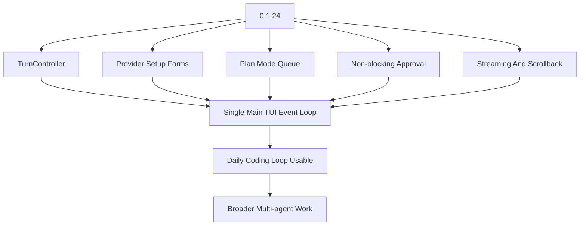

# Viden Engineering Plan

> Product direction update, 2026-06-26: **Viden is the active product
> direction.** Viden is now a legacy implementation and release-artifact
> name during the compatibility migration. Product, TUI, and
> GUI planning should follow the accepted Viden design source under
> `docs/viden-design/Viden/`; do not use the deleted
> `docs/design/canvas-export` import.
> The approved large-refactor development model is tracked in
> `docs/parallel-development-plan.md` and
> `docs/parallel-development-plan.zh-CN.md`.

## Context, Evidence, And Cost Source Of Truth

The approved contract is [Context, Evidence, And Cost Engine
Design](docs/superpowers/specs/2026-07-18-context-evidence-cost-engine-design.md):

- Viden owns the native engine; Headroom is optional adapter and benchmark
  infrastructure, never a required execution dependency.
- `0.2.1` owns context and cost, `0.2.3` canonical evidence verification,
  `0.2.4` optional adapters, and `0.2.5` the DeepSeek A/B release gate.
- Canonical content remains immutable and auditable; compact views alone cannot
  satisfy a Merge Gate.
- TUI/GUI clients consume `viden-core` and shared contracts. They must not
  depend directly on context, runtime, provider, tool, or workflow internals.

## Harness Direction

The accepted follow-up direction from the 2026-08-16 DeepSeek Harness
benchmark study is tracked in [Agent Harness Direction](docs/harness-direction.md)
(Chinese: [docs/harness-direction.zh-CN.md](docs/harness-direction.zh-CN.md)):
the model-visible-means-logged transcript contract (tests landed), the planned
OS-level capability seam and tool pre/post seam in Core, and the
minimal-preset / code-orchestration proposals gated behind the V3 contract
freeze.

## Current Planning Revision

As of the 0.1.24 planning line, the next release is upgraded from a
provider-setup-only interaction patch to **Provider Setup + Non-blocking
Operator Loop Gate**.

`docs/spec-review-0.1.24.md` is the controlling spec review for this planning
line. The release cannot be called complete while its P0 gaps remain open or
undocumented in release status.

This changes the immediate engineering plan:

Immediate P0:

- keep `TuiRuntime`/`TurnController` as the only provider-turn path; the former
  blocking `run_provider_turn_interactive` loop has been removed;
- finish runtime-visible queue state for provider turns, plan mode, queued
  follow-ups, and provider errors;
- keep approval on the main event loop and later clean it into first-class
  panel state;
- make ContextBundle builds, provider doctor/probe, shell/tool jobs, lane jobs,
  and release smoke emit events/tails/evidence instead of blocking the UI;
- preserve the welcome surface while `/connect`, `/models`, `/settings`,
  `/provider`, and setup panels are used before a real task starts;
- gate the release on plan-mode queue smoke, streaming/scrollback behavior,
  approval non-blocking checks, provider setup evidence, DeepSeek live coding
  smoke, screenshots/previews, GitHub Release assets, and Homebrew sync.

The final 0.1.x line is a TUI stability exit, not a feature-expansion sprint.
Viden should not enter `0.2.x` until known P0/P1 display and interaction
bugs are cleared: input locks, Plan mode locks, approval/modal focus traps,
resize corruption, scrollback loss, stale active-work state, provider/model
setup confusion, and misleading side-panel status are release blockers. The
controlling gate is `docs/tui-stability-zero-bug-gate.md`.

## Current State

Mainline landed status:

- lightweight REPL and slash-command runtime
- layered config resolution
- multi-provider model abstraction
- native tool-calling support for Anthropic and OpenAI-style providers
- provider-plugin runtime and DeepSeek v4 support, including `deepseek`, `deepseek-anthropic`, expanded OpenAI-compatible gateway descriptors, provider-scoped config, and official `deepseek-v4-flash` / `deepseek-v4-pro` model names
- permission-aware local tool runtime
- JSONL transcripts plus rebuildable SQLite session index
- session listing and resume selectors
- file, search, shell, web, and Git tool families
- V2-A runtime/session commands: `/status`, `/config`, `/doctor`, richer `/sessions`, grouped `/help`
- V2-C workflow continuity: `viden-workflows`, project tasks, project/session memory, `/tasks`, `/task ...`, `/memory ...`, `/task resume-context`, workflow JSONL logs
- V2-B LSP foundation: `viden-lsp`, `lsp_*` tools, `/lsp ...` commands, real semantic queries, session reuse, and document synchronization
- V2-D structured view slices: grouped diagnostics, grouped symbols, compact references, structured sessions/tasks/memory, structured permission denials, structured `/git diff` and `/diff`, and shared `viden-runtime` presentation helpers
- TUI cockpit and terminal-lane runtime: main cockpit layout, theme variants,
  companion screen registry, `/lane run` lifecycle, external Codex/Claude and
  generic lane adapters, per-lane worktree isolation, explicit accept/apply
  decisions, external terminal/tmux/PTY attach, `/lane send`, and lane log-tail
  replay while reusing the shared `SessionEngine`
- 0.1.13 default cockpit entry: `viden` opens the main TUI by default,
  `--no-tui` keeps the legacy line REPL available for scripts, and `/settings`
  / `/setup` provide first-run provider/model setup with saved defaults
- provider runtime hardening checkpoints: descriptor validation, registry refresh coverage, blank-key handling, provider-scoped diagnostics, and offline/live smoke harnesses
- DeepSeek V4 compatibility flags: reasoning-content replay, non-null assistant tool-call content, explicit `tool_choice` capability, and `high`/`max` reasoning-effort metadata

Current published release (`0.1.30`):

- `docs/release-0.1.30-status.md` records the final 0.1.x zero-bug TUI gate:
  final zero-bug smoke, RC TUI stability smoke, deterministic 0.1.30
  screenshots, manual Terminal/iTerm2 evidence, plan-mode smoke, daily-loop
  smoke, lane operator smoke, live DeepSeek development smoke, GitHub Release
  assets, and Homebrew validation.
- `0.1.30` closes the known P0/P1 TUI backlog at `0` and makes the remaining
  Mode/Permission/provider/model UI stability checks release-visible before
  0.2.x work starts.
- GitHub Release assets, Homebrew tap update, and post-publish smoke are part
  of the same release unit.

Next release planning (`0.2.x` and `0.3.x`):

- Multi-agent core orchestration is tracked in
  `docs/multi-agent-core-orchestration.md` and
  `docs/multi-agent-core-orchestration.zh-CN.md`. The 0.2.x line owns the
  shared Agent DAG, ContextBundle, evidence, permission, and merge-gate
  contracts; broader external/team agents remain 0.3.x+ work.
- `0.2.0`: Architecture cut and core structure refactor. Establish the
  `viden-core` facade, dependency direction, runtime supervisor, event stream,
  command bus, and compatibility exports before starting GUI implementation.
- `0.2.1`: Context and token/cost engine. Build `ContextBundle`, semantic file
  selection, log compaction, tool-result deduplication, token budgets, and cost
  panels to address long-task context growth, DeepSeek 413 failures, and
  invisible spend. The approved design keeps canonical raw context and evidence
  content-addressed, gives agents scoped `ContextHandle` references with audited
  retrieval, routes content through deterministic type-aware reducers, and
  attributes usage through an append-only cost ledger. See
  `docs/superpowers/specs/2026-07-18-context-evidence-cost-engine-design.md` and
  `docs/superpowers/plans/2026-07-18-context-evidence-cost-engine.md`.
- `0.2.2`: Agent DAG and role runtime - complete in the current working tree.
  Completion evidence is recorded in `docs/release-0.2.2-status.md` and
  `docs/release-0.2.2-status.zh-CN.md`. Promote planner, coder, reviewer,
  tester, and doc-writer into supervised roles with tasks, inputs, outputs,
  ContextBundle references, evidence, failure classification, and next actions.
  The implementation has landed `StartAgentDag` plus provider-backed
  `StartAgentTask` with dependency gating, AgentTask-bound ContextBundle
  events, role evidence, durable start/blocker/completion workflow events, and
  merge-gate updates; active role turns can be cancelled without leaving the
  runtime worker stuck, and explicit `CancelAgentTask` commands now persist
  `agent_task_cancelled` workflow events for queued or inactive tasks. Basic
  merge gate accept/reject decisions are also runtime commands now. Role
  `permission_policy` is applied to provider-requested tools during AgentTask
  execution; the role-policy matrix now covers tester verification,
  docs-only, reviewer read-only, scoped coder mutation, release-gate, and
  least-privilege external-agent behavior before approval/execution.
  Structured tool-result events now carry success and exit code through the
  runtime contract so TUI/GUI clients do not infer status from output text.
  Provider-backed role failures now persist `agent_task_failed` events with
  `failure_class`, `recovery_suggestion`, and a retry next action.
  Completed AgentTasks now store the provider output summary in `task.result`
  and link the same output to role evidence.
  AgentTask ContextBundles now include initial role-specific guidance,
  file-scope, evidence-contract sources, and deterministic scoped file
  candidates, lightweight symbol candidates, and live LSP diagnostics selected
  per role. Agent artifact accept/reject plus
  accepted-patch merge state transitions are now runtime commands with durable
  workflow events; accepted patch evidence is now applied to the workspace
  through a basic unified-diff reducer with conflict reporting that leaves files
  unchanged on mismatch. Scoped role Git staging now allows in-scope `git_add`
  while denying unscoped staging and high-risk Git mutations. Live LSP
  references enrichment, richer patch formats, release/publish Git rules, and
  the full evidence cockpit remain later work.
- `0.2.3`: Evidence and merge gate. Require task, context, permission, test,
  review, and release evidence before accepting generated changes. First slice
  adds `RecordAgentEvidence`, kind-based gate reduction, and matching
  runtime/workflow events for recorded evidence. Final acceptance must resolve
  canonical evidence and reject summary-only evidence.
- `0.2.4`: Plugin runtime boundary. Add process-plugin protocol,
  manifest/capability registration, extension boundaries, and least-privilege
  external agent scopes. Context reducers such as Headroom remain optional
  adapters with native fallback and cannot become mandatory dependencies.
- `0.2.5`: Real development gate. Keep DeepSeek live development smoke,
  daily-loop, plan-mode, provider/model, lane operator, release gate, and
  token/cost summaries mandatory before releases. Add three-run-per-cohort
  Context Engine A/B evidence with task/test parity, canonical evidence parity,
  median token/cost comparisons, retrieval counts, latency, and failure classes.
- `0.3.0`: Multi-frontend contract freeze and Viden migration plan. Freeze the
  UI/runtime contract before parallel UI work and define `viden` binary/config
  migration plus the `viden` compatibility shim.
- `0.3.1`: Parallel TUI and GUI implementation. Use the independent
  `codex/v3-core-runtime`, `codex/v3-tui-client`, and
  `codex/v3-gui-client` worktrees/branches, with at most three owners working
  against the shared contract. The GUI branch remains framework-neutral until
  the Tauri/GPUI vertical-slice gate selects the production client framework.
- `0.3.2`: Integration release candidate. Merge core, then TUI, then GUI, and
  run TUI/GUI parity, migration, plugin, and real development gates.
- `0.3.3`: Operable GUI beta and compatibility hardening. Batches, gates,
  and exit criteria are in `docs/release-0.3.3-plan.md`; the Core contract
  increment behind them is in `docs/release-0.3.3-contract-design.md`.
- `0.3.4`: Visual fidelity and production release gate.
- Keep Mode/Permission, provider/model, plan-mode, daily-loop, and live
  DeepSeek token/cost smoke in the release gate for future releases.
- GUI implementation starts only after the contract freeze, but then runs in
  parallel with the TUI client branch. GUI must consume the shared runtime; it
  must not become a parallel execution path.
- GUI functional design is tracked in
  `docs/gui-version-functional-design.md` and
  `docs/gui-version-functional-design.zh-CN.md`: D11 intake, D4 lane creation,
  the D1 cockpit shell and activity views, D2 decisions, D10 monitoring, D12
  conflict recovery, D14 audit, provider/model setup, context/cost,
  history/replay, and release/test all depend on the shared runtime contract.
- TUI/GUI visual work follows `docs/viden-design-adoption.md`. Discarded design
  imports and generated implementation previews must not become roadmap or
  release-gate visual targets.
- The first 0.3.x frontend sequence follows
  `docs/parallel-development-plan.md`: contract freeze, parallel TUI/GUI
  branches, integration candidate, operable GUI beta, and visual fidelity gate.

0.1.x final planning:

- `0.1.29`: release-candidate stabilization - freeze new surface area, burn
  down all known P0/P1 TUI bugs, and run Terminal/iTerm2 manual screenshot
  acceptance.
- `0.1.30`: final 0.1.x zero-bug gate - complete with known P0/P1 TUI bugs at
  zero, deterministic and manual screenshot evidence, full smoke, GitHub
  Release assets, Homebrew sync, and post-publish validation.

## Near-Term Plan

1. TUI Cockpit and Terminal Lanes.
   - Phase 1-7 of the current TUI/lane plan are landed on `main`: cockpit
     layout, theme variants, companion screens, lane runtime, external-tool
     adapters, isolation, and attachable terminal panes.
   - `0.1.13` hardening landed reliable exits, modal cleanup, lane diff/artifact
     review, ContextBundle pressure visibility, and release-smoke compatibility
     with the default TUI entry.
   - `0.1.16` lands interaction reliability: non-blocking active-turn feedback,
     command-palette scroll parity, approval diff/evidence control, resize
     stability, visible caret behavior, and truthful footer actions.
   - `0.1.17` should make first-run setup feel real: DeepSeek-first defaults,
     interactive provider/model setup, and in-product switch-model recovery
     when the selected model is unavailable or incompatible.
   - Keep lane completion separate from acceptance, and keep apply/cleanup as
     explicit operator actions.

2. Programming Evidence and Terminal Hardening.
   - Promote test output, edit summaries, approval state, and changed-file
     evidence into the main screen and side-2.
   - Improve apply-conflict recovery beyond the current audited retry path.
   - In `0.1.17`, prove the daily coding loop through a deterministic smoke:
     request -> edit -> approve -> test -> diff -> final evidence.
   - Evaluate whether full cursor-addressed terminal replay is worth the added
     parser/rendering complexity after log-tail replay has covered the first
     cockpit observation need.

3. Codex Adapter as the Reference Agent Backend.
   - Implement Codex setup/doctor, review, adversarial review, task/rescue,
     status, result, cancel, and resume/follow-up flows as the first native
     external-agent adapter.
   - Prefer Codex app-server / protocol events over terminal scraping where
     available; persist thread IDs, touched files, command executions, final
     output, and reasoning/evidence summaries into Viden lane evidence.
   - Use read-only as the default review posture; require explicit permission
     boundaries for write-capable Codex work.
   - In `0.1.14`, make read-only Codex review and Claude template/tmux lanes
     reproducible before broadening write-capable external-agent workflows.

4. External Coding Tool Adapter Expansion.
   - Keep Codex, Claude Code, DeepSeek, shell, tmux, PTY, and future ACP agents
     behind one lane lifecycle and one evidence model.
   - Add more templates and docs for tools such as Gemini, Junie, Kiro, and
     local coding CLIs as real operator workflows demand them.
   - Promote durable lane primitives out of `viden-cli` only when non-TUI
     surfaces need the same model.

5. Extension Foundation.
   - Define plugin, skill, MCP, tool, and agent descriptor boundaries.
   - Make extension health visible through doctor commands and side-2 before
     adding complex invocation or marketplace-like installation flows.
   - Keep every extension invocation on the shared permission, runtime, and
     transcript path.

6. 0.20 Usability Gate.
   - `0.1.17`: Daily Coding Loop Baseline - make one ordinary coding task
     repeatable and evidenced.
   - `0.1.18`: Failure Recovery And Review Gates - make tests, diffs, apply,
     rollback, and rerun flows obvious.
   - `0.1.19`: Delegated Lane Usefulness - make one Codex/Claude/shell
     delegated review workflow dependable.
   - `0.1.20`: Usability Beta - a clean install should complete both the daily
     coding loop and one delegated review loop with screenshots and smoke
     evidence.

7. Provider Compatibility Completion.
   - Keep the provider live matrix documented and aligned with built-in descriptors.
   - Validate real API compatibility across built-in and descriptor-backed OpenAI-compatible providers when credentials are available.
   - Keep dynamic loading, registry refresh, descriptor compatibility flags, and collision tests covered.
   - Keep provider binding instance-scoped so multiple sessions or agents can use different providers in the same process.
   - Harden OpenAI-style and Anthropic-style protocol compatibility, including DeepSeek reasoning/tool-call turns.

8. V3 Platform Expansion.
   - MCP runtime and plugin loading.
   - Skills/workflow plugin model.
   - Multi-agent coordinator.
   - Bridge, remote, and server mode.
   - Automation only after workflow state is reliable.

## Landed Phase Notes

1. V2-C Memory and Task Workflows.
   - Keep project tasks and memory state separate from session transcripts.
   - Preserve permission and transcript invariants for all workflow commands.
   - Treat the branch as an early workflow layer, not a complete memory/task
     platform.

2. V2-B LSP Foundation.
   - Add semantic code intelligence without replacing file/search tools.
   - Keep LSP actions behind the same permission and transcript guarantees.
   - Keep maturing the runtime from an early implementation toward a stable merge target.
   - Focus next on robustness, output quality, and long-lived session behavior rather than broadening scope.

3. Provider Plugin Runtime + DeepSeek v4.
   - Add a dynamic provider registry and provider host/runtime.
   - Support runtime registry refresh for newly loaded providers.
   - Keep provider binding instance-scoped so multiple agents can use different providers in the same process.
   - Land DeepSeek as the first independent plugin-backed provider using the official OpenAI-style and Anthropic-compatible API surfaces.

## Gap vs `.ref/claude-code-main`

Completed or substantially covered:

- shared session engine pattern
- slash-command command families
- permission modes and approval path
- local file/search/shell tools
- Git and web command families
- transcript and resume model
- provider abstraction
- provider plugin runtime and dynamic registry
- DeepSeek v4 as an independent provider family
- early task/memory workflow layer
- early LSP foundation with real semantic queries and normalized terminal output
- structured terminal views for diagnostics, symbols, references, sessions, tasks, memory, diff, and permission denials

Partial:

- command surface breadth
- LSP runtime execution depth
- provider streaming/cancellation maturity
- dynamic provider loading and plugin hardening
- session summaries and long-history management
- task workflows compared with reference task/session model
- richer interactive TUI behavior beyond structured plain-text sections

Missing:

- MCP
- general skills/plugins beyond provider plugins
- multi-agent/team coordinator
- bridge/remote/server mode
- cron/automation
- voice
- managed settings, analytics, feature flag platform

Deferred intentionally:

- Bun/React/Ink internals
- reference product operations machinery
- remote-first flows before local CLI stability

## Implementation Policy

- Build from small written plans in `docs/superpowers/plans/`.
- Keep every feature on a dedicated `codex/*` branch/worktree.
- Prefer behavior-level compatibility with `.ref`, not direct code translation.
- Keep JSONL canonical and SQLite derived.
- Keep mutations permission-gated.
- Keep transcript entries sufficient for audit and resume.
- Update English and Chinese docs together for user-facing docs.
- Commit checkpoints after focused test passes.

## Source Docs

Primary planning docs:

- `docs/product-requirements.md`
- `docs/staged-roadmap.md`
- `docs/long-term-roadmap.md`
- `docs/ref-gap-matrix.md`
- `docs/reference-analysis.md`
- `docs/architecture.md`
- `DESIGN.md`
- `docs/code-agent-benchmark.md`
- `docs/tui-lane-architecture-plan.md`
- `docs/tui-lane-architecture-plan.zh-CN.md`
- `docs/release-0.1.16-plan.md`
- `docs/release-0.1.16-plan.zh-CN.md`
- `docs/release-0.1.17-plan.md`
- `docs/release-0.1.17-plan.zh-CN.md`
- `docs/release-0.1.15-plan.md`
- `docs/release-0.1.15-plan.zh-CN.md`
- `docs/release-0.1.14-plan.md`
- `docs/release-0.1.14-plan.zh-CN.md`
- `docs/superpowers/plans/2026-05-23-tui-cockpit-terminal-lanes.md`
- `docs/superpowers/plans/2026-05-23-tui-cockpit-terminal-lanes.zh-CN.md`
- `docs/superpowers/plans/2026-04-11-viden-plan-index.md`

Current V2-C docs, when present:

- `docs/superpowers/specs/2026-04-11-v2-memory-task-workflows-design.md`
- `docs/superpowers/plans/2026-04-11-v2-memory-task-workflows.md`

Current V2-B docs, when present:

- `docs/superpowers/plans/2026-04-21-v2-lsp-foundation.md`

Current V2-D docs, when present:

- `docs/superpowers/plans/2026-04-23-v2-d-structured-views.md`
