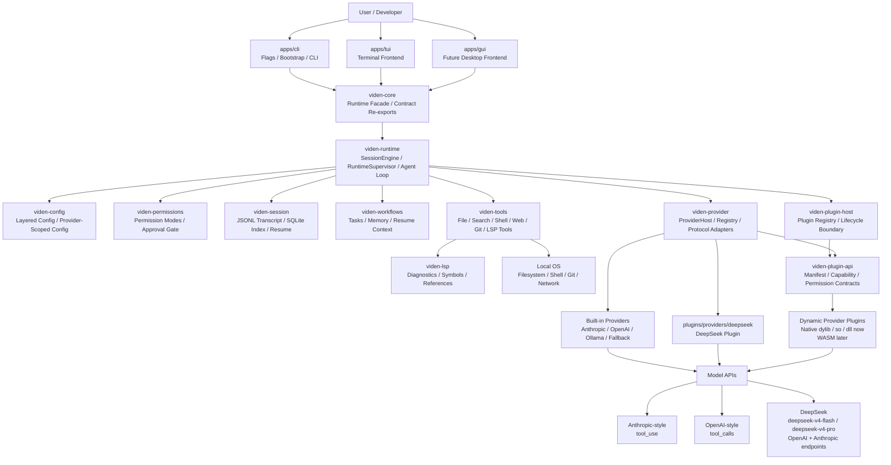
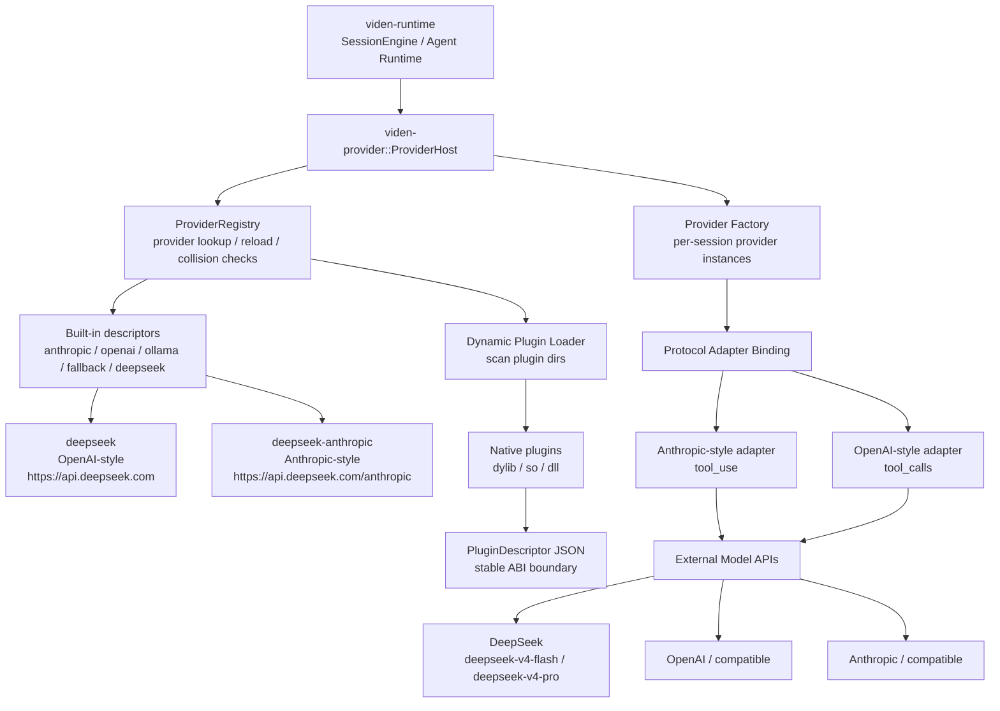

# Viden Architecture

## Target Architecture

Viden is organized as a local-first developer agent runtime with app surfaces,
reusable core crates, and first-party plugins. CLI/TUI/GUI code lives under
`apps/`; runtime, state, tools, permissions, workflows, LSP, provider, and
plugin contracts live under `crates/`; concrete provider/tool/agent/workflow
plugins live under `plugins/`.

## Workspace Layout

- `apps/cli`: executable entrypoint, flags, preview commands, and current CLI/TUI launcher.
- `apps/tui`: terminal frontend app boundary. The full TUI render/input
  loop should move here over follow-up slices.
- `crates/core`: stable runtime facade for clients; owns the internal
  pre-release `LocalCoreHost` workspace binding and re-exports the shared
  client/contract types without TUI or GUI dependencies. The host also owns
  trusted one-use credential staging so secret bytes never enter serialized
  commands, events, transcripts, or workflow audit. These host services are not
  advertised as frontend handshake capabilities until the Core 0.3.2 gate.
- `crates/config`: config loading, merge precedence, startup defaults, and
  preservation-safe atomic user UI preference persistence.
- `crates/runtime`: shared startup bootstrap, session engine, and turn
  orchestration.
- `crates/lanes`: lane lifecycle orchestration and lane-local side effects,
  below the runtime and driven entirely through injected seams.
- `crates/agents`: the external agent adapter layer below the runtime — one
  strategy per external CLI (ACP generic client, Codex app-server) plus the
  spawn infrastructure they share, reaching the OS only through `viden-tools`
  capabilities and receiving runtime policy through injected seams.
- `crates/provider`: provider host/runtime, HTTP adapters, provider registry, and tool-calling protocol translation.
- `crates/plugin-api`: shared plugin manifests, capabilities, permissions, provider descriptors, and ABI symbols.
- `crates/plugin-host`: plugin discovery, registry, validation, and lifecycle boundary.
- `crates/tools`: builtin local tools and execution adapters.
- `crates/permissions`: permission modes, rules, and approval decisions.
- `crates/session`: JSONL transcripts plus SQLite indexing.
- `crates/types`: shared domain types.
- `crates/workflows`: project task, memory, resume-context, and workflow-log state.
- `crates/lsp`: language-server configuration, protocol framing, semantic query execution, and result normalization.
- `plugins/providers/deepseek`: first-party DeepSeek provider plugin.

The root workspace keeps `viden-session` JSONL transcripts as the durable
source of truth. SQLite is a rebuildable index used for listing and resuming
sessions quickly.

## Configuration Model

Startup config is resolved through a fixed precedence chain:

1. CLI flags
2. Environment variables
3. Project-local `.viden/config.toml`
4. Global config file
5. Built-in defaults

That general chain governs provider and runtime configuration. Personal UI
preferences deliberately use a separate chain: safe CLI UI override, stored
user `[ui]`, system resolution, then built-in English. Project-local
`.viden/config.toml` cannot select or persist a person's locale, skin/mode,
density, or motion.

The resolved config currently covers:

- provider family
- model name
- API base URL
- API key
- provider-scoped config with generic fallback
- permission mode
- session home
- request timeout
- retry count

This allows the engine and provider layer to stay free of ad hoc environment
lookups after startup.

## Main Execution Flow

1. CLI receives a line of user input.
2. `viden-runtime` decides whether the line is a slash command, a direct tool
   request, or a normal model prompt.
3. Normal prompts are appended to the transcript and handed to the model
   provider.
4. Provider emits assistant text and/or tool calls.
5. Assistant tool calls are written into the in-memory conversation state so
   the next round-trip has a complete tool transcript.
6. Tool calls are routed through the permission engine.
7. If approval is required, the CLI prompts the user and returns the decision to
   the engine.
8. Tools execute through a shared registry.
9. Tool results are written to the transcript and reintroduced into the
   conversation history.
10. The engine loops until the provider finishes the turn.

This keeps every tool invocation on one shared path: validation, permission
decision, execution, transcript logging, and model reinjection all happen in
the same runtime flow.

## Runtime Contract Boundary

The refactor introduces a frontend-neutral runtime contract before any new TUI
or GUI implementation work:

- `viden-types` defines shared runtime facts and commands:
  `RuntimeSnapshot`, `RuntimeEvent`, `RuntimeCommand`, `CommandAction`,
  `ApprovalRequestView`, `EvidenceView`, `ProviderHealthView`,
  `TokenCostView`, and `RuntimeViewState`.
- `RuntimeViewState::apply_event` is the replay reducer. A client can rebuild
  its visible state from the initial snapshot plus ordered runtime events.
- Tool-result runtime events carry structured `success` and `exit_code` facts;
  clients must render those fields instead of inferring status from output
  text.
- `viden-runtime` exposes `SessionEngine::runtime_snapshot()`,
  `SessionEngine::runtime_view_state()`, and
  `SessionEngine::runtime_events_for_engine_events(...)` as the first bridge
  from the current engine loop to the shared contract.
- `viden-runtime` also exposes `RuntimeSupervisor`, a non-UI worker boundary
  that owns `SessionEngine`, accepts `RuntimeCommand`, emits ordered
  `RuntimeEvent` values, cancels active provider turns through
  `ModelRequestControl`, and resolves approvals through pending approval
  channels.
- Future TUI and GUI code must consume this contract instead of directly owning
  provider loops, tool execution, permission decisions, task state, or
  provider telemetry.
- Completed core modules must also update
  [Frontend Integration Contract](frontend-integration-contract.md), which maps
  runtime facts, commands, events, and view-state fields to TUI/GUI integration
  surfaces.

This boundary is intentionally data-first. It lets the existing engine continue
to run while contract tests freeze the facts that multiple frontends will share.

## Future Multi-Agent Core Orchestration

The multi-agent target is specified in
[Multi-Agent Core Orchestration](multi-agent-core-orchestration.md). It extends
the current runtime contract with agent DAG, ContextBundle, evidence, and
merge-gate contracts while preserving the same frontend-neutral event stream.

Architecture TODO:

- expand the landed `AgentTask`, `AgentDag`, `ContextBundle`, `Evidence`, and
  `MergeGate` contracts in `viden-types` without binding them to a frontend;
- continue storing DAG, task, memory, artifact, and evidence events in
  `viden-workflows` as durable project workflow state, separate from session
  transcripts;
- keep extending `RuntimeSupervisor` so role-based agent tasks emit replayable
  runtime events without blocking UI input;
- route every agent tool call through `viden-permissions` and `viden-tools`
  before mutation, and keep expanding the landed role-policy matrix beyond
  scoped Git staging into release/publish scopes;
- keep provider-specific protocol behavior inside `viden-provider` adapters and
  keep agent orchestration inside `viden-runtime` / `viden-workflows`;
- make TUI and GUI render only `RuntimeViewState` plus ordered runtime events.

### Native Context, Evidence, And Cost Boundary

The approved boundary is defined in
[Context, Evidence, And Cost Engine Design](superpowers/specs/2026-07-18-context-evidence-cost-engine-design.md).
`crates/context` owns content-addressed canonical storage, deterministic
type-aware reducers, scoped retrieval, quality checks, and exact cost
aggregation. `viden-runtime` remains the only orchestrator that builds bundles,
enforces budgets, calls providers, and emits replayable facts. Merge gates
validate canonical evidence rather than compact summaries. Optional external
reducers use plugin/MCP adapter contracts with native fallback; they never
become a mandatory provider path.

Version ownership is `0.2.1` for native context/cost, `0.2.3` for canonical
evidence, `0.2.4` for optional adapters, and `0.2.5` for the DeepSeek A/B gate.
TUI/GUI apps consume this state through `viden-core` and shared contracts; they
must not depend directly on context, runtime, provider, tool, or workflow
internals. CLI now uses the same `viden-runtime` bootstrap path that
`LocalCoreHost` uses before wrapping the supervisor in the transport-neutral
Core client.

Credential ingress follows the same boundary. Local frontends stage raw bytes
only through the bound host client, receive an opaque request id, and then send
`StoreCredentialHandle` through the runtime command path. Runtime persists only
safe `CredentialHandle` metadata; the platform credential sink receives the
secret after workspace/provider/backend binding, TTL, and one-use checks.

Personal UI preference mutation follows the runtime boundary as well.
`SetUiPreferences` and `ResetUiPreferences` validate before supervised
permission, recheck permission at execution, atomically update the user config,
then emit `UiPreferencesUpdated`. The reducer updates both the top-level view
fact and snapshot copy. User config remains the recovery authority; the event
is not added to project workflow JSONL as a second persistence authority.

## Terminal Presentation

`viden-runtime` owns plain-text terminal presentation helpers so slash-command
views stay consistent without requiring a full-screen TUI. Current structured
views cover:

- LSP diagnostics, symbols, and references
- session lists
- project tasks and memory
- permission denials and approval outcomes that block execution
- `/git diff` and `/diff` summaries with file/addition/deletion counts

The renderer keeps section titles, summaries, entry headings, field rows, empty
states, and diff summaries in one place. Future TUI work should reuse these
same output contracts rather than creating a second command-result model.

## Transcript Schema

The canonical transcript is JSONL. Each line is one `TranscriptEntry` tagged by
type:

- `message`
- `tool_call`
- `tool_result`
- `permission`
- `command`
- `session_meta`

The transcript is append-only. SQLite stores derived summaries and can always be
rebuilt from JSONL.

Session metadata currently supports:

- project-scoped session listing
- `/sessions` output for the current repository
- `/resume latest`
- `/resume #<index>`
- `/resume <session-id-prefix>`

## Permission Model

Supported modes:

- `default`
- `acceptEdits`
- `bypassPermissions`
- `dontAsk`
- `plan`

Rules are grouped into allow, deny, and ask buckets. Additional working
directories expand the set of in-scope paths. File reads and searches can be
auto-allowed inside scope; mutations require approval unless mode or rule says
otherwise.

The permission engine also has a small set of behavior-specific exceptions. For
example, Git worktree operations can target paths outside the current repository
root, so those paths ask for approval instead of being treated as an automatic
out-of-scope deny.

## Provider Runtime

The model layer exposes a provider trait that accepts:

- session id
- current model name
- conversation messages
- tool specs
- current permission mode

Providers return streamed or batched model events:

- assistant text
- tool calls
- end-of-turn

V1 includes a provider factory with these backend families:

- `anthropic`
- `openai`
- `openai-compatible`
- `deepseek` as an independent provider family using the official OpenAI-style API surface
- `deepseek-anthropic` for DeepSeek's official Anthropic-compatible API surface
- OpenAI-compatible gateway descriptors for `openrouter`, `groq`, `mistral`, `together`, `kimi`, `qwen`, `dashscope-coding-plan`, `dashscope-coding-plan-anthropic`, `dashscope-tokenplan`, `dashscope-tokenplan-anthropic`, `zhipu`, and `volcengine`
- `ollama`
- `fallback`

The provider runtime on main has evolved from a small built-in factory into a
provider host/runtime with:

- built-in provider descriptors
- dynamic provider registry
- a compatibility matrix for built-in descriptors, including protocol family, default model, streaming capability, and tool-call capability
- protocol adapters separated from provider identity
- a plugin contract designed for native dynamic loading first and WASM
  migration later
- instance-scoped provider binding so different sessions/agents can use
  different providers concurrently in the same process

The HTTP-backed providers use the system `curl` binary so the workspace remains
dependency-light and offline-compilable. The provider config includes request
timeouts and retry counts, and the HTTP path retries transient failures before
returning a structured error.

Current protocol support:

- Anthropic native `tool_use`
- OpenAI native `tool_calls`
- OpenAI-compatible tool calling using the same message shape
- OpenAI-compatible gateway providers through shared descriptor-backed HTTP providers
- DeepSeek as an independent provider identity with:
  - `deepseek` bound to the OpenAI-style adapter family at `https://api.deepseek.com`
  - `deepseek-anthropic` bound to the Anthropic-style adapter family at `https://api.deepseek.com/anthropic`
- DeepSeek V4 defaults to `deepseek-v4-flash`; `deepseek-v4-pro` is selectable explicitly
- Ollama text-only chat flow
- local `fallback` behavior for offline use and smoke testing

If credentials are missing, Viden can still run against deterministic local
fallback behavior instead of failing to start.

Runtime provider loading target:

- the registry can be refreshed while the process is running
- newly loaded providers become available to newly created provider instances
- active sessions keep their bound provider instances instead of hot-swapping in
  place
- built-in and dynamically discovered descriptors flow through one registry,
  while full plugin-backed execution, streaming, cancellation, and broader
  provider compatibility continue to harden

### Provider Plugin Runtime

The provider runtime separates provider identity from protocol behavior. The
registry answers "what providers exist"; the host creates instance-scoped
providers for each session or agent.

## Tool System

Builtin tools:

- `shell`
- `read_file`
- `write_file`
- `edit_file`
- `glob`
- `grep`
- `web_search`
- `web_fetch`
- `git_status`
- `git_diff`
- `git_branch`
- `git_switch`
- `git_add`
- `git_commit`
- `git_push`
- `git_fetch`
- `git_restore`
- `git_stash_list`
- `git_stash_push`
- `git_stash_pop`
- `git_stash_drop`
- `git_worktree_list`
- `git_worktree_add`
- `git_worktree_remove`
- `lsp_diagnostics`
- `lsp_symbols`
- `lsp_references`

Every tool declares:

- metadata
- mutability
- schema hint
- execution logic

All builtin tools return serializable results so their behavior is fully visible
in the transcript.

The CLI currently exposes these tool surfaces through slash commands as well:

- `/help`
- `/model`
- `/provider`
- `/permissions`
- `/plan`
- `/sessions`
- `/resume`
- `/diff`
- `/test <command>`
- `/git ...`
- `/web ...`
- `/tasks`
- `/task ...`
- `/memory ...`
- `/lsp ...`

Current workflow/LSP notes:

- `viden-workflows` keeps task and memory state outside the canonical transcript while remaining rebuildable from JSONL event logs.
- `/test <command>` reuses the shell tool permission path and stores the latest
  test evidence in `SessionEngine` so `/status` can report the most recent
  verification command, exit code, likely failing-file count, and output tail
  without creating a second execution path. The command output also includes a
  small parser for common Rust/cargo and pytest failure-summary/file patterns.
- `/status` also acts as a read-only cockpit snapshot: it collects git dirty
  files, active workflow tasks, and typed lane state from the
  `viden-workflows` `lanes.jsonl` log, with each collector degrading
  independently if that source is unavailable. Legacy `.viden/lanes.tsv` is
  only an idempotent session-start or resume-activation migration input.
- Successful `write_file` and `edit_file` results are structured as `path`,
  `size`, and `effect` lines so transcript and TUI surfaces can summarize file
  changes without parsing free-form prose.
- Lane inspect/apply/recovery commands store auditable artifacts under
  `.viden/lanes/` and render a recommended next action so the operator can
  move from evidence review to accept/apply/resolve/cleanup without guessing
  the command sequence.
- Side screens reuse the same lane next-action language and artifact hints:
  side-1 emphasizes lane supervision plus persisted log tails, while side-2
  carries compact ops activity rows for the same command sequence.
- `viden-lsp` currently supports query-driven semantic code intelligence through language-server stdio sessions.
- The current LSP runtime already covers real queries, session reuse, document synchronization, and normalized output, but it is still an early implementation rather than a fully mature long-lived LSP platform layer.

## Platform Notes

Viden keeps one shared engine across platforms and varies only the execution
adapter where necessary:

- POSIX shell adapter on macOS and Linux
- PowerShell adapter on Windows

Behavior is aligned at the tool contract level rather than by forcing identical
shell syntax across operating systems.
