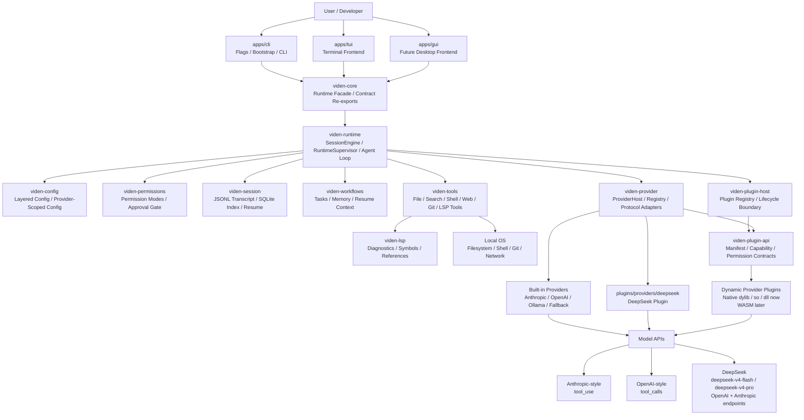
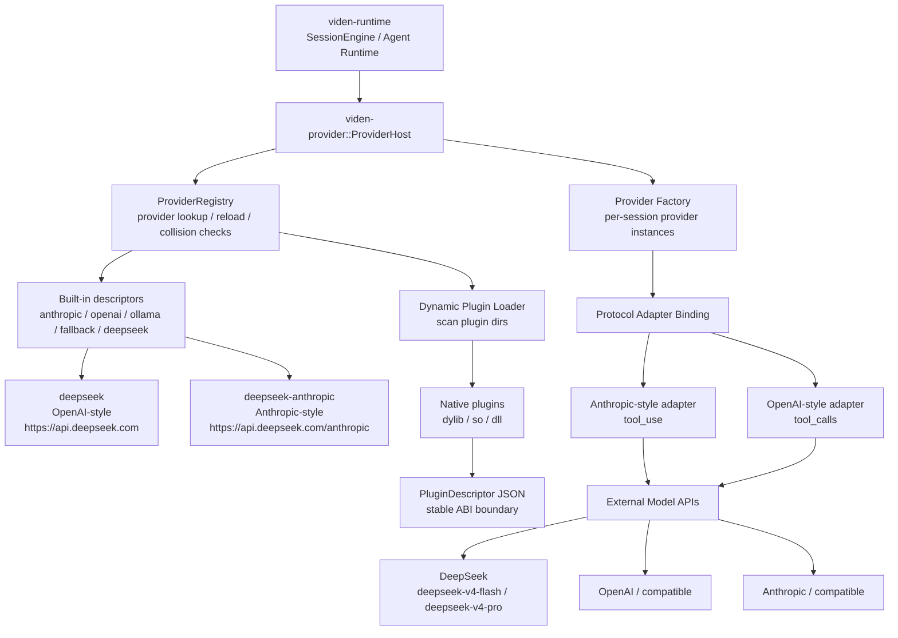

# Viden 架构

英文版： [architecture.md](architecture.md)

## 目标架构

Viden 是 local-first developer agent runtime，按 app surface、可复用 core
crate、first-party plugin 三层组织。CLI/TUI/GUI 代码放在 `apps/`；runtime、
状态、工具、权限、workflow、LSP、provider 和 plugin contract 放在 `crates/`；
具体 provider/tool/agent/workflow plugin 放在 `plugins/`。

## Workspace 布局

- `apps/cli`：可执行入口、flags、preview commands，以及当前 CLI/TUI launcher
- `apps/tui`：终端 frontend app 边界；完整 TUI render/input loop 后续应迁移到这里
- `crates/core`：稳定 runtime facade，供客户端导入；拥有内部 pre-release
  `LocalCoreHost` workspace binding，并重导出共享 client/contract 类型，不引入
  TUI 或 GUI 依赖；同时拥有可信的一次性 credential staging，保证 secret bytes
  不进入序列化 commands、events、transcripts 或 workflow audit；Core 0.3.2 gate
  前不把这些 host services 作为 frontend handshake capability 对外公布
- `crates/config`：配置加载、优先级合并、启动默认值，以及保留未知字段的原子 user UI 偏好持久化
- `crates/runtime`：共享启动 bootstrap、会话引擎和 turn 编排
- `crates/lanes`：lane 生命周期编排与 lane 本地副作用，位于 runtime 之下，
  完全通过注入的接缝驱动
- `crates/agents`：位于 runtime 之下的外部 agent adapter 层——每个外部 CLI 一种
  策略（通用 ACP 客户端、Codex app-server）以及两者共享的进程启动基础设施；
  只通过 `viden-tools` capabilities 访问操作系统，并通过注入的接缝接收 runtime 策略
- `crates/provider`：provider host/runtime、HTTP 适配、provider registry，以及 tool-calling 协议转换
- `crates/plugin-api`：共享 plugin manifest、capability、permission、provider descriptor 和 ABI symbol
- `crates/plugin-host`：plugin discovery、registry、validation 和 lifecycle 边界
- `crates/tools`：内置本地工具和执行适配器
- `crates/permissions`：权限模式、规则和审批决策
- `crates/session`：JSONL transcript 和 SQLite 索引
- `crates/types`：共享领域类型
- `crates/workflows`：项目级 task、memory、resume-context 与 workflow log 状态
- `crates/lsp`：language server 配置、协议 framing、语义查询执行和结果归一化
- `plugins/providers/deepseek`：first-party DeepSeek provider plugin

整个 workspace 中，`viden-session` 的 JSONL transcript 是持久化事实源；SQLite 只是可重建的索引，用来更快地列会话和恢复会话。

## 配置模型

启动配置按照固定优先级解析：

1. CLI flags
2. 环境变量
3. 项目级 `.viden/config.toml`
4. 全局配置文件
5. 内置默认值

这条通用链适用于 provider 与 runtime 配置。个人 UI 偏好使用独立优先级：安全 CLI UI
override、已存储 user `[ui]`、system 解析、内置英文。项目级 `.viden/config.toml`
不能选择或持久化个人 locale、skin/mode、density 或 motion。

当前已覆盖的配置项：

- provider family
- model name
- API base URL
- API key
- provider-scoped config 与 generic fallback
- permission mode
- session home
- request timeout
- retry count

这样在启动完成后，engine 和 provider 层就不需要再各自做零散的环境变量读取。

## 主执行流程

1. CLI 接收一行用户输入
2. `viden-runtime` 判断它是 slash command、直接工具请求，还是普通模型 prompt
3. 普通 prompt 会写入 transcript 并交给 model provider
4. provider 返回 assistant 文本和/或 tool calls
5. assistant 的 tool call 会先写入内存中的会话状态
6. 工具调用交给 permission engine 判定
7. 如果需要审批，CLI 提示用户并把决策回传给 engine
8. 工具通过统一 registry 执行
9. 工具结果写入 transcript，并重新注入到会话历史
10. 引擎循环执行，直到 provider 完成本轮

这个流程保证所有工具调用都走同一条主路径：校验、权限决策、执行、transcript 记录、模型回注。

## Runtime Contract 边界

这次重构会先引入前端无关的 runtime contract，再开始任何新的 TUI 或 GUI 实现：

- `viden-types` 定义共享 runtime facts 和 commands：
  `RuntimeSnapshot`、`RuntimeEvent`、`RuntimeCommand`、`CommandAction`、
  `ApprovalRequestView`、`EvidenceView`、`ProviderHealthView`、
  `TokenCostView` 和 `RuntimeViewState`。
- `RuntimeViewState::apply_event` 是 replay reducer。客户端可以通过初始
  snapshot 加有序 runtime events 重建可见状态。
- tool-result runtime events 会携带结构化 `success` 和 `exit_code` facts；
  客户端必须渲染这些字段，而不是从输出文本推断状态。
- `viden-runtime` 暴露 `SessionEngine::runtime_snapshot()`、
  `SessionEngine::runtime_view_state()` 和
  `SessionEngine::runtime_events_for_engine_events(...)`，作为当前 engine loop
  到共享 contract 的第一版 bridge。
- `viden-runtime` 还暴露 `RuntimeSupervisor`，这是一个非 UI 的 worker 边界：
  它拥有 `SessionEngine`、接收 `RuntimeCommand`、发出有序 `RuntimeEvent`，
  通过 `ModelRequestControl` 取消运行中的 provider turn，并通过 pending approval
  channels 处理审批响应。
- 后续 TUI 和 GUI 代码必须消费这个 contract，而不是直接拥有 provider loop、
  tool execution、permission decision、task state 或 provider telemetry。
- 已完成的核心模块还必须同步更新
  [前端对接契约](frontend-integration-contract.zh-CN.md)，说明 runtime facts、
  commands、events 和 view-state fields 如何对接 TUI/GUI。

这个边界故意先采用 data-first 方式。它让现有引擎继续运行，同时用 contract tests
冻结多个前端需要共享的事实。

## 未来多 Agent 核心编排

多 Agent 目标详见
[多 Agent 核心编排](multi-agent-core-orchestration.zh-CN.md)。它在当前 runtime
contract 之上扩展 agent DAG、ContextBundle、evidence 和 merge-gate 契约，同时保持同一套
frontend-neutral event stream。

架构 TODO：

- 扩展已落地的 `AgentTask`、`AgentDag`、`ContextBundle`、`Evidence` 和
  `MergeGate` contracts，同时避免绑定到某个 frontend；
- 继续在 `viden-workflows` 中将 DAG、task、memory、artifact 和 evidence events
  存为 durable project workflow state，并与 session transcript 分离；
- 继续扩展 `RuntimeSupervisor`，让基于 role 的 agent tasks 发出可 replay 的
  runtime events，不能阻塞 UI input；
- 每个 agent tool call 在变更前都必须经过 `viden-permissions` 和 `viden-tools`，
  并在已落地的 role-policy matrix 和 scoped Git staging 之上继续扩展
  release/publish scopes；
- provider-specific protocol behavior 只留在 `viden-provider` adapters，agent
  orchestration 留在 `viden-runtime` / `viden-workflows`；
- TUI 和 GUI 只渲染 `RuntimeViewState` 加有序 runtime events。

### 原生 Context、Evidence 与 Cost 边界

已批准边界见
[Context、Evidence 与 Cost Engine 设计](superpowers/specs/2026-07-18-context-evidence-cost-engine-design.zh-CN.md)。
`crates/context` 负责 content-addressed canonical storage、确定性 type-aware
reducers、scoped retrieval、quality checks 和精确 cost aggregation。只有
`viden-runtime` 可以构造 bundle、执行 budget、调用 provider 并发送可 replay facts。
Merge Gate 校验 canonical evidence，不能只信 compact summary。可选 external reducer
通过 plugin/MCP adapter contract 接入并具备 native fallback，不能成为强制 provider path。

版本归属为：`0.2.1` 原生 context/cost、`0.2.3` canonical evidence、`0.2.4`
可选 adapter、`0.2.5` DeepSeek A/B gate。TUI/GUI app 只通过 `viden-core` 和
shared contracts 消费状态，不能直接依赖 context、runtime、provider、tool 或 workflow
internals；CLI 现在使用与 `LocalCoreHost` 相同的 `viden-runtime` bootstrap
路径，再由 Core host 把 supervisor 包装为 transport-neutral Core client。

Credential ingress 也遵守同一边界。本地前端只能通过已绑定的 host client 暂存原始
bytes，获得 opaque request id，然后经 runtime command path 发送
`StoreCredentialHandle`。Runtime 只持久化安全的 `CredentialHandle` metadata；platform
credential sink 只会在 workspace/provider/backend binding、TTL 和一次性消费检查后收到
secret。

个人 UI 偏好 mutation 也遵守 runtime 边界。`SetUiPreferences` 与
`ResetUiPreferences` 会先校验，再进入 supervised permission，并在执行侧重新检查
permission；随后原子更新 user config 并发出 `UiPreferencesUpdated`。Reducer 同步更新
顶层 view fact 与 snapshot 副本。恢复权威仍是 user config，不会把该 event 再写入
project workflow JSONL 形成第二套持久化权威。

## 终端展示

`viden-runtime` 负责 plain-text terminal presentation helpers，让 slash-command
views 保持一致，而不要求立即引入 full-screen TUI。当前 structured views 覆盖：

- LSP diagnostics、symbols、references
- session 列表
- project tasks 和 memory
- 阻断执行的 permission denials / approval outcomes
- 带 files/additions/deletions 摘要的 `/git diff` 与 `/diff`

renderer 统一管理 section titles、summaries、entry headings、field rows、empty
states 和 diff summaries。后续 TUI 工作应复用这些输出契约，而不是新增第二套 command-result model。

## Transcript Schema

canonical transcript 采用 JSONL。每一行都是一个带类型标签的 `TranscriptEntry`：

- `message`
- `tool_call`
- `tool_result`
- `permission`
- `command`
- `session_meta`

transcript 是 append-only。SQLite 存储派生摘要，始终可以从 JSONL 重建。

当前 session 元数据支持：

- 按项目列出会话
- `/sessions` 输出当前仓库的会话
- `/resume latest`
- `/resume #<index>`
- `/resume <session-id-prefix>`

## 权限模型

当前支持的模式：

- `default`
- `acceptEdits`
- `bypassPermissions`
- `dontAsk`
- `plan`

规则分为 allow、deny、ask 三类。additional working directories 可以扩展路径作用域。文件读取和搜索在作用域内可自动允许；变更型操作除非模式或规则允许，否则都要审批。

权限系统里还包含少量特例。例如 Git worktree 可能会操作仓库根目录之外的路径，因此这些路径会进入审批，而不是直接被视为 out-of-scope deny。

## Provider Runtime

模型层暴露一个 provider trait，接收：

- session id
- 当前 model 名称
- 会话消息
- tool specs
- 当前 permission mode

provider 返回流式或批式事件：

- assistant text
- tool calls
- end-of-turn

当前 V1 已有的 provider family：

- `anthropic`
- `openai`
- `openai-compatible`
- `deepseek`，作为独立 provider family，使用官方 OpenAI-style API surface
- `deepseek-anthropic`，用于 DeepSeek 官方 Anthropic-compatible API surface
- OpenAI-compatible gateway descriptors：`openrouter`、`groq`、`mistral`、`together`、`kimi`、`qwen`、`dashscope-coding-plan`、`dashscope-coding-plan-anthropic`、`dashscope-tokenplan`、`dashscope-tokenplan-anthropic`、`zhipu`、`volcengine`
- `ollama`
- `fallback`

main 上的 provider runtime 已经从小型 built-in factory 演进为 provider host/runtime，包含：

- built-in provider descriptors
- dynamic provider registry
- built-in descriptors 的兼容矩阵，包括协议族、默认模型、streaming capability 和 tool-call capability
- 将 protocol adapters 与 provider identity 分离
- 先支持 native dynamic loading、后续可迁移到 WASM 的 plugin contract
- instance-scoped provider binding，使同一进程中的不同 sessions/agents 能并发使用不同 provider

HTTP provider 使用系统 `curl`，因此 workspace 能保持依赖轻量且可离线编译。provider 配置中也包含 timeout 和 retry，HTTP 路径会对瞬时失败做重试，并返回结构化错误。

当前协议支持：

- Anthropic 原生 `tool_use`
- OpenAI 原生 `tool_calls`
- OpenAI-compatible 的相同工具调用消息形状
- 通过 descriptor-backed HTTP provider 复用 OpenAI-compatible gateway providers
- DeepSeek 作为独立 provider identity，提供：
  - `deepseek`：绑定 OpenAI-style adapter family，endpoint 为 `https://api.deepseek.com`
  - `deepseek-anthropic`：绑定 Anthropic-style adapter family，endpoint 为 `https://api.deepseek.com/anthropic`
- DeepSeek V4 默认使用 `deepseek-v4-flash`；可显式选择 `deepseek-v4-pro`
- Ollama 的纯文本聊天流
- 本地 `fallback` 行为，用于离线与 smoke test

即使没有配置凭证，Viden 仍然可以通过 deterministic fallback 启动，而不是直接失败。

运行时 provider 加载目标：

- 进程运行中可刷新 registry
- 新加载的 provider 可被新建的 provider instances 使用
- 活跃 session 保持自己已经绑定的 provider instance，而不是原地热替换
- built-in 与动态发现的 descriptors 已经进入同一个 registry，但完整 plugin-backed execution、streaming、cancellation 与更广 provider 兼容性仍在继续加固

### Provider Plugin Runtime

provider runtime 把 provider identity 和 protocol behavior 分离。registry
回答“有哪些 provider 可用”；host 为每个 session 或 agent 创建
instance-scoped provider。

## 工具系统

当前内置工具：

- `shell`
- `read_file`
- `write_file`
- `edit_file`
- `glob`
- `grep`
- `web_search`
- `web_fetch`
- `git_status`
- `git_diff`
- `git_branch`
- `git_switch`
- `git_add`
- `git_commit`
- `git_push`
- `git_fetch`
- `git_restore`
- `git_stash_list`
- `git_stash_push`
- `git_stash_pop`
- `git_stash_drop`
- `git_worktree_list`
- `git_worktree_add`
- `git_worktree_remove`
- `lsp_diagnostics`
- `lsp_symbols`
- `lsp_references`

每个工具都定义：

- metadata
- mutability
- schema hint
- execution logic

所有内置工具都返回可序列化结果，因此它们的行为可以完整进入 transcript。

CLI 当前也通过 slash commands 暴露这些工具面：

- `/help`
- `/model`
- `/provider`
- `/permissions`
- `/plan`
- `/sessions`
- `/resume`
- `/diff`
- `/test <command>`
- `/git ...`
- `/web ...`
- `/tasks`
- `/task ...`
- `/memory ...`
- `/lsp ...`

当前 workflow / LSP 说明：

- `viden-workflows` 把 task / memory state 放在 canonical transcript 之外，但仍保持 JSONL event logs 可重建。
- `/test <command>` 复用 shell tool 的权限路径，并把最近一次 test evidence
  存在 `SessionEngine` 中，让 `/status` 能报告最新 verification command、
  exit code、可能失败文件数量和 output tail，而不引入第二条执行通道。命令输出还
  包含一个小 parser，用于提取常见 Rust/cargo 和 pytest failure-summary / file
  模式。
- `/status` 也是只读 cockpit 快照：它会采集 git dirty files、active workflow
  tasks，以及 `viden-workflows` `lanes.jsonl` 中的 typed lane state；某个来源
  不可用时只降级该 collector，不让整个命令失败。旧 `.viden/lanes.tsv` 只作为
  幂等的 session 启动或 resume activation 迁移输入。
- 成功的 `write_file` 和 `edit_file` result 会结构化为 `path`、`size` 和 `effect`
  行，让 transcript 和 TUI surface 不必解析自由文本也能总结文件变更。
- Lane inspect / apply / recovery 命令会把可审计 artifacts 存到
  `.viden/lanes/`，并渲染 recommended next action，让操作者能从 evidence
  review 直接推进到 accept / apply / resolve / cleanup，而不用猜命令顺序。
- 副屏复用同一套 lane next-action 语言和 artifact hints：side-1 偏 lane 监督与
  persisted log tails，side-2 用更紧凑的 ops activity rows 承载同一命令序列。
- `viden-lsp` 当前通过 language-server stdio sessions 提供 query-driven 的 semantic code intelligence。
- 当前 LSP runtime 已覆盖 real queries、session reuse、document synchronization 和 normalized output，但仍属于 early implementation，而不是完整成熟的长期 LSP 平台层。

## 平台说明

Viden 在不同平台上共用同一套 engine，只在必要处切换执行适配器：

- macOS / Linux 使用 POSIX shell adapter
- Windows 使用 PowerShell adapter

目标是保证工具契约层面的行为一致，而不是强行让所有系统拥有完全相同的 shell 语法。
