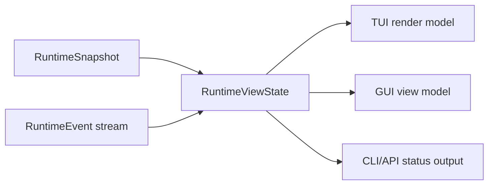

# Frontend Integration Contract

Chinese version: [frontend-integration-contract.zh-CN.md](frontend-integration-contract.zh-CN.md)

This document defines how completed core runtime modules are exposed to TUI,
GUI, CLI automation, and future clients. It is a contract document, not a UI
layout spec. TUI and GUI implementations must consume these facts instead of
owning provider loops, tool execution, permission decisions, or workflow state.

## Frozen Contract Identity

Core `0.3.0` freezes `frontend-contract-v1` as frontend schema `1`. The complete
compatibility manifest, migration gate, fixture corpus, and post-commit evidence
field are recorded in [Core 0.3 Compatibility](core-0.3-compatibility.md).

| Field | Frozen value |
| --- | --- |
| Component | `viden-core` |
| Component version | `0.3.0` |
| Active schema | `1` |
| Supported schemas | `[1]` |
| Client boundary | `CoreClient` and protocol/view contracts re-exported by `viden-core` |
| Contract payload | `contract_payload_sha: 5bd2b80b0953f4194d082940a7b9164c7231ca2d` |

The Core handshake advertises this exact lexically sorted capability set:

```text
runtime.agent_dag
runtime.approvals
runtime.commands
runtime.context
runtime.cost
runtime.events
runtime.evidence
runtime.merge_gate
runtime.queued_input
runtime.replay
runtime.snapshot
runtime.transcript_page
runtime.typed_lanes
runtime.typed_tasks
ui.preferences
```

Core `0.3.6` keeps schema `1` and advertises the following twenty-three
separately versioned, lexically sorted extension capabilities. Base-only clients
still connect; each feature checks its own extension and remains visibly
unavailable with zero command transport when that extension is absent. The list
below is the set recorded in `crates/core/release-manifest.toml` at the `0.3.6`
checkpoint; it grew from nineteen when the `0.3.3` contract increment added
`runtime.structured_diff`, `runtime.operator_git`, `runtime.conflict_content`,
and `runtime.evidence_reads`.

```text
core.workspace_host
runtime.agent_adapters
runtime.agent_conversation
runtime.agent_permission_bridge
runtime.agent_session_input
runtime.agent_sessions
runtime.audit
runtime.cockpit_context_v1
runtime.conflict_content
runtime.credential_handles
runtime.credential_staging
runtime.evidence_reads
runtime.lane_lifecycle
runtime.lane_owner_projection
runtime.operator_git
runtime.project_onboarding
runtime.recent_work
runtime.starter_lane_preview
runtime.structured_diff
runtime.trust_loop
runtime.workspace_eligibility
runtime.workspace_files
ui.preference_persistence
```

The recorded SHA is the reviewed payload commit. This document is stored in a
separate evidence commit, which is the exact common TUI/GUI branch base; its
parent must equal the recorded payload SHA. No SHA is guessed or made
self-referential inside the payload commit.

## Integration Principles

- Core modules publish facts through `RuntimeSnapshot`, ordered
  `RuntimeEvent` values, and `RuntimeViewState`.
- Frontend code imports the transport-neutral `CoreClient` boundary and public
  protocol/view contracts from `viden-core`. It must not import runtime,
  provider, tool, permission, session, or workflow internals.
- Pre-release frontend branches open a project through `viden_core::LocalCoreHost`, which
  canonicalizes an existing workspace directory, runs the shared runtime
  bootstrap, starts a `RuntimeSupervisor`, and returns a bound `CoreClient`.
  Rebinding to another workspace creates an independent binding and stream; it
  must not mutate an existing client's cursor or snapshot. Clients gate this
  trusted boundary on `core.workspace_host`; credential ingress separately
  requires `runtime.credential_staging`.
- Frontends send intent through `RuntimeCommand`; they do not call tools,
  providers, or permission engines directly.
- `RuntimeViewState::apply_event` is the canonical reducer for client-visible
  state. TUI, GUI, API, and tests should share equivalent replay fixtures.
- Durable workflow facts remain in `viden-workflows`; session transcript facts
  remain in `viden-session`. Frontends render them but do not mutate them
  directly.
- UI-only state is limited to layout, selection, focus, filters, sort order,
  local panel expansion, and scrollback position.
- `viden_core::legacy` is a deprecated, temporary bootstrap bridge for the
  pre-v3 TUI. New TUI, GUI, CLI, and API clients must not use it.

## Core Module Map

| Core module | Frontend surface | Primary facts | Commands / actions | Status |
| --- | --- | --- | --- | --- |
| Workspace host | first-run project open, workspace rebind | `WorkspaceBinding.canonical_root`, `session_id`, `stream_id` | `LocalCoreHost::open_workspace` | Core `0.3.2` extension `core.workspace_host` |
| Workspace Lane eligibility | new Lane entry-point availability, isolation mode, and classified diagnostics | `RuntimeViewState.workspace_eligibility`, `WorkspaceEligibilityUpdated` | `PreviewDefaultStarterLane` | Core `0.3.5` extension `runtime.workspace_eligibility`; Core alone selects Git branch/worktree isolation when a valid HEAD exists or direct-workspace mode otherwise |
| Trusted credential staging | provider credential entry, platform-secret bridge | `CredentialRequestId`, `CredentialHandle`, `ProviderHealthView.credential` | `BoundCoreClient::stage_credential`, then `StoreCredentialHandle` | Core `0.3.2` extension `runtime.credential_staging` |
| Compatibility and transport | client bootstrap, reconnect, compatibility error | `CoreHandshake`, schema version, capability set, `EventCursor`, snapshot/replay envelopes | `CoreClient::discover`, `snapshot`, `replay`, `recv`, `transcript_page` | frozen in Core `0.3.0` |
| Runtime supervisor | activity rail, live work indicator, cancellation affordance | `RuntimeEvent`, `RuntimeViewState`, `RuntimeErrorView` | `SubmitUserInput`, `QueueFollowUp`, `CancelActiveTurn` | landed |
| Cockpit context | bounded workspace source, structured changes/checks, MCP/LSP health | `WorkspaceSourceUpdated`, `WorkspaceChangeUpdated`, `CheckRunUpdated`, `RuntimeServiceHealthUpdated` | read-only status sampling; normal runtime/tool commands produce facts | Core `0.3.5` extension `runtime.cockpit_context_v1` |
| Mode and permissions | top bar, approval panel, permission picker | `RuntimeSnapshot.work_mode`, `RuntimeSnapshot.permission_level`, `ApprovalRequestView` | `SetWorkMode`, `SetPermissionLevel`, `RespondToApproval` | landed |
| Provider/model setup | provider panel, model picker, health strip | `RuntimeSnapshot.provider_id`, `ProviderHealthView`, active model config | `ConfigureProvider`, `SelectModel`, `ActivateModel`, `DeactivateModel` | landed |
| Tool execution | transcript tool cards, active tool strip, evidence list | `ToolCallStarted`, `ToolCallFinished`, structured `success` / `exit_code` | approval response only; tools run through core | landed |
| Agent DAG and tasks | agent board, lane list, task detail, next-action dock | `AgentDagRecord`, `AgentTaskRecord`, `AgentNextAction` | `StartAgentDag`, `StartAgentTask`, `CancelAgentTask` | landed in `0.2.2` |
| Agent workflow visibility | Mission Control board, workflow strip, plan/now/done/acceptance/blocked columns | `AgentDagRecord`, `AgentTaskRecord`, `EvidenceView`, `MergeGateRecord`, `RuntimeErrorView` | existing workflow/task/evidence/merge commands | proposed |
| ContextBundle | context panel, token pressure meter, omitted-source list | `ContextBundleRecord`, `ContextSourceRecord`, token budgets | no direct mutation; future context-policy commands | partial |
| Evidence and merge gate | evidence center, diff/test/review checklist, merge gate card | `EvidenceView`, `MergeGateRecord` | `RecordAgentEvidence`, `AcceptMergeGate`, `RejectMergeGate`, `AcceptAgentArtifact`, `RejectAgentArtifact`, `MergeAgentPatch` | reducer first slice landed in `0.2.3` |
| Cross-lane trust loop | handoff/review/contract/dependency cards, conflict and revert recovery | `HandoffRecord`, `ReviewRequestRecord`, `ContractRecord`, `DependencyRecord`, typed `MergeGateRecord`, `ConflictBounce`, `RevertRecord` | `CreateHandoff`, `RequestReview`, `DecideReview`, `ConfirmContract`, `SetDependency`, `BounceMergeConflict`, `RevalidateMergeConflict`, `RevertAppliedChange` | Core `0.3.2` extension `runtime.trust_loop` |
| Token/cost | cost bar, provider card, task budget panel | `TokenCostView`, provider telemetry | future budget commands | partial |
| Lanes and external agents | lane monitor, external-job cards | `AgentLaneRecord`, lane lifecycle events | negotiated lane lifecycle commands | Core `0.3.2` extension `runtime.lane_lifecycle` |
| Native and ACP agent sessions | built-in DeepSeek/OpenAI work and Codex/Claude/Kiro ACP sessions | `AgentAdapterView.startability`, `AgentSessionView`, `RuntimeViewState.agent_session_inputs`, ordered `agent_conversation` | `StartAgentSession`, `SendAgentSessionInput`, `RetryAgentSession`, `CancelAgentSession` | Core `0.3.5` extensions `runtime.agent_adapters`, `runtime.agent_sessions`, `runtime.agent_session_input`, `runtime.agent_conversation` |
| Live Lane runtime owners | exact cancel availability and owner-scoped controls | `LaneRuntimeOwnerBinding`, `LaneRuntimeOwnerBound`, `RuntimeViewState.lane_runtime_owners` | existing `CancelActiveTurn` with the exact bound envelope owner | Core `0.3.2` extension `runtime.lane_owner_projection` |
| Reviewed starter Lane | first-run starter choice and reviewed isolation target | owner-scoped `StarterLanePreview`, `StarterLaneReceipt`, typed invalidation reason | `PreviewStarterLane`, then `CreateStarterLane` with the exact preview id/hash | Core `0.3.2` extension `runtime.starter_lane_preview`; Git workspaces carry branch/worktree facts, while direct workspaces carry neither |
| Errors and recovery | inline warning, recovery dock, retry action | `RuntimeErrorView`, `AgentNextAction` | task-specific retry command or existing runtime command | landed |
| UI preferences | locale, skin/mode, density, motion | synchronized `RuntimeViewState.ui_preferences` and `RuntimeSnapshot.ui_preferences`, `UiPreferencesUpdated` | `SetUiPreferences`, `ResetUiPreferences` | Core `0.3.2` extension `ui.preference_persistence` |
| Recent work | cross-project history and resume entry points | `RuntimeViewState.recent_projects`, `recent_sessions`, `recent_work_diagnostics`, `RecentWorkLoaded` | `QueryRecentWork` | Core `0.3.2` extension `runtime.recent_work` |
| Audit timeline | who changed what, on which objects, with what outcome | `AuditRecord`, `AuditPage`, `AuditCursor`, `AuditObjectRef`, `AuditActorFilter`, `AuditPageLoaded` | `QueryAudit` | Core `0.3.5` extension `runtime.audit`; newest-first, exclusive `before`, page size clamped to `1..=500`. `AuditPageLoaded.command_id` names the exact read it answers; a client requires an exact match, falls back to its own accepted query only for a page with no id, and must never infer one from record contents. `AuditQuery` actor and `[from, until)` filters are applied before pagination, so `complete` and `next_before` describe the filtered timeline |
| Structured diff | approval decision context, changed-file rows, DiffReview file tree and diff pane | `DiffDocument`, `DiffFile`, `DiffHunk`, `DiffLine`, `ApprovalRequestView.decision_context`, `WorkspaceChangeView.diff`, `WorkspaceDiffLoaded` | `QueryWorkspaceDiff` | Core `0.3.6` extension `runtime.structured_diff`; Core is the only producer of diff rows, and the read is permission-gated under the existing non-mutating `git_diff` tool with the resolved target root as the input path |
| Operator source control | DiffReview commit bar, titlebar sync control | `OperatorGitAction`, `OperatorGitOutcome`, `OperatorGitFailureClass`, `OperatorGitActionFinished`, the `WorkspaceSourceUpdated` that follows it | `RunOperatorGitAction` | Core `0.3.6` extension `runtime.operator_git`; each action is gated and executed under the *existing agent* tool spec it maps to, so one rule set governs an operator and an agent, and the failure taxonomy is typed so no client parses git output |
| Conflict content | DiffReview conflict pane, decisions overlay conflict detail | `ConflictContent`, `ConflictBaseline`, `ConflictFile`, `ConflictHunk`, `ConflictHunkReason`, `ConflictBounce.content`, `LaneConflictView.content`, `LaneConflictDetected.content` | none; the content rides the events a failed apply already publishes | Core `0.3.6` extension `runtime.conflict_content`; two sides plus the patch preimage, never a three-way merge, with a named baseline and only hunks the strict apply actually rejected |
| Evidence archive reads | EvidenceView day-grouped list, row detail, and the content behind a row | `EvidenceQuery`, `EvidencePage`, `EvidenceCursor`, `EvidenceContent`, `EvidenceUnavailableReason`, `EvidencePageLoaded`, `EvidenceContentLoaded` | `QueryEvidence`, `ReadEvidenceContent` | Core `0.3.6` extension `runtime.evidence_reads`; the durable archive rather than the recent-window `latest_evidence`, ordered ascending on `(timestamp, id)` with undated rows first, an opaque cursor, filters applied before the page is cut, and content served only from canonical bytes that verified against the row's own `source_hash`. Gate posture is `QueryAudit`'s, not `QueryWorkspaceFiles`': bounded and owner-scoped, never tool-gated, because the archive is Viden's own state rather than the operator's tree |
| Workspace file inventory | the ordered path list of the open workspace | `WorkspaceFileEntry`, `WorkspaceFileKind`, `WorkspaceFilePage`, `WorkspaceFilesLoaded` | `QueryWorkspaceFiles` | Core `0.3.5` extension `runtime.workspace_files`; permission-gated before any directory is read, under the non-mutating tool `workspace_file_inventory` with the workspace root as the input path. A deny, and an unresolved ask, both come back as `CommandRejected` naming this exact read and carrying the refusal — never an empty page, and never a bare `Error`, which has no command id and would let a client with a read outstanding mistake an unrelated failure for its own refusal. Plan mode still answers, because the tool mutates nothing. The walk is gitignore-aware and unconditionally excludes `.git/`, `.viden/`, `.omx/`, `.worktrees/`, `.ref/`. Entries are lexicographic; the prefix filter, the exclusive `after` cursor, and the `1..=500` limit clamp are applied to that order, so `complete` and `next_after` describe the filtered ordered inventory. `WorkspaceFilesLoaded.command_id` is required, so unlike an audit page there is no uncorrelated case. A client must never walk the filesystem itself |

For Core `0.3.4`, follow-up and retry preserve the logical session id and exact
`RuntimeOwner`. During one Core process lifetime, a healthy ACP continuation
reuses the resident agent process and agent-native session and sends
`session/prompt` directly. If that process has exited, its agent/config no longer
matches, or Core itself restarted, Core reconnects and reloads the persisted
agent-native session before prompting. The fallback decision must happen before
prompt delivery; Core must never automatically replay a prompt after delivery is
ambiguous. Cancellation must use the exact owner and retire an idle resident
connection when applicable. Core bounds this optimization to eight resident
ACP sessions and retires connections idle for more than 15 minutes.
Supervisor shutdown retires every resident connection for its workspace before
the Core host is dropped.
`AgentSessionInputAccepted` is appended before ACP startup or reuse, and
snapshot/replay restores both the session and accepted
inputs after a restart. A retry is a new attempt of the same logical session, not
a new frontend session inferred from display text.

`RuntimeViewState.agent_conversation` is the bounded, ordered dialogue source
for Agent-session clients. Core reduces the initial `AgentSessionStarted` task,
each accepted follow-up start, and each non-empty completed response into stable
`AgentConversationMessageView` rows. A retry does not duplicate the user row.
Frontends must render these rows in order and may use the latest `task`/`output`
pair only as a compatibility fallback for an older snapshot that does not
advertise `runtime.agent_conversation`.

A streamed reply arrives as ordered `AssistantDelta` chunks carrying the session
id and one stable message id for the whole prompt turn. Replaying them grows a
single `AgentConversationMessageView` whose content equals the finished reply,
and the terminal completion fact settles the turn without appending a second
copy. Non-text content travels as `AgentMessagePart`: typed `AgentContentPart`
values with a media type and an immutable content reference into the Agent parts
directory, never inline bytes. `agent_message_part` is a known schema-1 event
type, so a part is reduced instead of being quarantined as an unknown event, it
attaches only to the message its event named, and a part kind Core does not
model round-trips verbatim rather than being dropped. The canonical extension
fixtures are `streamed-turn.json` and `message-parts.json`.

Frontend acknowledgement remains event-driven and should appear as soon as the
ordered input/start facts arrive. Warm ACP turns must not pay another
`initialize` or `session/load` round trip; model queueing, context processing,
and inference time remain agent/provider latency and are reported separately
from Core dispatch latency.
When no process-local Lane binding survives a restart, the sole terminal ACP
session may continue through its durable exact session owner. Core must publish
`LaneRuntimeOwnerBound` for that same owner before `AgentSessionStarted`, so
the continuation remains owner-routable and visible throughout its active
attempt. The client and adapter must still reject duplicate sessions, owner
mismatch, and non-ACP restoration.

### Cockpit Context

`runtime.cockpit_context_v1` is the only capability name for this surface.
Workspace source sampling is strictly read-only, time bounded, and memory
bounded. Timed-out samplers terminate their complete process tree before
joining the bounded output reader: Unix uses an isolated process group, while
Windows starts the process suspended, assigns it to a kill-on-close Job Object,
and only then resumes it. `WorkspaceSourceStatus` is `ready`, `unavailable`, or
`truncated`; branch totals are authoritative only when status is `ready`. A
later failed or truncated sample replaces an older ready source through an
ordered `WorkspaceSourceUpdated` event instead of leaving stale data visible.

Changes and checks come from structured tool results, not transcript text.
Their identity is the pair `(RuntimeOwner, id)`. Patch additions/deletions are
calculated before display bytes are truncated, and change kind is inferred
conservatively from structured diff markers. MCP remains unavailable until its
execution and permission path is wired. LSP is ready only while the configured
child process is still running.

All cockpit lifecycle and tool-result facts enter the normal ordered
`RuntimeEvent` journal, reducer, snapshot, and replay path. A Lane's first
native or ACP agent/session identity is persisted atomically. Restarts hydrate
that identity, concurrent duplicate attempts resolve to one durable identity,
and a conflicting identity fails closed before work is accepted.

## Event Consumption Rules

Frontends should process events in strict sequence order.



- `SnapshotUpdated` replaces the baseline snapshot.
- `AssistantDelta` appends to `assistant_stream`; clients may also render
  deltas in transcript order.
- `assistant_stream` is the in-flight surface for the turn being streamed, not
  a durable transcript. A terminal agent-session fact —
  `AgentSessionCompleted`, `AgentSessionFailed`, or an `AgentSessionUpdated`
  carrying a terminal status — clears it. After settlement the reply is carried
  by the terminal fact's `session.output` and by the owner-scoped
  `agent_conversation`; read those, not the stream, for a finished turn.
  A turn with no agent session (the built-in local provider emits no
  agent-session facts) has no terminal event, so its text stays in the stream
  as before.
- `ToolCallStarted` inserts an active tool call; `ToolCallFinished` removes it
  and may append evidence.
- Facts derived from an executed provider tool are emitted in causal order:
  `ToolCallStarted`, `ToolCallFinished`, then any `WorkspaceChangeUpdated` or
  `CheckRunUpdated` facts from that result. Any later failure, including a
  second tool dispatch or transcript/cost persistence failure, preserves that
  completed prefix before emitting `Error`.
- `TaskUpdated`, `AgentDagUpdated`, `LaneUpdated`, `EvidenceRecorded`,
  `ContextUpdated`, `MergeGateUpdated`, `HandoffUpdated`,
  `ReviewRequestUpdated`, `ContractUpdated`, `DependencyUpdated`,
  `MergeConflictBounced`, and `RevertRecorded` upsert their records by id.
- `ApprovalRequested` and `ApprovalResolved` maintain pending approvals. For
  supervised provider turns, the supervisor's live pair is the single
  authoritative publication; buffered turn output never repeats a synthetic
  pair.
- `InputQueued` and `InputDequeued` maintain follow-up input state.
- `ProviderHealthUpdated`, `TokenCostUpdated`, and `Error` update side panels
  without blocking composer input.
- `WorkspaceSourceUpdated` replaces the complete source sample;
  `WorkspaceChangeUpdated` and `CheckRunUpdated` upsert by `(owner, id)`; and
  `RuntimeServiceHealthUpdated` upserts one service-health sample.
- `ProjectProbed`, `ProjectConfigPreviewed`, `ProjectConfigConfirmed`, and
  `CredentialHandleStored` update onboarding state; clients must not infer a
  successful write from command acceptance alone.
- `UiPreferencesUpdated` is the only persistence confirmation for a preference
  command and updates both the top-level and snapshot preference facts.
- `RecentWorkLoaded` atomically replaces the three recent-work view slices;
  snapshot and replay recover the most recently loaded safe result.
- `StarterLanePreviewed` upserts one owner-scoped preview;
  `StarterLanePreviewInvalidated` removes only its exact owner/id pair; and
  `StarterLaneCreated` replaces that preview with the authoritative receipt and
  durable Lane fact. The payload owner must equal the envelope owner. These
  events participate in normal in-process snapshot and replay recovery.
- `LaneRuntimeOwnerBound` upserts one exact live-worker binding by `lane_id`.
  A later binding for the same Lane replaces the previous value; a binding
  whose payload owner differs from the envelope owner is rejected at the wire
  boundary, and one whose `owner.lane_id` does not exactly match its `lane_id`
  is ignored by the reducer.
  `LaneUpdated` with `done`, `failed`, `cancelled`, or `archived` removes only
  that Lane's binding.
- Live-work facts — `AgentTaskRecord`, `ToolCallView`, `QueuedInputView`, and
  `EvidenceView` — carry an optional full `RuntimeOwner`. Core sets it only
  where the emitting site holds a real owner identity, and omits it from the
  wire otherwise. A client attributes such a fact to a Lane only by full owner
  equality against that Lane's exact `LaneRuntimeOwnerBinding`; an absent or
  different owner means the fact belongs to no Lane scope, and a client must
  never attribute it by timing, ordering, or a display label.
- The bind-once Lane-agent execution identity is durable workflow metadata,
  stored separately from the public Lane lifecycle event log. It survives
  restart and arbitrates concurrent starts, but it is not evidence that an
  agent session is currently live.
- Every command, snapshot, and event envelope uses schema `1`. A known event's
  sequence must equal its cursor sequence.
- Clients call `discover` before sending commands or consuming state. Missing
  required capabilities and unsupported schemas are compatibility errors.
- Duplicate or older cursors do not change confirmed state. A contiguous next
  event is reduced normally; a gap triggers replay; a stream mismatch or replay
  boundary that requires a snapshot replaces state only after validation.
- Unknown optional event payloads remain inspectable but do not create local
  business state. Unknown mandatory fixture capabilities are rejected. Malformed
  live wire input is rejected; malformed or unknown *persisted* transcript lines
  are quarantined per line instead, as described under Protocol Evolution Rules.

## Protocol Evolution Rules

These rules govern how the runtime protocol and the on-disk transcript may
change without breaking an older or a newer build. They are enforced by
`crates/types/tests/evolution_guardrails.rs`; changing one of these behaviors is
a contract change, not a refactor.

- **Additive fields stay optional.** A new field on an event, command, snapshot,
  or transcript payload must be readable by builds that predate it and writable
  by builds that postdate it: readers ignore unknown fields, and new optional
  fields carry `#[serde(default)]`. Wire and transcript types must never use
  `deny_unknown_fields`.
- **Renames keep their legacy tag.** A renamed variant keeps every tag it was
  ever serialized under as `#[serde(alias = "...")]`, while the new name stays
  the one written out. `AgentTaskStatus` in `crates/types/src/lib.rs` is the
  reference implementation.
- **Unknown event types round-trip, never error.** An event type this build does
  not know deserializes to `RuntimeWireEvent::Unknown { event_type, payload }`,
  re-serializes with that payload intact for the next hop, and reduces to a
  no-op. Rejecting it would drop an entire stream over one extension.
- **Transcript replay quarantines, never fails the file.** An unknown entry
  type, an unknown runtime event kind, or a malformed payload quarantines that
  one line — reported as `QuarantinedLine { line_number, raw, reason }` by
  `SessionStore::load_transcript` — and the rest of the session still loads. On
  disk replay and the live wire agree about what "known" means, because both go
  through `RuntimeWireEvent`. Quarantine is never silent: session hydrate
  surfaces the count as a system fact, and recent work reports
  `recent.quarantined_transcript_lines`. Nothing is lost, because transcripts
  are append-only and a load never rewrites the file.
- **Batch semantics are unchanged by quarantine.** A quarantined line inside a
  transcript batch still invalidates that whole batch atomically; only
  committed, complete batches are replayed.
- **Wire-facing enums are `#[non_exhaustive]`.** `RuntimeEventKind` and
  `TranscriptEntry` are marked `#[non_exhaustive]`, so adding a variant cannot
  break a sibling crate: every out-of-crate match must already carry a wildcard
  arm. This is the compile-time twin of the two runtime rules above.

## Command Ownership

| User intent | Frontend sends | Core owns |
| --- | --- | --- |
| Start a normal turn | `SubmitUserInput` | provider loop, context bundle, tools, transcript |
| Add input while work runs | `QueueFollowUp` | queue ordering, and the drain behind a completed turn: `InputDequeued` then a `TurnStarted { QueuedInput }` of its own |
| Cancel current work | `CancelActiveTurn` with the selected Lane's exact bound envelope owner, or `CancelAgentTask` | exact owner validation, request cancellation, task/Lane state, and a `TurnFinished { Cancelled }` that releases nothing queued behind it |
| Start supervised workflow | `StartAgentDag` then `StartAgentTask` | DAG validation, dependencies, workflow events |
| Change mode/permissions | `SetWorkMode`, `SetPermissionLevel` | permission mode mapping and policy enforcement |
| Approve or deny a tool | `RespondToApproval` | decision recording and gated execution |
| Record evidence for a gate | `RecordAgentEvidence` | evidence validation, `EvidenceRecorded`, gate reducer, workflow event |
| Review a merge gate | merge/artifact commands | gate state, workflow events, patch application |
| Coordinate cross-lane trust | handoff/review/contract/dependency commands | typed owner/audit facts, dependency state, validator policy, replay |
| Recover an apply | `BounceMergeConflict`, revalidated evidence, `RevertAppliedChange` | originating-lane bounce, write-ahead workflow fact, byte rollback, typed recovery |
| Configure provider/model | provider/model commands | config persistence, registry validation, health |
| Probe and onboard a project | `ProbeProject`, `PreviewProjectConfig`, `ConfirmProjectConfig` | Git/config probe, exact reviewed bytes/hash, permission-gated write and replay |
| Store a credential reference | `StoreCredentialHandle` with opaque ingress id | injected backend access, safe handle fact, provider health and secret exclusion |
| Load recent work | `QueryRecentWork { query }` | shared-home discovery, canonical metadata validation, stable ordering, bounds, diagnostics, and safe view projection |
| Read a structured diff | `QueryWorkspaceDiff { command_id, query }` | target resolution from Core-owned Lane records, the `git_diff` permission gate before any process spawns, `git status`/`git diff` sampling, ordering, byte bounds, and the typed page |
| Run an operator source-control action | `RunOperatorGitAction { owner, target, action }` | action validation, target resolution from Core-owned Lane records, the mapped `git_*` permission gate before any process spawns, the audit record before the effect, tool execution, failure classification, and the resampled source |
| Page the evidence archive | `QueryEvidence { command_id, query }` | the durable archive rebuilt from the workflow agent log, stable `(timestamp, id)` ordering, the opaque cursor, owner-scope and kind filtering applied before the page is cut, bounds, and the typed page |
| Read the bytes behind one evidence row | `ReadEvidenceContent { command_id, evidence_id }` | canonical ContextStore lookup, `source_hash` verification before anything is served, the typed content or unavailable reason, and the 256 KiB bound |
| Open one workspace file | `ReadWorkspaceFile { command_id, query }` | target resolution from Core-owned Lane records, path validation that refuses rather than repairs, the real `read_file` permission gate before any byte is read, symlink containment against the resolved root, the binary/text decision, the character-boundary cut, and the whole-file `size` and `sha256` |
| Create a starter Lane | `PreviewStarterLane`, review the result, then `CreateStarterLane` with the unchanged request/id/hash | preset resolution, workspace/isolation checks, permission gate, execution-time recheck, compensation, typed receipt |
| Arrange the cockpit layout | `SetUiLayoutPreferences { patch }`, `ResetUiLayoutPreferences` | `[ui.layout]` persistence in the user config, bounds on the hidden-segment list, the published record with `persisted` and its diagnostics, and the snapshot-prefix copy |

Starter Lane isolation is selected by Core, not by the frontend. A workspace
inside a Git work tree with a valid `HEAD` receives the existing branch and
worktree isolation. Any other existing directory receives a direct-workspace
Lane with `AgentLaneRecord.branch = None` and `worktree = None`; its
`worktree_path` receipt identifies the canonical opened directory. Direct
workspace Lanes do not create `.git`, a branch, or `.worktrees`, and their
approval preview is bound to the canonical workspace identity rather than a
fabricated Git revision. The normal permission gate and exact preview hash
remain mandatory in both modes.

`PreviewProjectConfig` is read-only. A valid preview includes the exact UTF-8
contents that its SHA-256 describes; invalid or secret-bearing candidates omit
those contents and cannot be confirmed. Root `viden.toml` accepts only the D11
`project`, `gates`, `runner`, `budget`, and `targets` schema; unknown root or
nested fields are rejected. Provider, backend, and ingress identifiers must be
bounded opaque ASCII identifiers, not paths or secret-like labels. Serialized credential commands,
events, transcript rows, and workflow audit never contain credential secret
bytes.

For local frontends, credential bytes cross only the trusted host API:
`BoundCoreClient::stage_credential(provider_id, backend_id, SecretBytes)` returns
a serializable `CredentialRequestId`. `SecretBytes` is not cloneable,
debug-printable, or serializable and is zeroized on drop. The staged request is
workspace-, provider-, and backend-bound, expires after five minutes, is capped
by host capacity, and is removed exactly once before the platform credential
sink is called. A wrong workspace/provider/backend cannot consume another
workspace's request id; a sink failure does consume the request so replay cannot
retry secret bytes. Until a platform sink is injected, production
`LocalCoreHost` returns a typed unavailable error rather than storing secrets.

Frontends must not synthesize successful state after sending a command. They
should wait for `CommandAccepted` plus subsequent state events. If the command
is rejected, render `CommandRejected.reason`.

### Reviewed Starter Lane

The read-only preview resolves the `coder`, `reviewer`, or `tester` preset into
an exact owner, Lane record, branch, canonical worktree path, current Git base,
diagnostics, preview id, and SHA-256. The hash binds the owner and every resolved
creation field. A create request is one-shot and must match the original request,
owner, id, hash, current base, branch availability, and worktree availability.
Core performs the permission check before any Git or workflow effect and repeats
the base/path/branch checks immediately before execution after a pending approval.
While that approval is pending, the reviewed preview remains visible, and any
second reviewed create or other Lane mutation for the same Lane is rejected
without replacing its receipt association.
`CancelActiveTurn` is the exception: after the approval is visible it resolves
that approval as denied, invalidates the preview with `permission_denied`, and
emits no Lane, recovery, error, Git, or workflow effect.

Matched invalid requests and denied or failed execution emit
`StarterLanePreviewInvalidated` with a closed reason code. An unknown id or a
wrong owner does not consume another owner's preview. Only
`StarterLaneCreated.receipt` authorizes immediate navigation to the created Lane;
`LaneUpdated` remains the durable Lane fact and is not a substitute for this
review receipt. If persistence fails after Git worktree creation, Core removes
both the worktree and the newly created branch before reporting recovery.

Previews are normal owner-scoped state within the current runtime stream and are
available through snapshot and replay after reconnect. A process restart creates
a new stream and preview cache, so an old preview must be generated again. The
legacy `CreateLane` command remains supported for existing callers; first-run D4
flows use the reviewed command pair. Clients enable that pair only when
`runtime.starter_lane_preview` is advertised.

### Live Lane Runtime Owner

`LaneRuntimeOwnerBinding { lane_id, owner }` is process-local authority for a
live `LaneWorkerHandle`. Core copies `owner` from the actual worker handle; it
does not reconstruct workspace, project, Lane, session, task, or turn fields
from durable Lane state, current selection, display text, or frontend defaults.
For a newly spawned worker, Core publishes `LaneCommandAccepted`, then
`LaneRuntimeOwnerBound`, before that worker can publish command-driven Lane
state. Snapshot and replay preserve the exact binding within the same runtime
stream.

A process restart creates a new stream and deliberately restores no runtime
owner from hydrated Lane records. The first accepted owner-scoped command that
spawns a new live worker publishes a fresh binding. Owner mismatch, missing or
terminal Lane, Plan-mode denial, hydration failure, or any path that does not
create a live worker publishes no binding.

Frontend cancel is fail-closed. A client must first discover the
`runtime.lane_owner_projection` extension capability, then require exactly one
valid binding for the selected active Lane and send `CancelActiveTurn` with the
entire bound owner unchanged. Missing capability, zero or ambiguous matches,
or any `owner.lane_id` mismatch means cancel is unavailable and command
transport sends nothing. Unknown future runtime-owner events remain inspectable
wire events and do not mutate `RuntimeViewState`.

When an exact owner has both a live model turn and a live Lane worker,
`CancelActiveTurn` cancels the model turn first and preserves the Lane binding.
Lane lifecycle cancellation is considered only when no exact model turn is
active.

## Agent DAG And Task UI Contract

`AgentDagRecord` is the workflow container. `AgentTaskRecord` is the
frontend-facing unit of work.

The first workflow surface should answer the Mission Control questions defined
in [Agent Workflow Visibility](agent-workflow-visibility.md): assignment
rationale, planned next work, current work, completed output, acceptance state,
blockers, and cost impact.

Required rendering fields:

- `id`, `parent_id`, `agent`, `kind`, `transport`, and `title` identify the
  task.
- `status`, `activity`, and `progress` drive visible state and progress.
- assignment reason and cost profile explain why this agent/tool/skill owns the
  task.
- `summary`, `result`, and `next_action` describe the outcome and next step.
- `workspace`, `evidence`, and `permissions` link to supporting facts.
- `started_at` and `updated_at` are display timestamps; they are not ordering
  substitutes for runtime event sequence numbers.

Status handling:

| Status group | Values | UI behavior |
| --- | --- | --- |
| Pending/running | `queued`, `thinking`, `streaming`, `editing`, `running_tool`, `testing`, `reviewing`, `running`, `attached` | show active animation, allow cancel, keep composer editable |
| Waiting | `waiting_approval`, `needs_input`, `blocked` | show required user action or dependency |
| Completed | `done`, `applied`, `discarded`, `archived` | show outcome, evidence, next action if present |
| Failed/cancelled | `failed`, `cancelled` | show recovery hint and retry/cancel history |

## Evidence And Merge Gate UI Contract

Evidence is append-only from the frontend point of view.

- `EvidenceView.id` is the stable lookup key.
- `kind` controls icon, filter, and checklist grouping.
- `summary` is human-readable and may be truncated for compact surfaces.
- `path` links to files or artifacts when present.
- `source` identifies the role, tool, or runtime source.
- `timestamp` is display-only.

`MergeGateRecord` connects evidence to a task:

- `required_evidence` declares the checklist.
- `evidence_ids` records collected evidence.
- `status` controls the action surface.
- `gate_type`, `owner`, `validator`, and `policy_snapshot` preserve the
  authority and policy used for a decision.
- `decision` is a typed outcome with reason, actual actor, exact reviewed
  evidence id/hash bindings, review-request id, audit id, and timestamp. Legacy
  schema-1 string decisions are read-only migration facts; new writes never
  serialize strings.
- `conflict`, `applied_change_id`, `recovery_snapshot`, and `audit_ids` connect
  bounce, apply, restart-safe revert recovery, and audit without frontend
  inference. `recovery_snapshot` exposes only a safe snapshot id and manifest
  hash; recovery bytes remain in the workflow-owned private store.

Current `0.2.3` reducer behavior:

- Frontends record external evidence with `RecordAgentEvidence`.
- Core emits `EvidenceRecorded`, then `MergeGateUpdated`, and persists a matching
  `agent_evidence_recorded` workflow event.
- `MergeGateRecord.status` is reduced from recorded evidence kinds, not from
  frontend-local checklist state or evidence id suffixes.
- Missing required evidence or summary-only evidence keeps the gate in
  `collecting_evidence`; only verified canonical references satisfy required
  evidence.
- Provider/assistant task output is always display-only `task_summary`
  evidence, even when it contains a diff or claims hashes, verification, test,
  or permission status. Canonical evidence requires real ContextStore bytes and
  a Core-issued permission receipt.
- Complete canonical evidence may move a basic gate to `accepted`. A gate with
  an independent review policy, or a gate revalidated after conflict, requires
  an explicit typed acceptance by the assigned validator over the exact current
  evidence id/hash set before merge.
- `RequestReview.owner` must exactly match the requesting gate owner scope
  (`workspace_id`, `project_id`, `lane_id`, and `task_id`), not just the lane
  string, and is not the validator. Core derives the validator lane from
  `reviewer_lane_id`, so a reviewer cannot create a self-authorizing review
  request. `dependency_id` is bound to one `(task_id, depends_on_task_id)` edge
  and cannot be rebound to another edge, including by an `Unblocked` update.
- `DecideReview` records the reviewer verdict on a pending review. Only the
  independent reviewer lane may decide, the reviewed evidence bindings must
  still match the request, an accepted verdict stamps the gate validator, and a
  settled review is never overwritten by a later gate decision. `AcceptMergeGate`
  fails closed while the linked review is rejected; `RejectMergeGate` stays
  available. Optional `feedback` is reviewer prose on the review record only and
  is redacted in published command events like a rejection reason.
- Rejected evidence moves the gate to `needs_changes` and removes that evidence
  id from the gate/task evidence lists. `RejectMergeGate` and
  `RejectAgentArtifact` carry an explicit `actor`; Core rejects missing or
  unauthorized actors before approval and records the accepted actor on the
  typed decision.
- `AcceptAgentArtifact` only accepts an already recorded evidence id. Unknown
  evidence ids are rejected and must not be used by frontends as implicit
  evidence creation. `RejectAgentArtifact` only rejects evidence already bound
  to the selected gate.
- Trust-loop mutations use the normal supervisor approval flow. Pure owner,
  dependency, decision, receipt, and canonical-byte preflight completes before
  `ApprovalRequested`. Merge publishes a private, content-addressed recovery
  snapshot and durable precommit before file effects; conflict bounce requires
  the gate owner origin lane plus a verified canonical baseline. Revert verifies
  the snapshot and current postimage before approval, including after restart.
  Recovery snapshot load is read-only: a missing recovery store returns a
  validation error without creating private directories, locks, or chmod side
  effects, and symlinks inside the private recovery tree are rejected before
  bytes are read or restored.

The first supported required evidence kinds are `patch`, `test_result`,
`review`, `doc_update`, and `release_artifact`. Clients may display other
runtime-provided kinds, but should treat the known set as first-class checklist
groups.

### Evidence archive reads

Requires the `runtime.evidence_reads` extension (Core `0.3.6`, GUI-CORE-025).
Without the capability a client keeps whatever `RuntimeViewState.latest_evidence`
gives it, renders no archive and no content, and must not present that window as
the archive.

`latest_evidence` is a **recent-window projection**: a client-side reduction of
whatever event stream that client received, with no ordering rule, no cursor and
no content. `QueryEvidence` -> `EvidencePageLoaded` pages the durable archive
instead — the evidence Core rebuilds at open from the append-only workflow agent
log — and `ReadEvidenceContent` -> `EvidenceContentLoaded` answers the bytes
behind one row. Both commands are new, both events are new, and neither answer is
reduced into `RuntimeViewState`, so publishing one moves no snapshot digest.

- **Ordering** is ascending on `(timestamp, id)`, where `timestamp` is
  `EvidenceView.timestamp`. A row Core never dated sorts **first**, before every
  dated row: undated is the oldest thing Core can honestly say about it, so a
  forward-paging client meets it once at the start rather than watching it arrive
  after rows it already rendered as newer. The `id` breaks a timestamp tie so two
  rows recorded in the same second still page deterministically.
- **The cursor is opaque.** `EvidencePage.next_after` is a string a client passes
  back verbatim as `EvidenceQuery.after`. Clients must not parse, construct, or
  compare it: a client that reconstructed one would be re-deriving Core's
  ordering rule from a string, which is the coupling the opaque form exists to
  prevent. `next_after` is `None` exactly when `complete` is true.
- **Filters run before the page is cut**, so `complete` and `next_after` describe
  the *filtered* archive. `owner` is a prefix scope match over `RuntimeOwner` that
  fails closed on both sides: a query naming a task is not satisfied by a row that
  only knows its lane, and a row with no recorded owner never satisfies a scoped
  read, because answering one with it would turn "Core did not know" into "this
  lane produced it". Empty `kinds` means every kind, never nothing.
- **Content comes only from canonical bytes.** Core reads the ContextStore item
  named by `EvidenceView.canonical` and verifies it against that reference's
  `source_hash` before serving anything. `EvidenceContent` is `Text` (bounded, with
  `truncated`), `Diff` (kind `patch`, parsed by the same producer the structured
  diff capability uses, so "Open in review" renders one shape rather than two), or
  `Unavailable { reason }`. Both content variants carry the `sha256` the bytes were
  verified against, so a reader can join what it rendered to the row's own
  canonical reference.
- **Core never serves unverified bytes as canonical.** There is no variant for
  content Core could not verify. `SummaryOnly` means the row carries no canonical
  reference at all — display-only evidence such as `task_summary`, which the merge
  gate already refuses as evidence; `MissingCanonicalBytes` means the reference
  names bytes the store no longer holds; `HashMismatch` means the bytes are there
  and are exactly the ones a reviewer must not be shown, and they are never
  published; `Binary` means the bytes verify and have no text or diff shape.
  `EvidenceUnavailableReason` is `#[non_exhaustive]`, and clients switch on the
  reason rather than parsing a message.
- **Gate posture matches `QueryAudit`**, deliberately not `QueryWorkspaceFiles`':
  bounded and owner-scoped, never tool-gated. The evidence archive is Viden's own
  state rather than the operator's tree, so there is no workspace read to authorize
  and no `git_*` or file tool whose `viden.toml` rule would describe one. Both
  reads mutate nothing and prompt for nothing, so both stay answerable in Plan
  mode.
- **A refusal is never an empty page.** An over-limit `kinds` list, a cursor this
  build did not issue, and an evidence id Core never recorded all arrive as
  `CommandRejected` carrying the caller's own command id, with the actionable hint
  folded into the reason. `limit` is clamped to `1..=200` rather than refused, as
  `AuditQuery` does. Bounds: 50 rows per page by default, at most 200; at most 32
  `kinds` filters; 256 KiB of content.

### Conflict content

Requires the `runtime.conflict_content` extension (Core `0.3.6`,
GUI-CORE-015). Without the capability a client renders the conflict exactly as
before — the bounce's `reason`, the Lane conflict's `summary` — and must not
claim there was nothing to show.

`ConflictBounce.content`, `LaneConflictView.content`, and the
`LaneConflictDetected` payload's `content` are the same optional
`ConflictContent`. There is no new event type: both existing events gained one
field, and a payload written before the capability deserializes to `None` as a
known event.

- `ConflictContent` is `baseline`, `files`, and `truncated`. Each
  `ConflictFile` is a target-relative `/`-separated path, its rejected
  `hunks`, and `omitted`.
- A `ConflictHunk` is **two sides plus the patch preimage**: `ours` at
  `ours_start` is a read-only read of the target file at the hunk's declared
  old range, clamped to the file; `theirs` at `theirs_start` is the incoming
  hunk's new-side lines; `base` is that hunk's own preimage, the text the patch
  expected to find. Core computes no merge base and resolves nothing. **This is
  not a three-way merge.** A client renders the three sides and must not
  present a merged result or offer to auto-resolve.
- `base` is `None` only when the hunk had no preimage to show at all;
  `Some(vec![])` means it expected an empty region, which is what a creation
  hunk expects. The two are different facts and are encoded differently.
- `ConflictBaseline` says what `ours` was read against, and is
  `#[non_exhaustive]`. `Evidence { bindings }` is the merge path's answer
  whenever the gate holds canonical reviewed evidence, because a gate's
  baseline is its bindings rather than a bare commit. `Revision { sha }` is the
  Lane apply path's answer, and the merge path's fallback when the gate's
  bindings no longer validate. `Unknown` means Core held no baseline it could
  name; render it as unknown, never silently as `HEAD`.
- `ConflictHunkReason` is classified once by Core from what the apply saw and
  is `#[non_exhaustive]`: `ContextMismatch`, `AlreadyApplied` when the file
  already holds the hunk's new side at that range, `FileMissing`,
  `FileDeleted` when a deletion's preimage would leave the file behind, and
  `Binary`. Clients switch on the reason and never parse a message.
- Content exists only where a real apply failure stands behind the record. An
  operator `BounceMergeConflict` carries a reason and no apply failure, so its
  `content` is `None`; so is a merge that resolved every hunk and failed while
  writing. Hunks after the refusal were never attempted and are not listed.
  `None` means Core has nothing to show, never that the conflict was empty.
- The bound is 256 KiB across the published lines. A file over it keeps its
  entry with `omitted` set and no hunks, and the content sets `truncated`, so
  "not shown" stays distinguishable from "no conflict here".

## Context And Token UI Contract

`ContextBundleRecord` is read-only for current frontends:

- `sources` explain what entered the provider request.
- `omitted_sources` explain what was intentionally excluded.
- `estimated_tokens`, `soft_token_budget`, `hard_token_limit`, and
  `pressure_percent()` drive token pressure UI.
- `largest_sources` and `compaction_notes` drive context diagnostics.

TUI should use compact summaries and drill-down panels. GUI should expose a
source table with filters for included, omitted, large, diagnostic, and
evidence sources.

The native Context Engine extends this projection with bundle-built, item/view
derived, retrieval, budget, quality, cache, and cost events. Frontends may send
`RetrieveContext` with a user-visible reason, but only runtime resolves handles
and returns bounded content. Frontends must never import `crates/context`, read
canonical blobs, trust compact views as merge evidence, or calculate
authoritative cost. See
[Context, Evidence, And Cost Engine Design](superpowers/specs/2026-07-18-context-evidence-cost-engine-design.md).

## Source Control And Diff UI Contract

Requires the `runtime.structured_diff` extension (Core `0.3.6`, GUI-CORE-012).
A client without it renders the approval `input_preview` verbatim and states
that diff rows are unavailable; it must not parse display text into rows.

Core is the only producer of diff rows. The unified-diff parser that *applies*
patches (`crates/tools/src/patch.rs`) is promoted to emit `DiffDocument`, so
the apply path and every client agree about what a file, a hunk, and a line
are. A frontend never parses diff text.

`DiffDocument` semantics:

- A `DiffLine` carries `old_line` and `new_line` only for the side it exists
  on. A removed line has no new-file number and an added line has no old-file
  number; those fields are absent rather than `0`, which a client would render
  as a real line. Numbers come from the `@@` header Git wrote, so a client
  renders Git's numbering rather than counting rows itself.
- `DiffFile.binary` says Git reported binary content, so there are no rows to
  render. It is its own flag because "no hunks" alone is ambiguous.
- `DiffFile.old_path` is present only for a rename, and holds the pre-rename
  path; `path` is always the post-change path.
- **`truncated` and `omitted` are the honesty pair.** `DiffDocument.byte_limit`
  is the bound the document was built under. A file whose rows would cross that
  bound is published with `omitted: true` and no hunks, while `additions` and
  `deletions` stay real, and the document sets `truncated: true`. Entries are
  never dropped: a reviewer must always be able to tell "not shown" from
  "unchanged". `WorkspaceDiffPage.truncated` says the same thing for a page.
- `None` for a diff means Core produced none — a `git diff` that failed, or a
  tool Core cannot preview. It never means "nothing changed".

`ApprovalRequestView.decision_context` carries what Core knows about the change
an approval would make. It is produced for two proposals and no others:

- `edit_file` and `write_file`, by reading the target file read-only through
  the same filesystem capability the tool uses and computing the proposed
  content in memory. **No mutation happens at approval time**, which is what
  keeps a denial meaningful. `base_sha256` is the SHA-256 of the bytes Core
  read; it is absent for a file Core could not read, because there is no
  preimage to hash and publishing the hash of nothing would let a client
  believe it held a real base.
- The trust loop's `MergeAgentPatch`, from the canonical patch bytes Core
  already holds. This is the multi-file case. It carries no `base_sha256`: one
  hash cannot describe several files, and naming one would invite a client to
  verify the wrong one.

Every other tool, including `shell` and the `git_*` family, carries no context,
because Core cannot predict an external process's effect without running it.

**Stated limitation.** The preview is computed at approval time and execution
runs the proposed tool input against whatever the file holds then. A file
changed in between can produce a different result. `base_sha256` is what lets a
client or an audit reader detect that afterwards. Core does not re-check before
execution in `0.3.3`.

`WorkspaceChangeView.diff` carries the completed change as the same rows, under
the same 64 KiB bound as `patch`. `patch` stays for base clients; the two are
two views of one computation, never two independent ones.

`QueryWorkspaceDiff { command_id, query }` -> `WorkspaceDiffLoaded { command_id,
page }` is the operator read:

- **Target, not path.** `SourceTarget` names the workspace or one Lane; a
  client never passes a path. Core resolves a Lane's worktree from its own
  records, and an unknown, archived, or cancelled Lane is a rejection rather
  than a silent fall back to the workspace root, which would describe one tree
  with another tree's facts. A Lane with no worktree is a direct-workspace
  Lane, so it resolves to the workspace root.
- **Gate first.** `PermissionEngine::decide` runs on the existing non-mutating
  `git_diff` tool with the resolved target root as the input path, before any
  process spawns. One `viden.toml` rule set therefore governs an operator's
  review pane and an agent's `git_diff` call. A deny, an unresolved ask, an
  escaping path, and an unresolvable Lane all come back as
  `CommandRejected { command_id, reason }` naming this exact read with the
  actionable hint folded into the reason — never an empty page, which reads as
  "nothing changed", and never a bare `Error`, which carries no command id.
  Plan mode still answers, because the tool mutates nothing.
- **Source.** `git status --porcelain=v2 -z` is the authority for which paths
  changed and how; `git diff` and `git diff --cached` supply rows per scope.
  `-z` because a path containing a space or a quote is a real path and the
  escaped spelling would open the wrong file. Untracked entries follow the same
  unconditional exclusions the file inventory applies — `.git/`, `.viden/`,
  `.omx/`, `.worktrees/`, `.ref/` — and an untracked file's diff is its whole
  content as an addition, subject to the bound, because `git diff` says nothing
  about it and silence would read as "this file does not exist".
- **Scope `Both`.** A path changed on both sides carries its *worktree* rows,
  because that is the content the operator's file holds right now. The staged
  half stays visible through the entry's `index` classification and `staged`,
  so nothing is hidden; only the rows pick one side.
- `byte_limit` is clamped to `1..=1 MiB` with a 256 KiB default. Entries are
  lexicographic by path.
- The page is a query answer like `WorkspaceFilesLoaded`, not view state: it is
  never folded into `RuntimeViewState`, so publishing one moves no snapshot
  digest. `command_id` is required, so a client never attributes a page by
  arrival order.

### Operator Source-Control Actions

Requires the `runtime.operator_git` extension (Core `0.3.6`, GUI-CORE-020). A
client without it disables its commit bar and sync control and says so; it must
not drive `git` itself, and it must not fall back to a shell command.

`RunOperatorGitAction { owner, target, action }` -> `OperatorGitActionFinished
{ command_id, target, action, outcome, audit_id }`, followed by
`WorkspaceSourceUpdated`.

**One vocabulary with agents.** Each action resolves to exactly one existing
`git_*` tool spec and executes through the same tool registry an agent's tool
call goes through:

| Action | Tool spec | Input |
| --- | --- | --- |
| `Stage { paths }` | `git_add` | `paths` when non-empty, otherwise `all=true` |
| `Unstage { paths }` | `git_restore` | `staged=true worktree=false`, `paths` or `.` |
| `Commit { message }` | `git_commit` | `message`, target root as `path` |
| `Push { remote, set_upstream }` | `git_push` | `remote` (default `origin`), `set_upstream`, target root as `path` |
| `Fetch { remote }` | `git_fetch` | `remote` (default `origin`), target root as `path` |

So a `viden.toml` rule for `git_commit` governs an operator's commit bar and an
agent's commit alike, and there is exactly one git implementation in Viden.
`Unstage` never passes `worktree=true`: discarding the operator's edits is the
one thing an unstage must not do.

**The flow, in order.** Each step is where a specific failure is prevented:

- **Validate.** A commit message must be present and at most 4 KiB — an empty
  one makes `git commit` open an editor in a non-interactive child and hang.
  A staged path must be target-relative and stay inside the target; one that
  leaves it is refused, never clamped, because clamping stages a file nobody
  asked for.
- **Gate.** `PermissionEngine::decide` on the *mapped* spec, before any process
  spawns. Plan mode and a deny rule both stop here. An `Ask` routes through the
  owner-scoped supervisor approval queue with `target.kind = "git"` — the five
  actions are one surface to an operator, so a dock groups them as one — and
  risk ranked by *reversibility*: `High` for `Push`, the only action that
  leaves the machine; `Medium` for `Commit`, which moves `HEAD` but can still
  be amended; `Low` for `Stage`, `Unstage`, and `Fetch`, none of which destroys
  working-tree content. A `Commit` approval carries a `decision_context` whose
  diff is the *staged* change, which is exactly what the commit will contain.
- **Audit, then effect.** The authorization record is appended before the tool
  runs and fail-closed, under `AuditObjectRef` kind `source` plus the Lane ref
  for a Lane target, with action key `source.<verb>`; `OperatorGitActionFinished
  .audit_id` names it. The audit log is append-only, so the result cannot amend
  that record: it arrives as a second record naming the authorization through
  its `attempt` argument.

**Refused and failed are different facts.** `CommandRejected` is only for
refusals that happened *before* anything ran: a malformed action, an escaping
path, an unknown or archived Lane, plan mode, a deny rule, a denied approval.
Once the gate granted the action, a failure is an `OperatorGitActionFinished`
carrying `Failed`, because the effect was attempted and the attempt is audited.
A client that rendered the two alike would tell an operator "denied" about a
problem in their own index.

**Clients never parse output.** Core classifies git's stderr in one function
into `NothingToCommit`, `NonFastForward`, `AuthenticationRequired`,
`RemoteUnreachable`, `NoUpstream`, `PathOutsideRepository`, or `Other`. A
frontend renders a localized message per class and offers the matching recovery
— fetch for `NonFastForward`, set upstream for `NoUpstream`. `Other` is
permanent, not a gap: an unrecognized failure keeps its real `detail` rather
than being squeezed into the nearest-looking class. `Completed.output` is
display text under an 8 KiB bound with its own `truncated` flag; every fact a
client needs is already typed in `outcome` or in `source`.

**A push that cannot be tracked does not run.** `Push` with
`set_upstream: false` on a branch with no upstream settles as
`Failed { NoUpstream }` instead of executing. `git push <remote> <branch>` would
succeed and create an untracked remote branch, after which ahead/behind is
unknowable and the source chip would read "in sync" forever. The class is what
tells a client to offer `set_upstream`.

**Deliberate exclusions**, each with its reason: `pull`, `merge`, and `rebase`
move `HEAD` and can create conflicts that belong to the Lane conflict
machinery; `commit --amend`, `reset`, force push, and branch delete rewrite
history with no affordance in the registered DiffReview and no undo story;
`switch` and `checkout` would invalidate a bound Lane's owner binding, which
Core owns through the starter Lane path; `stash` is not in the design. `pull` is
revisited in `0.3.4` once conflict content can render its result.

**Ordering and state.** The finished event is a settled answer to one command
and is never folded into `RuntimeViewState`, so publishing one moves no
snapshot digest. The `WorkspaceSourceUpdated` that follows carries the source
resampled *after* the effect and is reduced as it always was, so a client that
only tracks the source chip still sees the post-effect tree. "Commit and push"
is two sequential commands: a client sends the second only after the first
reports `Completed`, and never infers success from output text.

## Workspace Identity, Turn Lifecycle, And Durable Evidence

The `0.3.4` Core increment adds the facts the `0.3.3` real task stopped on. This
section is written as each batch lands; the headed placeholder below names what
is not delivered yet rather than implying it is.

### Workspace identity (`runtime.workspace_owner`, GUI-CORE-027)

Every audited mutation in Viden names a `RuntimeOwner`. Until this capability
there was exactly one way to obtain a real one: run inside a Lane. A commit made
from the cockpit with no Lane selected therefore had no actor at all, so both
clients refused it locally rather than file an authorized source-control change
under `RuntimeOwner::default()`, which names nobody.

Core now mints the identity at open and publishes it:

- **Minting.** `workspace_id` is `ws_` plus the first 16 lowercase hex
  characters of SHA-256 over the canonical root path. It is derivable, so the
  same directory always mints the same id with no store to consult — and moving
  the repository changes it, because the id names a *location*. `project_id` is
  read from `.viden/project.toml` `[project] id`, or minted there as
  `prj_<token>` on the first open; that is the half that survives a move and the
  half an audit trail joins on. An id already in the file is never rewritten.
- **The fact.** `WorkspaceRuntimeOwnerBound { binding }` is emitted once per
  open, as the first fact after `SnapshotUpdated`, and again on a rebind. The
  binding carries the canonical root, the owner, and a `project_id_origin` of
  `existing` or `minted`, so an operator meeting a new project id in an audit
  trail can tell which of the two happened.
- **The scope is a scope, not a fallback.** A workspace owner carries
  `workspace_id` and `project_id` and nothing else. A binding that also names a
  Lane, session, task, or turn is refused by the producer and ignored by the
  reducer rather than trimmed, because a trimmed one would make one Lane's
  identity the actor every workspace-target mutation is audited under.
- **Absence is an answer.** `RuntimeViewState.workspace_owner` is absent until
  Core publishes one. A frontend gates its workspace-target commit bar and sync
  control on presence and keeps its existing refusal text when the capability is
  missing. It never substitutes `RuntimeOwner::default()`.
- **New bindings inherit it.** Core folds the two ids into an envelope owner
  that carries neither, so a Lane created after open carries them in its
  binding. An owner a client did name is never rewritten, and a command that
  carries its own actor is left alone — the supervisor validates actor against
  envelope owner, and rewriting one side would launder a mismatch past that
  check.
- **Operator git on the workspace target.** `RunOperatorGitAction` with
  `SourceTarget::Workspace` is accepted when its owner names the published
  workspace and refused before any process spawns when it names none or names
  another one. The refusal is a `CommandRejected` quoting GUI-CORE-027, so an
  operator learns which capability their client is missing rather than only that
  they were refused, and the audit record the action appends names that owner.

**Per-Lane source.** `LaneSourceUpdated { lane_id, source }` reduces into
`RuntimeViewState.lane_sources`, a map keyed by Lane id. Core samples it when a
Lane's worktree is first announced, wherever it samples the workspace source —
at connect, at every snapshot, and after every completed supervised command —
and again after an operator git action targeting that Lane. `WorkspaceSourceUpdated` keeps its meaning, the
workspace root only, so a Lane action no longer puts one tree's branch and
ahead/behind into another tree's chip. A Lane with no worktree of its own is a
direct-workspace Lane whose source *is* `workspace_source`, so it has no row;
an empty map means Core sampled no Lane, never that every Lane is clean.

### Cockpit layout preferences (`ui.layout_preferences`)

`SetUiLayoutPreferences { patch }` and `ResetUiLayoutPreferences` write the
Lane sidebar mode and the ambient statusbar segments the operator hid;
`UiLayoutPreferencesUpdated { command_id, preferences, persisted, diagnostics }`
answers, repeating the envelope's command id, and rides the snapshot prefix with
`command_id` absent because nobody asked for that copy.

This is a separate record from `UiPreferences` rather than a field on it:
`ResolvedUiPreferences` serializes into every `RuntimeSnapshot`, so one more
field there would move the recorded digest of all nine frozen base fixtures.
`RuntimeViewState.layout_preferences` is optional and skipped when absent, so it
moves none.

Rules a frontend must honor:

- `persisted: false` means Core applied the record for this session but could
  not write it, with the reason in `diagnostics`. Render that difference; do not
  report a preference that will not survive a restart as saved.
- `None` on a patch field means "leave it", never "reset it". A reset is its own
  command.
- The hidden-segment list is bounded to 16 names of at most 64 bytes and is
  *refused* over the bound, not clamped. Identity and actionable statusbar
  segments must never be offered for hiding.
- Core keeps segment names verbatim, including ones it does not recognize: the
  statusbar vocabulary belongs to the client.
- The default `lane_sidebar_mode` is `floating`, per design decision
  `D-SIDEBAR`: the sidebar peeks on hover and leaves the horizontal space to
  the transcript. A reset lands there.
- Absent `layout_preferences` means Core published no record, which is a
  different fact from "Core says floating".

### Turn lifecycle (`runtime.turn_lifecycle`)

Core publishes a matched pair for every turn on every execution path:
`TurnStarted { turn }` immediately after the turn's `CommandAccepted`, and
`TurnFinished { turn_id, owner, outcome, finished_at }` as the last fact of the
turn on every exit — completion, failure, and cancellation alike. `TurnView`
carries `turn_id`, `owner`, `source`, and `started_at`, and reduces into
`RuntimeViewState.active_turns`, which is skipped when empty.

Before this capability exactly one kind of turn published a terminal fact: an
Agent session. A built-in native turn published none, so both clients inferred
liveness from display residue.

Rules a frontend must honor:

- **Liveness is `active_turns`, never residue.** A composer is busy when
  `active_turns` holds an entry whose owner is in the scope it targets. Match on
  the scope — workspace, project, Lane, session — and ignore `turn_id`, which is
  a fresh per-turn value present so an audit row has something to join on. Do
  not read `assistant_stream`, a lingering `turn_id`, or the shape of the last
  event.
- **The three outcomes are three facts.** `completed`, `failed { reason }`, and
  `cancelled` are not interchangeable: only `completed` releases the queue
  behind the turn. An unmodeled future outcome must be rendered as "ended, cause
  unknown" and never as success, or a client will promise a queued prompt that
  Core has already decided not to run. `reason` is sanitized and bounded to 500
  characters.
- **`TurnSource` explains text nobody typed.** `user_input`,
  `queued_input { input_id }`, and `agent_session { session_id }`. A drained
  turn puts a prompt in the transcript that the operator sent earlier; render
  which queue entry it came from. `input_id` is the exact id `InputQueued` and
  `InputDequeued` carry.
- **The stream settles on the turn's end.** A `TurnFinished` whose owner names
  no Lane clears the unscoped `assistant_stream`, the same settlement a terminal
  Agent-session fact performs. A Lane-scoped turn does not touch it.
- **The trailing `SnapshotUpdated` is no longer the end.** It keeps its place;
  `TurnFinished` is what a client reads as the end of the turn.

**The session queue.** On a `TurnFinished { completed }` for the session-scoped
owner, Core pops the oldest entry of `RuntimeViewState.queued_inputs`, publishes
`InputDequeued { input_id }` before starting anything, and runs it as its own
bracketed turn naming that entry, repeating until the queue is empty or a turn
does not complete. A drained turn is a turn in every other respect: it holds the
active job, so `CancelActiveTurn` stops it, and it raises approvals through the
same path, so an operator answers one exactly as they would a typed turn's. It
publishes no `CommandAccepted`, because no client sent a command for it.

A failed or cancelled turn keeps the queue, and the snapshot prefix re-lists it;
nothing runs behind a turn that did not complete. Render "queued · waits for the
next completed turn" rather than implying imminent execution. Because Core's
supervisor is a single worker, a `QueueFollowUp` sent while a turn is running is
still in flight when that turn ends: a completed session-scoped turn arms the
drain, and such a follow-up runs as soon as it is queued. A Lane's own queue is
the Lane worker's and is unchanged.

**Crash safety.** A turn is never resumed across a restart and leaves no durable
trace: neither fact is persisted, because a stored `TurnStarted` whose process
died before its `TurnFinished` would replay as a turn that is still running — a
phantom Core cannot cancel and a client cannot clear. A reconnecting client sees
the turns Core is running now, and a queue it can inspect.

### Durable work evidence (C7)

Not delivered. `runtime.durable_work_evidence` is designed in
`docs/release-0.3.4-contract-design.md` section 4 and lands in batch C7; this
section is written when it does.

### Workspace file reads (`runtime.workspace_file_reads`)

Requires the `runtime.workspace_file_reads` extension. A client without it
renders the file tree from `QueryWorkspaceFiles` alone and states that file
content is unavailable; it must not read the operator's files itself, and it
must not fall back to a shell command.

`ReadWorkspaceFile { command_id, query }` -> `WorkspaceFileLoaded { command_id,
file }` is the pair to the inventory read beside it: `runtime.workspace_files`
says a path exists, this says what is in it. `WorkspaceFileReadQuery` carries
`target`, a target-relative `path`, and an optional `byte_limit`.

Rules a frontend must honor:

- **Target, not path.** `SourceTarget` names the workspace or one Lane; a
  client never passes a filesystem path. Core resolves a Lane's worktree from
  its own records, and an unknown, archived, or cancelled Lane is a rejection
  rather than a silent read of the workspace root, which would serve one tree's
  file under another tree's identity.
- **A refusal and an absence are different answers.** A malformed path, an
  unresolvable Lane, and a permission decision are `CommandRejected { command_id,
  reason }` with the actionable hint folded in. A missing path, a directory, and
  an unreadable file are `WorkspaceFileBody::Unavailable { reason }` on a
  published `WorkspaceFileLoaded`. Render them differently: the first is a
  decision about the operator, the second a fact about their tree. In
  particular, a path that leaves the target is never answered as `not_found` —
  Core has not checked, and would be claiming the tree lacks a file that may
  well exist.
- **`Binary` has no payload, and that is deliberate.** Render the file's `size`
  and `sha256` and offer no editor. Do not ask again with a larger bound: the
  decision is about the bytes, not about the bound. Core publishes `Binary` when
  the leading 8 KiB hold a NUL or the published prefix does not decode as UTF-8.
- **`truncated` means the bound cut the file, never that the file is short.**
  The text is cut on a character boundary, so it never ends in a replacement
  character or a split sequence. A bound equal to the file's length is not
  truncated. To read further, re-ask with a larger `byte_limit`, up to 1 MiB;
  `byte_limit` is clamped rather than refused, with a 256 KiB default.
- **`size` and `sha256` describe the whole file.** Not the published body. That
  is what lets a client tell a truncated view of one revision from a full view
  of another, and what lets it detect that the file moved under an open tab. A
  body that is `Unavailable` carries neither: they are absent rather than `0`
  and `""`, which would render as a real empty file with a real digest.
- **The gate is the agent's own `read_file`.** One `viden.toml` allow/ask/deny
  rule set governs an operator opening a file and an agent reading the same
  bytes. A deny and an unresolved ask both refuse without an approval prompt,
  because this read answers a keystroke; plan mode still answers, because
  `read_file` mutates nothing. A symlink that resolves outside the target root
  is `Unavailable { Unreadable }` rather than followed.
- **The answer is not view state.** It is never folded into `RuntimeViewState`,
  so publishing one moves no snapshot digest. Re-ask when a file is reopened
  rather than caching a body across a tree that can change underneath it.
  `command_id` is required, so a client with two files open never attributes an
  answer by arrival order.

## Approval And Permission UI Contract

Approvals use `ApprovalRequestView` and `RespondToApproval`.

Frontends must show:

- `title`, `tool_name`, and `message`;
- `input_preview`;
- `is_mutating`;
- `reason`, when present;
- the active permission level and work mode from `RuntimeSnapshot`.

Frontends must not call the underlying tool after approval. They send
`RespondToApproval`; the runtime resumes or denies execution.

Each approval-gated tool has exactly one live request/resolution pair. In a
multi-tool turn, the previous tool's `ToolCallStarted`, `ToolCallFinished`, and
structured facts are published before the next `ApprovalRequested`; the next
`ToolCallStarted` follows its `ApprovalResolved` and durable permission
decision. Synchronous command results preserve the same per-tool ordering
instead of collecting approval pairs at the first tool completion. If that
permission decision cannot be persisted, Core terminalizes the authoritative
provider and tool tasks before it emits `Error`, without opening an active tool
call. The same turn-scoped finalization applies to every later provider/tool
failure: Core marks only still-active tasks registered by that turn as failed,
preserves tasks that are already terminal, leaves unrelated active tasks
unchanged, and publishes the terminal task facts before `Error`.

## UI Preference And Design Entry Contract

Schema `1` exposes configuration values needed by both frontends without
prescribing their layout:

- the effective frontend fact is the synchronized
  `RuntimeViewState.ui_preferences` and
  `RuntimeSnapshot.ui_preferences: ResolvedUiPreferences`; frontends render it
  and do not re-resolve preference precedence locally;
- clients send a typed `UiPreferencePatch` through `SetUiPreferences`, or send
  `ResetUiPreferences` to delete the complete user `[ui]` table. A local visual
  preview is not persistence confirmation;
- only a successful `UiPreferencesUpdated { resolved, persisted, diagnostics }`
  confirms the write. `persisted` is `None` after reset, while `resolved` still
  reflects a safe CLI override or the system/built-in fallback;

- built-in effective locales: `en` and `zh-CN`; `system` is a resolver input,
  not a third built-in translation catalog;
- skins: `aurora`, `ice`, `mono`, `amber`, and `phosphor`;
- eight valid effective skin/mode pairs: `aurora/dark`, `aurora/light`,
  `ice/dark`, `ice/light`, `mono/dark`, `mono/light`, `amber/dark`, and
  `phosphor/dark`;
- densities: `compact`, `regular`, and `comfy`;
- motion policies: `system`, `reduced`, and `full`.

`amber` and `phosphor` are dark-only. Persisted preference mutations validate
the complete resulting profile before any approval prompt or filesystem
effect; an invalid pair such as `amber/light` is rejected. Startup fallback for
legacy invalid input remains the safe `aurora/dark`, regular-density profile
with a stable `ui.invalid_skin_mode_pair` diagnostic.

Personal preference precedence is safe CLI UI override, stored user `[ui]`,
system resolution, then built-in English. Project `.viden/config.toml` never
selects personal locale, appearance, density, or motion and is never the
personal preference write target. Core writes only the five known `[ui]` keys,
preserves unrelated top-level and future `[ui]` keys, and uses a same-directory
`0600` temporary file, file sync, atomic replacement, and directory sync.
Corrupt TOML, invalid profiles, and Plan/Review/Explore denial leave bytes,
mtime, and temporary-file state unchanged.

The user config is the recovery authority. `UiPreferencesUpdated` is a current
runtime/frontend journal projection and is intentionally not duplicated into
the project workflow JSONL log.

The design entry hierarchy is normative and must not be replaced by old or
generated screenshots:

1. global design index: `docs/viden-design/Viden/index.html`;
2. client index: `TUI/Viden - 设计稿索引 (TUI).html` or
   `GUI/Viden - 设计稿索引 (GUI).html`;
3. component library: `TUI/Viden - 组件库 (TUI).html` or
   `GUI/Viden - 组件库 (GUI).html`;
4. canonical product entry: `TUI/Viden - 统一原型 (TUI).html` or
   `GUI/Viden - 桌面驾驶舱 (GUI).html` (D1).

GUI `pages/Viden - D11 首启与项目接入 (GUI).html` is subordinate first-run
onboarding. It is not the GUI cockpit and must not replace D1 as the desktop
visual target. All relative paths in this list start at
`docs/viden-design/Viden/`.

## Recent Work Contract

`QueryRecentWork` is read-only, available in Plan mode, and never requests
approval. Core emits exactly `CommandAccepted` followed by `RecentWorkLoaded`
on success. The loaded fact is retained in the supervisor snapshot/replay view,
but is not copied into session or workflow durable JSONL.

Production `LocalCoreHost::new()` resolves one user-scoped shared session home;
project-local `.viden` directories are not a cross-project inventory. Core
alone scans `<session-home>/projects`. Frontends must not inspect session files,
SQLite, or project directories.

Each new transcript begins with one committed metadata batch containing its
canonical root and stable creation timestamp. Inventory rebuild streams JSONL
line by line, recognizes only entry kinds, safe counts, those two metadata
facts, and stable timestamps, and never loads transcript bodies as summaries.
It validates the root-derived project key against the containing project
directory. Legacy records without a root and tampered identities are skipped
with stable diagnostics; the current cwd is never substituted. A non-empty
SQLite index is reconciled with this canonical inventory rather than trusted as
complete.

`RecentSessionSummary` is a whitelist DTO containing only canonical root,
session id, stable timestamps, and message/tool-call/command counts.
`RecentProjectSummary` contains canonical root, derived display name, latest
stable timestamp, and latest session id. Neither DTO contains transcript path,
title, preview text, arbitrary metadata, credential/backend values, or any
message, tool, or command body. Identity is `(canonical_root, session_id)`.

Core clamps `limit` to `1..=100`, globally orders sessions by
`(last_updated_at DESC, canonical_root ASC, session_id ASC)`, truncates that
session list first, and only then aggregates projects from the bounded result.
Both returned collections are therefore bounded.

## TUI Requirements

- Render only from `RuntimeViewState` plus local terminal layout state.
- Keep composer input editable while provider turns, agent tasks, approvals, or
  tool calls are active.
- Keep scrollback independent from active task state.
- Prefer compact panels: active task, approval, evidence, context pressure, and
  provider health.
- Never infer task/tool success from rendered transcript text.

## GUI Requirements

- Use the same reducer semantics as TUI.
- Build GUI view models from `RuntimeViewState`, not from separate stores.
- Keep GUI-only data scoped to filters, selected ids, pane layout, and local
  notifications.
- Every GUI screen that shows runtime facts must declare which fields it reads.
- GUI shutdown must not mutate session, workflow, provider, or permission
  state.

## Frozen Parity Corpus

Core `0.3.0` freezes exactly nine schema-1 fixtures under
`crates/types/tests/fixtures/frontend-contract-v1/`:

1. `stream-tool.json`
2. `approval-allow-deny.json`
3. `queued-follow-up.json`
4. `dag-blocker.json`
5. `multi-lane.json`
6. `merge-gate.json`
7. `context-pressure-cost-blind.json`
8. `plan-denial.json`
9. `d1-vertical-slice.json`

Each fixture contains its id, schema version, sorted required capabilities,
initial snapshot, contiguous event envelopes, expected final cursor, and final
view digest. Replay starts only after the v0 migration gate succeeds. Each
fixture is replayed twice from the same initial snapshot and must produce the
same `RuntimeViewState`, cursor, canonical bytes, and SHA-256 digest.

Canonical digest input is compact JSON for the final `RuntimeViewState` after
recursively sorting object keys. Array order remains semantic. The digest table
is synchronized with the tested fixture values in
[Core 0.3 Compatibility](core-0.3-compatibility.md).

TUI and GUI branches must start from the same resolved contract payload commit
and replay this corpus without frontend-owned effects or inferred success.
