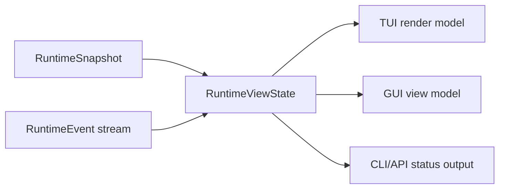

# 前端对接契约

English version: [frontend-integration-contract.md](frontend-integration-contract.md)

本文定义已经完成的核心 runtime 模块如何暴露给 TUI、GUI、CLI automation 和未来
clients。这是契约文档，不是 UI 布局规范。TUI 和 GUI 实现必须消费这些事实，不能自己
拥有 provider loop、tool execution、permission decisions 或 workflow state。

## 冻结契约标识

Core `0.3.0` 将 `frontend-contract-v1` 冻结为前端 schema `1`。完整的兼容清单、
migration gate、fixture corpus 和 post-commit 证据字段记录在
[Core 0.3 兼容性](core-0.3-compatibility.zh-CN.md)。

| 字段 | 冻结值 |
| --- | --- |
| Component | `viden-core` |
| Component version | `0.3.0` |
| Active schema | `1` |
| Supported schemas | `[1]` |
| Client boundary | `CoreClient` 和 `viden-core` 重导出的 protocol/view contracts |
| Contract payload | `contract_payload_sha: 5bd2b80b0953f4194d082940a7b9164c7231ca2d` |

Core handshake 公布以下精确且按字典序排列的 capability 集合：

```text
runtime.agent_dag
runtime.approvals
runtime.commands
runtime.context
runtime.cost
runtime.events
runtime.evidence
runtime.merge_gate
runtime.queued_input
runtime.replay
runtime.snapshot
runtime.transcript_page
runtime.typed_lanes
runtime.typed_tasks
ui.preferences
```

Core `0.3.4` 保持 schema `1`，并单独公布以下按字典序排列、独立版本化的 extension
capability。只具备 base 的 client 仍可连接；每项功能自行检查 extension，缺失时必须明确
显示 unavailable，且 command transport 零发送。

```text
core.workspace_host
runtime.agent_adapters
runtime.agent_permission_bridge
runtime.agent_session_input
runtime.agent_sessions
runtime.audit
runtime.credential_handles
runtime.credential_staging
runtime.lane_lifecycle
runtime.lane_owner_projection
runtime.project_onboarding
runtime.recent_work
runtime.starter_lane_preview
runtime.trust_loop
runtime.workspace_eligibility
ui.preference_persistence
```

这里记录的是评审通过的 payload commit SHA。本文位于单独的 evidence commit 中；该
evidence commit 是 TUI/GUI 的共同精确分支基线，并且它的 parent 必须等于这里记录的
payload SHA。Payload commit 内没有猜测或写入自引用 SHA。

## 对接原则

- 核心模块通过 `RuntimeSnapshot`、有序 `RuntimeEvent` 和 `RuntimeViewState`
  发布事实。
- 前端代码只从 `viden-core` 导入 transport-neutral `CoreClient` 边界和公共
  protocol/view contracts。不能导入 runtime、provider、tool、permission、session
  或 workflow 内部模块。
- pre-release 前端分支通过 `viden_core::LocalCoreHost` 打开项目。它会
  canonicalize 已存在的 workspace 目录，运行共享 runtime bootstrap，启动
  `RuntimeSupervisor`，并返回已绑定的 `CoreClient`。重新绑定到另一 workspace
  会创建独立 binding 和 stream，不能改变已有 client 的 cursor 或 snapshot。client
  以 `core.workspace_host` 门禁该可信边界；credential ingress 另要求
  `runtime.credential_staging`。
- 前端通过 `RuntimeCommand` 发送意图；不能直接调用 tools、providers 或
  permission engines。
- `RuntimeViewState::apply_event` 是 client-visible state 的标准 reducer。TUI、
  GUI、API 和测试应该共享等价 replay fixtures。
- Durable workflow facts 保存在 `viden-workflows`；session transcript facts
  保存在 `viden-session`。前端只渲染，不能直接修改。
- UI-only state 只包括布局、选择、焦点、过滤、排序、本地面板展开和 scrollback
  位置。
- `viden_core::legacy` 只是 pre-v3 TUI 的临时兼容 bootstrap，且已 deprecated。
  新的 TUI、GUI、CLI 和 API client 禁止使用它。

## 核心模块映射

| 核心模块 | 前端区域 | 主要事实 | Commands / actions | 状态 |
| --- | --- | --- | --- | --- |
| Workspace host | first-run project open、workspace rebind | `WorkspaceBinding.canonical_root`、`session_id`、`stream_id` | `LocalCoreHost::open_workspace` | Core `0.3.2` extension `core.workspace_host` |
| Workspace Lane eligibility | 新建 Lane 入口可用性、隔离模式与分类诊断 | `RuntimeViewState.workspace_eligibility`、`WorkspaceEligibilityUpdated` | `PreviewDefaultStarterLane` | Core `0.3.5` extension `runtime.workspace_eligibility`；只有 Core 决定在有效 `HEAD` 时使用 Git branch/worktree 隔离，否则使用直接工作区模式 |
| Trusted credential staging | provider credential 输入、platform-secret bridge | `CredentialRequestId`、`CredentialHandle`、`ProviderHealthView.credential` | `BoundCoreClient::stage_credential`，然后发送 `StoreCredentialHandle` | Core `0.3.2` extension `runtime.credential_staging` |
| Compatibility and transport | client bootstrap、reconnect、compatibility error | `CoreHandshake`、schema version、capability set、`EventCursor`、snapshot/replay envelopes | `CoreClient::discover`、`snapshot`、`replay`、`recv`、`transcript_page` | Core `0.3.0` 已冻结 |
| Runtime supervisor | activity rail、live work indicator、cancel 操作 | `RuntimeEvent`、`RuntimeViewState`、`RuntimeErrorView` | `SubmitUserInput`、`QueueFollowUp`、`CancelActiveTurn` | 已落地 |
| Cockpit context | 有界 workspace source、结构化 change/check、MCP/LSP health | `WorkspaceSourceUpdated`、`WorkspaceChangeUpdated`、`CheckRunUpdated`、`RuntimeServiceHealthUpdated` | 只读 status sampling；常规 runtime/tool command 产生 facts | Core `0.3.5` extension `runtime.cockpit_context_v1` |
| Mode and permissions | top bar、approval panel、permission picker | `RuntimeSnapshot.work_mode`、`RuntimeSnapshot.permission_level`、`ApprovalRequestView` | `SetWorkMode`、`SetPermissionLevel`、`RespondToApproval` | 已落地 |
| Provider/model setup | provider panel、model picker、health strip | `RuntimeSnapshot.provider_id`、`ProviderHealthView`、active model config | `ConfigureProvider`、`SelectModel`、`ActivateModel`、`DeactivateModel` | 已落地 |
| Tool execution | transcript tool cards、active tool strip、evidence list | `ToolCallStarted`、`ToolCallFinished`、structured `success` / `exit_code` | 只发送 approval response；tools 由 core 执行 | 已落地 |
| Agent DAG and tasks | agent board、lane list、task detail、next-action dock | `AgentDagRecord`、`AgentTaskRecord`、`AgentNextAction` | `StartAgentDag`、`StartAgentTask`、`CancelAgentTask` | `0.2.2` 已落地 |
| Agent workflow visibility | Mission Control board、workflow strip、plan/now/done/acceptance/blocked columns | `AgentDagRecord`、`AgentTaskRecord`、`EvidenceView`、`MergeGateRecord`、`RuntimeErrorView` | 现有 workflow/task/evidence/merge commands | 提案 |
| ContextBundle | context panel、token pressure meter、omitted-source list | `ContextBundleRecord`、`ContextSourceRecord`、token budgets | 当前无直接 mutation；后续增加 context-policy commands | 部分落地 |
| Evidence and merge gate | evidence center、diff/test/review checklist、merge gate card | `EvidenceView`、`MergeGateRecord` | `RecordAgentEvidence`、`AcceptMergeGate`、`RejectMergeGate`、`AcceptAgentArtifact`、`RejectAgentArtifact`、`MergeAgentPatch` | `0.2.3` reducer 第一刀已落地 |
| 跨 Lane trust loop | handoff/review/contract/dependency cards、conflict 与 revert recovery | `HandoffRecord`、`ReviewRequestRecord`、`ContractRecord`、`DependencyRecord`、typed `MergeGateRecord`、`ConflictBounce`、`RevertRecord` | `CreateHandoff`、`RequestReview`、`DecideReview`、`ConfirmContract`、`SetDependency`、`BounceMergeConflict`、`RevalidateMergeConflict`、`RevertAppliedChange` | Core `0.3.2` extension `runtime.trust_loop` |
| Token/cost | cost bar、provider card、task budget panel | `TokenCostView`、provider telemetry | 后续 budget commands | 部分落地 |
| Lanes and external agents | lane monitor、external-job cards | `AgentLaneRecord`、Lane 生命周期 events | 协商后启用 Lane 生命周期 commands | Core `0.3.2` extension `runtime.lane_lifecycle` |
| 原生与 ACP agent session | 内置 DeepSeek/OpenAI 工作，以及 Codex/Claude/Kiro ACP session | `AgentAdapterView.startability`、`AgentSessionView`、`RuntimeViewState.agent_session_inputs`、有序 `agent_conversation` | `StartAgentSession`、`SendAgentSessionInput`、`RetryAgentSession`、`CancelAgentSession` | Core `0.3.5` extensions `runtime.agent_adapters`、`runtime.agent_sessions`、`runtime.agent_session_input`、`runtime.agent_conversation` |
| Live Lane runtime owner | 精确 cancel 可用性与 owner-scoped control | `LaneRuntimeOwnerBinding`、`LaneRuntimeOwnerBound`、`RuntimeViewState.lane_runtime_owners` | 使用精确 bound envelope owner 的现有 `CancelActiveTurn` | Core `0.3.2` extension `runtime.lane_owner_projection` |
| 已审阅 starter Lane | 首启 starter 选择与隔离目标审阅确认 | owner-scoped `StarterLanePreview`、`StarterLaneReceipt`、typed invalidation reason | `PreviewStarterLane`，再携带精确 preview id/hash 发送 `CreateStarterLane` | Core `0.3.2` extension `runtime.starter_lane_preview`；Git 工作区携带 branch/worktree facts，直接工作区两者均为空 |
| Errors and recovery | inline warning、recovery dock、retry action | `RuntimeErrorView`、`AgentNextAction` | task-specific retry command 或已有 runtime command | 已落地 |
| UI preferences | locale、skin/mode、density、motion | 同步的 `RuntimeViewState.ui_preferences` 与 `RuntimeSnapshot.ui_preferences`、`UiPreferencesUpdated` | `SetUiPreferences`、`ResetUiPreferences` | Core `0.3.2` extension `ui.preference_persistence` |
| Recent work | 跨项目历史与 resume 入口 | `RuntimeViewState.recent_projects`、`recent_sessions`、`recent_work_diagnostics`、`RecentWorkLoaded` | `QueryRecentWork` | Core `0.3.2` extension `runtime.recent_work` |
| Audit timeline | 谁在什么对象上做了什么、结果如何 | `AuditRecord`、`AuditPage`、`AuditCursor`、`AuditObjectRef`、`AuditActorFilter`、`AuditPageLoaded` | `QueryAudit` | Core `0.3.5` extension `runtime.audit`；newest-first、`before` 为排他上界、页大小钳制在 `1..=500`。`AuditPageLoaded.command_id` 指名它所回答的那次读取；客户端要求精确匹配，仅当 page 不带 id 时才退回到"关联自己已被 accept 的查询"，且不得从记录内容反推。`AuditQuery` 的 actor 与 `[from, until)` 过滤在分页之前应用，因此 `complete` 与 `next_before` 描述的是过滤后的 timeline |
| 工作区文件清单 | 当前工作区的有序路径列表 | `WorkspaceFileEntry`、`WorkspaceFileKind`、`WorkspaceFilePage`、`WorkspaceFilesLoaded` | `QueryWorkspaceFiles` | Core `0.3.5` extension `runtime.workspace_files`；在读取任何目录项之前先过权限门禁，工具名为非变更的 `workspace_file_inventory`，输入路径为工作区根。deny 与未解决的 ask 都以 `CommandRejected` 返回，指名这次确切的读取并携带拒绝原因——绝不发布空 page，也绝不发送不带 command id 的裸 `Error`（那会让有读取在途的客户端把无关失败误认成自己这次读取的拒绝）。该工具不产生变更，因此 plan mode 仍可回答。遍历遵循 gitignore，并无条件排除 `.git/`、`.viden/`、`.omx/`、`.worktrees/`、`.ref/`。条目按字典序排列；prefix 过滤、排他的 `after` 游标与 `1..=500` 的 limit 钳制都作用在该顺序之上，因此 `complete` 与 `next_after` 描述的是过滤后的有序清单。`WorkspaceFilesLoaded.command_id` 为必填，因此不像 audit page 那样存在无法关联的情形。客户端不得自行遍历文件系统 |

Core `0.3.4` 中，续聊与 retry 保持逻辑 session id 和精确 `RuntimeOwner` 不变。
在同一个 Core 进程生命周期内，健康的 ACP continuation 会复用常驻 agent 进程与
agent-native session，直接发送 `session/prompt`。若该进程已退出、agent/config 不再匹配，
或 Core 自身已重启，Core 才会先重连并重新加载持久化的 agent-native session。回退判断必须
发生在 prompt 发送前；prompt 是否已送达存在歧义时，Core 不得自动重放。取消必须使用精确
owner，并在适用时回收空闲的常驻连接。该优化最多保留八个 ACP Session；空闲超过 15 分钟的
连接由 Core 回收。Supervisor 关闭时会在 Core host 被释放前回收该工作区的全部常驻连接。
`AgentSessionInputAccepted` 在 ACP 启动或复用前追加，
重启后的 snapshot/replay 会恢复 session 及已接受输入。Retry 是同一逻辑 session 的新
attempt，前端不能从显示文本推断出一个新 session。

`RuntimeViewState.agent_conversation` 是 Agent Session 客户端使用的有界、有序对话真源。
Core 将首次 `AgentSessionStarted` task、每次已接受续聊的 start，以及每次非空完成回复，
归约为稳定的 `AgentConversationMessageView` 行；retry 不会重复追加用户消息。前端必须按序
渲染这些行。只有旧快照未声明 `runtime.agent_conversation` 能力时，才可使用最新
`task`/`output` 对作为兼容回退。

流式回复以有序 `AssistantDelta` chunk 到达，每个 chunk 携带 session id 以及整个 prompt turn
共用的稳定 message id。重放这些 chunk 会生长出唯一一条 `AgentConversationMessageView`，其
content 恰好等于最终回复；作为终止标记的完成事实只结算该 turn，不会再追加一份副本。非文本
内容通过 `AgentMessagePart` 传递：带 media type 与指向 Agent parts 目录的不可变 content
reference 的 typed `AgentContentPart`，绝不内联字节。`agent_message_part` 是 schema-1 的已知
event type，因此 part 会被归约而不是作为未知事件隔离；part 只挂到其事件指名的那条消息上；
Core 未建模的 part kind 原样往返，而不会被丢弃。规范扩展 fixture 为 `streamed-turn.json`
与 `message-parts.json`。

前端确认仍由有序事件驱动，并应在 input/start 事实到达时立即显示。热 ACP turn 不得再次
承担 `initialize` 或 `session/load` 往返；模型排队、上下文处理与推理耗时仍属于
agent/provider latency，应与 Core dispatch latency 分开报告。
重启后若进程内 Lane binding 已消失，唯一 terminal ACP Session 可继续使用其持久、精确的
Session owner 续聊。Core 必须在 `AgentSessionStarted` 前为同一 owner 发布
`LaneRuntimeOwnerBound`，让 continuation 在整个 active attempt 中保持 owner-routable 且可见；
client 与 adapter 仍必须拒绝重复 Session、owner 错配以及非 ACP 恢复。

### Cockpit Context

该区域只使用 `runtime.cockpit_context_v1` 这一 capability 名称。Workspace source
采样严格只读，并有时间与内存上限。超时采样会先终止完整 process tree，再 join
有界 output reader：Unix 使用隔离 process group；Windows 先以 suspended 状态启动
process、将其加入 kill-on-close Job Object，然后才恢复运行。
`WorkspaceSourceStatus` 为 `ready`、`unavailable` 或 `truncated`；只有 `ready`
状态下的 branch totals 才具有权威性。后续失败或截断的采样必须通过有序
`WorkspaceSourceUpdated` event 替换旧的 ready source，不能继续显示过期数据。

Change 与 check 来自结构化 tool result，不能解析 transcript 文本；其 identity 是
`(RuntimeOwner, id)`。Patch 的 additions/deletions 必须在 display bytes 截断前计算，
change kind 只能根据结构化 diff marker 保守判断。MCP 在 execution/permission path
接通前保持 unavailable；LSP 仅在已配置的 child process 仍在运行时为 ready。

所有 cockpit lifecycle 与 tool-result facts 都进入标准的有序 `RuntimeEvent`
journal、reducer、snapshot 和 replay 路径。每个 Lane 的第一个 native 或 ACP
agent/session identity 会原子持久化；重启时恢复该 identity，并发重复尝试只产生一个
持久 identity，冲突 identity 必须在接受工作前 fail closed。

## Event 消费规则

前端必须按 sequence 顺序处理 events。



- `SnapshotUpdated` 替换 baseline snapshot。
- `AssistantDelta` 追加到 `assistant_stream`；客户端也可以按 transcript 顺序渲染
  deltas。
- `assistant_stream` 是当前流式回合的 in-flight 表面，而不是持久 transcript。终态
  agent-session fact——`AgentSessionCompleted`、`AgentSessionFailed`，或携带终态
  status 的 `AgentSessionUpdated`——会清空它。结算之后，回复由该终态 fact 的
  `session.output` 和 owner-scoped `agent_conversation` 承载；读取已完成回合时请
  读这两者，而不是该 stream。没有 agent session 的回合（内置本地 provider 不发出
  agent-session facts）没有终态事件，其文本照旧留在 stream 中。
- `ToolCallStarted` 插入 active tool call；`ToolCallFinished` 移除 active tool
  call，并可能追加 evidence。
- 由已执行 provider tool 产生的 facts 按因果顺序发出：
  `ToolCallStarted`、`ToolCallFinished`，随后是该结果产生的
  `WorkspaceChangeUpdated` 或 `CheckRunUpdated`。任何后续失败（包括第二个 tool
  dispatch 或 transcript/cost persistence 失败）都必须先保留这段已完成前缀，再发出
  `Error`。
- `TaskUpdated`、`AgentDagUpdated`、`LaneUpdated`、`EvidenceRecorded`、
  `ContextUpdated`、`MergeGateUpdated`、`HandoffUpdated`、
  `ReviewRequestUpdated`、`ContractUpdated`、`DependencyUpdated`、
  `MergeConflictBounced` 和 `RevertRecorded` 按 id upsert records。
- `ApprovalRequested` 和 `ApprovalResolved` 维护 pending approvals。对于受
  supervisor 管理的 provider turn，supervisor 实时发出的 pair 是唯一权威来源；
  buffered turn output 不得重复 synthetic pair。
- `InputQueued` 和 `InputDequeued` 维护 follow-up input state。
- `ProviderHealthUpdated`、`TokenCostUpdated` 和 `Error` 更新侧栏或状态区，不能阻塞
  composer input。
- `WorkspaceSourceUpdated` 替换完整 source sample；
  `WorkspaceChangeUpdated` 与 `CheckRunUpdated` 按 `(owner, id)` upsert；
  `RuntimeServiceHealthUpdated` upsert 单个 service-health sample。
- `ProjectProbed`、`ProjectConfigPreviewed`、`ProjectConfigConfirmed` 与
  `CredentialHandleStored` 更新项目接入状态；client 不能只凭 command acceptance
  推断文件已经写入成功。
- `UiPreferencesUpdated` 是 preference command 唯一持久化确认，并同步更新顶层与
  snapshot preference facts。
- `RecentWorkLoaded` 原子替换三组 recent-work view slice；snapshot 与 replay 可恢复最近
  一次已加载的安全结果。
- `StarterLanePreviewed` upsert 一条 owner-scoped preview；
  `StarterLanePreviewInvalidated` 只移除精确 owner/id；`StarterLaneCreated` 用权威
  receipt 和持久 Lane fact 替换该 preview。payload owner 必须等于 envelope owner。
  这些 event 使用正常的进程内 snapshot 和 replay 恢复语义。
- `LaneRuntimeOwnerBound` 按 `lane_id` upsert 一条精确 live-worker binding；同一
  Lane 的后续 binding 替换旧值。payload owner 与 envelope owner 不同时在 wire
  boundary 拒绝；若 `owner.lane_id` 与 `lane_id` 不精确相等则由 reducer 忽略。
  `LaneUpdated` 进入 `done`、`failed`、`cancelled` 或 `archived` 时，只移除该 Lane
  的 binding。
- 实时工作事实——`AgentTaskRecord`、`ToolCallView`、`QueuedInputView` 与
  `EvidenceView`——携带一个 optional 的完整 `RuntimeOwner`。Core 只在发出点持有真实
  owner 身份时设置它，否则不写入 wire。client 只能通过与该 Lane 精确
  `LaneRuntimeOwnerBinding` 的完整 owner 相等来把这类事实归属到 Lane；owner 缺省或
  不一致即表示该事实不属于任何 Lane 范围，client 绝不能依据时序、顺序或展示标签归属。
- bind-once Lane-agent execution identity 是持久 workflow metadata，独立于公开
  Lane lifecycle event log 存储。它在重启后仍可用于仲裁并发启动，但不能证明某个
  agent session 当前仍然存活。
- 每个 command、snapshot 和 event envelope 都使用 schema `1`。已知 event 的
  sequence 必须等于 cursor sequence。
- client 必须先调用 `discover`，才能发送 command 或消费状态。缺少 required
  capability 或使用不支持的 schema 都属于 compatibility error。
- duplicate/older cursor 不修改已确认状态；连续 next event 正常归约；gap 触发
  replay；stream mismatch 或 replay 要求 snapshot 时，只能在验证通过后替换状态。
- 未知 optional event payload 可以保留供检查，但不能生成本地业务状态。未知 mandatory
  fixture capability 必须拒绝。malformed 的实时 wire 输入必须拒绝；而 malformed 或
  未知的**已持久化** transcript 行改为逐行隔离，详见“协议演进规则”。

## 协议演进规则

这些规则约束 runtime 协议与磁盘 transcript 如何演进，才不会破坏更旧或更新的构建。
它们由 `crates/types/tests/evolution_guardrails.rs` 以可执行形式固定；改变其中任一
行为都属于契约变更，而不是重构。

- **新增字段必须是可选的。** event、command、snapshot 或 transcript payload 上的新
  字段，必须既能被早于它的构建读取，也能被晚于它的构建写入：读取方忽略未知字段，新增
  可选字段带 `#[serde(default)]`。wire 与 transcript 类型不得使用
  `deny_unknown_fields`。
- **重命名保留旧 tag。** 被重命名的 variant 必须以 `#[serde(alias = "...")]` 保留它
  曾经序列化过的每一个 tag，同时以新名称作为写出的规范名。参考实现是
  `crates/types/src/lib.rs` 中的 `AgentTaskStatus`。
- **未知 event type 必须可往返，不得报错。** 本构建不认识的 event type 反序列化为
  `RuntimeWireEvent::Unknown { event_type, payload }`，再序列化时原样保留 payload
  交给下一跳，并归约为 no-op。拒绝它会因为一个扩展而丢弃整条流。
- **transcript 回放隔离单行，绝不使整个文件失败。** 未知 entry type、未知 runtime
  event kind 或 malformed payload 只隔离那一行——由
  `SessionStore::load_transcript` 以 `QuarantinedLine { line_number, raw, reason }`
  报告——会话其余部分照常加载。磁盘回放与实时 wire 对“已知”的判定一致，因为两者都走
  `RuntimeWireEvent`。隔离绝不静默：会话 hydrate 以 system fact 呈现数量，recent work
  上报 `recent.quarantined_transcript_lines`。数据不会丢失，因为 transcript 是
  append-only，加载过程从不重写文件。
- **batch 语义不因隔离而改变。** transcript batch 内被隔离的行仍然整体作废该 batch；
  只有已 commit 且完整的 batch 才会被回放。
- **面向 wire 的 enum 使用 `#[non_exhaustive]`。** `RuntimeEventKind` 与
  `TranscriptEntry` 标注了 `#[non_exhaustive]`，因此新增 variant 不会破坏兄弟 crate：
  crate 外的每个 match 都必须已经带有通配分支。这是上述两条运行时规则在编译期的对应。

## Command 归属

| 用户意图 | 前端发送 | Core 负责 |
| --- | --- | --- |
| 启动普通 turn | `SubmitUserInput` | provider loop、context bundle、tools、transcript |
| 工作运行时追加输入 | `QueueFollowUp` | queue ordering 和后续 dequeue |
| 取消当前工作 | 携带所选 Lane 精确 bound envelope owner 的 `CancelActiveTurn`，或 `CancelAgentTask` | 精确 owner 校验、request cancellation 与 task/Lane state |
| 启动受监督 workflow | `StartAgentDag` 然后 `StartAgentTask` | DAG validation、dependencies、workflow events |
| 修改 mode/permissions | `SetWorkMode`、`SetPermissionLevel` | permission mode mapping 和 policy enforcement |
| 批准或拒绝 tool | `RespondToApproval` | decision recording 和 gated execution |
| 记录 gate evidence | `RecordAgentEvidence` | evidence validation、`EvidenceRecorded`、gate reducer、workflow event |
| 审核 merge gate | merge/artifact commands | gate state、workflow events、patch application |
| 协调跨 Lane trust | handoff/review/contract/dependency commands | typed owner/audit facts、dependency state、validator policy 与 replay |
| 恢复 apply | `BounceMergeConflict`、revalidated evidence、`RevertAppliedChange` | 回到原 Lane、workflow write-ahead fact、byte rollback 与 typed recovery |
| 配置 provider/model | provider/model commands | config persistence、registry validation、health |
| 探测并接入项目 | `ProbeProject`、`PreviewProjectConfig`、`ConfirmProjectConfig` | Git/config probe、精确审阅字节/hash、权限控制写入与 replay |
| 保存 credential 引用 | 带 opaque ingress id 的 `StoreCredentialHandle` | 注入 backend、安全 handle fact、provider health 与 secret 隔离 |
| 加载 recent work | `QueryRecentWork { query }` | shared-home 发现、canonical metadata 校验、稳定排序、边界、diagnostic 与安全 view projection |
| 创建 starter Lane | `PreviewStarterLane`，审阅结果后携带未变化 request/id/hash 发送 `CreateStarterLane` | preset 解析、workspace/isolation 校验、permission gate、执行前复检、补偿和 typed receipt |

Starter Lane 的隔离模式由 Core 决定，而不是由前端决定。位于 Git work tree 且具有有效
`HEAD` 的工作区继续使用 branch 与 worktree 隔离；其他任何真实存在的目录都创建直接工作区
Lane，其中 `AgentLaneRecord.branch = None`、`worktree = None`，receipt 的
`worktree_path` 指向已打开目录的 canonical path。直接工作区 Lane 不创建 `.git`、branch
或 `.worktrees`，其 approval preview 绑定 canonical workspace identity，而不是伪造 Git
revision。两种模式都必须继续经过标准 permission gate 与精确 preview hash 校验。

`PreviewProjectConfig` 是只读命令。有效 preview 包含其 SHA-256 所描述的精确 UTF-8
内容；无效或携带 secret 字段的候选不返回这些内容，也不能 confirm。此类
仓库根 `viden.toml` 只接受 D11 的 `project`、`gates`、`runner`、`budget`、`targets`
schema，未知 root/nested field 一律拒绝。Provider、backend 与 ingress 标识必须是有长度
上限的 opaque ASCII id，不能是 path 或 secret-like label。序列化的 credential
commands、events、transcript rows 与 workflow audit 都不得包含 credential
secret bytes。

对于本地前端，credential bytes 只能穿过可信 host API：
`BoundCoreClient::stage_credential(provider_id, backend_id, SecretBytes)` 返回可序列化的
`CredentialRequestId`。`SecretBytes` 不能 clone、不能 debug 打印、不能序列化，并在
drop 时清零。staged request 绑定 workspace、provider 和 backend，五分钟后过期，受 host
capacity 限制，并且只在调用 platform credential sink 前精确移除一次。错误的
workspace/provider/backend 不能消费其他 workspace 的 request id；sink 失败会消费该
request，避免重放 secret bytes。在注入 platform sink 之前，production `LocalCoreHost`
返回 typed unavailable error，而不是保存 secret。

前端发送 command 后不能自行合成成功状态。必须等待 `CommandAccepted` 和后续状态事件。
如果 command 被拒绝，渲染 `CommandRejected.reason`。

### 已审阅 Starter Lane

只读 preview 把 `coder`、`reviewer` 或 `tester` preset 解析为精确 owner、Lane record、
branch、canonical worktree path、当前 Git base、diagnostics、preview id 与 SHA-256。hash
绑定 owner 和全部已解析创建字段。create 是一次性请求，必须匹配原 request、owner、id、
hash、当前 base、branch 可用性和 worktree 可用性。Core 在任何 Git/workflow effect 前
执行 permission check；approval pending 结束后、真正执行前再次检查 base/path/branch。
approval pending 期间，已审阅 preview 继续可见；同一 Lane 的第二个 reviewed create、
legacy `CreateLane` 以及其他 Lane mutation 会被拒绝，且不能替换首个 preview 的
receipt 关联。
`CancelActiveTurn` 是例外：approval 可见后，它会把该 approval 干净地归约为 deny，
以 `permission_denied` 失效 preview，且不产生 Lane、recovery、error、Git 或 workflow
effect。

已匹配但无效的请求，以及被拒绝或失败的执行，会携带封闭 reason code 发出
`StarterLanePreviewInvalidated`。未知 id 或错误 owner 不会消费其他 owner 的 preview。
只有 `StarterLaneCreated.receipt` 能授权前端立即进入已创建 Lane；`LaneUpdated` 仍是持久
Lane fact，不能替代本次审阅 receipt。若 Git worktree 创建后持久化失败，Core 会先移除
worktree 和本次新建 branch，再报告 recovery。

preview 在当前 runtime stream 内属于正常 owner-scoped state，重连后可通过 snapshot 和
replay 恢复。进程重启会创建新 stream 和 preview cache，因此旧 preview 必须重新生成。
旧 `CreateLane` command 继续兼容已有调用方；首启 D4 flow 使用已审阅 command pair，且
只有 handshake 公布 `runtime.starter_lane_preview` 后才启用。

### Live Lane Runtime Owner

`LaneRuntimeOwnerBinding { lane_id, owner }` 是 live `LaneWorkerHandle` 的进程内
authority。Core 从真实 worker handle 直接复制 `owner`；禁止从持久 Lane state、当前
selection、显示文案或 frontend default 重建 workspace、project、Lane、session、task、
turn 中的任何字段。新 worker spawn 后，Core 先发布 `LaneCommandAccepted`，再发布
`LaneRuntimeOwnerBound`，之后 worker 才能发布该 command 驱动的 Lane state。同一
runtime stream 内，snapshot 与 replay 保留精确 binding。

进程重启会建立新 stream，并且刻意不从 hydrated Lane record 恢复 runtime owner。第一条
被接受且会 spawn 新 live worker 的 owner-scoped command 才发布 fresh binding。owner
mismatch、Lane 缺失或已终止、Plan mode 拒绝、hydration failure，或任何没有创建 live
worker 的路径都不发布 binding。

Frontend cancel 必须 fail-closed。client 先 discover
`runtime.lane_owner_projection` extension capability，再要求所选 active Lane 恰好一条
合法 binding，并把完整 bound owner 原样放入 `CancelActiveTurn` envelope。capability
缺失、零条或多条匹配、或任意 `owner.lane_id` mismatch 时，cancel 显示 unavailable，
command transport 零发送。未来未知 runtime-owner event 只作为可检查 wire event保留，
不修改 `RuntimeViewState`。

当精确 owner 同时拥有活跃模型 turn 与 live Lane worker 时，`CancelActiveTurn` 必须优先
取消模型 turn 并保留 Lane binding；只有不存在精确活跃模型 turn 时，才考虑 Lane 生命周期
取消。

## Agent DAG 和 Task UI 契约

`AgentDagRecord` 是 workflow container。`AgentTaskRecord` 是前端可见的工作单元。

首个 workflow surface 应回答 [Agent Workflow Visibility](agent-workflow-visibility.zh-CN.md)
定义的 Mission Control 问题：assignment rationale、后续计划、正在工作、已完成输出、
验收状态、blockers 和 cost impact。

必须渲染的字段：

- `id`、`parent_id`、`agent`、`kind`、`transport` 和 `title` 标识 task。
- `status`、`activity` 和 `progress` 驱动可见状态和进度。
- assignment reason 和 cost profile 解释为什么这个 agent/tool/skill 负责该任务。
- `summary`、`result` 和 `next_action` 描述结果和下一步。
- `workspace`、`evidence` 和 `permissions` 链接支撑事实。
- `started_at` 和 `updated_at` 只用于显示时间；排序不能替代 runtime event sequence。

状态处理：

| 状态组 | 值 | UI 行为 |
| --- | --- | --- |
| Pending/running | `queued`、`thinking`、`streaming`、`editing`、`running_tool`、`testing`、`reviewing`、`running`、`attached` | 显示 active animation，允许 cancel，composer 保持可编辑 |
| Waiting | `waiting_approval`、`needs_input`、`blocked` | 显示需要用户处理的动作或 dependency |
| Completed | `done`、`applied`、`discarded`、`archived` | 显示 outcome、evidence 和 next action |
| Failed/cancelled | `failed`、`cancelled` | 显示 recovery hint 和 retry/cancel history |

## Evidence 和 Merge Gate UI 契约

从前端视角看，Evidence 是 append-only。

- `EvidenceView.id` 是稳定 lookup key。
- `kind` 控制 icon、filter 和 checklist grouping。
- `summary` 是 human-readable，可在紧凑界面中截断。
- `path` 存在时链接文件或 artifact。
- `source` 表示 role、tool 或 runtime source。
- `timestamp` 只用于显示。

`MergeGateRecord` 将 evidence 连接到 task：

- `required_evidence` 声明 checklist。
- `evidence_ids` 记录已收集 evidence。
- `status` 控制 action surface。
- `gate_type`、`owner`、`validator` 与 `policy_snapshot` 保存 decision 使用的
  authority 和 policy。
- `decision` 是包含 reason、实际 actor、精确 reviewed evidence id/hash 绑定、review
  request id、audit id 和 timestamp 的 typed outcome。Schema-1 的旧 string decision
  只作为 migration fact 读取；新写入不再序列化 string。
- `conflict`、`applied_change_id`、`recovery_snapshot` 与 `audit_ids` 连接 bounce、
  apply、跨重启 revert recovery 与 audit，前端不能自行推断。`recovery_snapshot`
  只暴露安全 snapshot id 与 manifest hash；恢复 bytes 保留在 workflow 私有存储中。

当前 `0.2.3` reducer 行为：

- 前端用 `RecordAgentEvidence` 记录外部 evidence。
- Core 发出 `EvidenceRecorded`，随后发出 `MergeGateUpdated`，并持久化对应的
  `agent_evidence_recorded` workflow event。
- `MergeGateRecord.status` 由已记录 evidence 的 kind 归约，不由前端本地 checklist
  状态或 evidence id 后缀推断。
- 缺少 required evidence 或只有 summary 时 gate 保持 `collecting_evidence`；只有已验证的
  canonical reference 能满足 required evidence。
- Provider/assistant task output 始终只是展示用 `task_summary` evidence，即使内容包含
  diff，或声称 hash、verification、test、permission 状态也不例外。Canonical evidence
  必须绑定真实 ContextStore bytes 与 Core 签发的 permission receipt。
- canonical evidence 全部满足后，基础 gate 可以进入 `accepted`。要求 independent review
  的 gate 或 conflict 后重新验证的 gate，必须由指定 validator 对当前精确 evidence
  id/hash 集再次显式 typed accept，之后才能 merge。
- `RequestReview.owner` 必须完整匹配发起请求的 gate owner scope
  （`workspace_id`、`project_id`、`lane_id`、`task_id`），不能只匹配 lane 字符串；
  它也不是 validator。Core 从 `reviewer_lane_id` 派生 validator lane，因此 reviewer
  不能创建自我授权的 review request。`dependency_id` 绑定唯一
  `(task_id, depends_on_task_id)` edge，包含 `Unblocked` 更新在内都不能重绑到另一条
  edge。
- `DecideReview` 记录 reviewer 对 pending review 的结论。只有独立评审 Lane 可以决定；
  被评审的 evidence binding 必须仍与请求一致；接受结论会为 gate validator 打上
  `validated_at`；已结算的评审不会被后续 gate 决定覆盖。关联评审为 rejected 时
  `AcceptMergeGate` 失败关闭，`RejectMergeGate` 仍然可用。可选 `feedback` 只是评审记录
  上的 reviewer 文本，在发布的 command event 中与 rejection reason 一样被脱敏。
- evidence 被 reject 后 gate 进入 `needs_changes`，并从 gate/task evidence 列表移除该
  evidence id。`RejectMergeGate` 和 `RejectAgentArtifact` 带显式 `actor`；Core 会在
  approval 前拒绝缺失或未授权 actor，并把通过校验的真实 actor 写入 typed decision。
- `AcceptAgentArtifact` 只接受已记录的 evidence id。未知 evidence id 会被拒绝，前端不能
  把该命令当成隐式创建 evidence 的入口。`RejectAgentArtifact` 只能 reject 已绑定到当前
  gate 的 evidence。
- Trust-loop mutation 使用正常 supervisor approval flow。Owner、dependency、decision、
  receipt 与 canonical bytes 的纯 preflight 必须在 `ApprovalRequested` 前完成。Merge 在
  文件 effect 前发布私有 content-addressed recovery snapshot 和 durable precommit；
  conflict bounce 必须绑定 gate owner 原 Lane 和已验证 canonical baseline。revert 在
  approval 前验证 snapshot 与当前 postimage，重启后同样适用。Recovery snapshot load
  是只读路径：缺失 recovery store 会返回 validation error，不创建私有目录、lock 或
  chmod 副作用；私有 recovery tree 内的 symlink 会在读取或恢复 bytes 前被拒绝。

第一批一等 required evidence kind 是 `patch`、`test_result`、`review`、`doc_update`
和 `release_artifact`。客户端可以显示其他 runtime kind，但 checklist 分组应优先覆盖这组
核心类型。

## Context 和 Token UI 契约

当前前端只读 `ContextBundleRecord`：

- `sources` 解释哪些内容进入 provider request。
- `omitted_sources` 解释哪些内容被排除。
- `estimated_tokens`、`soft_token_budget`、`hard_token_limit` 和
  `pressure_percent()` 驱动 token pressure UI。
- `largest_sources` 和 `compaction_notes` 驱动 context diagnostics。

TUI 应使用紧凑摘要和 drill-down panels。GUI 应提供 source table，并支持 included、
omitted、large、diagnostic、evidence sources 过滤。

原生 Context Engine 会继续投影 bundle-built、item/view derived、retrieval、budget、
quality、cache 和 cost events。前端可以发送带用户可见 reason 的 `RetrieveContext`，
但只有 runtime 能解析 handle 并返回 bounded content。前端禁止 import
`crates/context`、读取 canonical blobs、把 compact view 当作 Merge Gate evidence，
或计算 authoritative cost。详见
[Context、Evidence 与 Cost Engine 设计](superpowers/specs/2026-07-18-context-evidence-cost-engine-design.zh-CN.md)。

## Approval 和 Permission UI 契约

Approval 使用 `ApprovalRequestView` 和 `RespondToApproval`。

前端必须展示：

- `title`、`tool_name` 和 `message`；
- `input_preview`；
- `is_mutating`；
- `reason`；
- `RuntimeSnapshot` 中的 active permission level 和 work mode。

前端不能在用户 approval 后直接调用底层 tool。只能发送 `RespondToApproval`；runtime
负责继续或拒绝执行。

每个需要 approval 的 tool 只能有一组实时 request/resolution pair。在 multi-tool
turn 中，前一个 tool 的 `ToolCallStarted`、`ToolCallFinished` 和 structured facts
必须在下一个 `ApprovalRequested` 前发出；下一个 `ToolCallStarted` 必须位于其
`ApprovalResolved` 和 permission decision 持久化之后。同步 command result
同样保留逐 tool 顺序，不会把全部 approval pair 集中到第一个 tool completion。
如果 permission decision 无法持久化，Core 会先终结 authoritative provider 和
tool task，再发出 `Error`，且不能留下 active tool call。之后任何 provider/tool
failure 都遵守同一 turn-scoped finalization：Core 只把该 turn 登记且仍 active 的
task 标记为 failed，保留已经 terminal 的 task，不改变无关 active task，并在
`Error` 之前发布 terminal task facts。

## UI 偏好与设计入口契约

Schema `1` 暴露两端都需要的配置值，但不规定布局：

- 前端消费的 effective fact 是同步的 `RuntimeViewState.ui_preferences` 与
  `RuntimeSnapshot.ui_preferences: ResolvedUiPreferences`；前端只渲染该值，不能在
  本地重新解析偏好优先级；
- client 通过 `SetUiPreferences` 发送 typed `UiPreferencePatch`，或通过
  `ResetUiPreferences` 删除完整的用户 `[ui]` table。本地视觉 preview 不代表持久化成功；
- 只有成功的 `UiPreferencesUpdated { resolved, persisted, diagnostics }` 才确认写入。
  reset 后 `persisted` 为 `None`，`resolved` 仍会反映安全 CLI override 或 system/内置
  fallback；

- 内置 effective locale：`en`、`zh-CN`；`system` 是解析输入，不是第三套内置翻译；
- skin：`aurora`、`ice`、`mono`、`amber`、`phosphor`；
- 八组有效 effective skin/mode：`aurora/dark`、`aurora/light`、`ice/dark`、
  `ice/light`、`mono/dark`、`mono/light`、`amber/dark`、`phosphor/dark`；
- density：`compact`、`regular`、`comfy`；
- motion policy：`system`、`reduced`、`full`。

`amber` 与 `phosphor` 仅支持 dark。持久化 mutation 会在任何 approval prompt 或文件
effect 之前校验完整结果；`amber/light` 这样的无效组合会直接被拒绝。旧版无效输入在
启动时仍会回退到安全的 `aurora/dark` + regular density，并发出稳定的
`ui.invalid_skin_mode_pair` diagnostic。

个人偏好优先级为安全 CLI UI override、已存储 user `[ui]`、system 解析、内置英文。
Project `.viden/config.toml` 绝不决定个人 locale、外观、density 或 motion，也绝不作为
个人偏好写入目标。Core 只修改五个已知 `[ui]` keys，保留无关 top-level 与未来
`[ui]` keys，并通过同目录 `0600` temp、file sync、atomic replacement 与 directory sync
完成写入。TOML 损坏、profile 无效，或 Plan/Review/Explore 拒绝时，bytes、mtime 与
temp-file 状态都保持不变。

恢复权威是 user config。`UiPreferencesUpdated` 只属于当前 runtime/frontend journal
projection，不会再复制一份到 project workflow JSONL。

设计入口层级是规范，不得被旧截图或生成式截图替代：

1. 全局设计索引：`docs/viden-design/Viden/index.html`；
2. client 索引：`TUI/Viden - 设计稿索引 (TUI).html` 或
   `GUI/Viden - 设计稿索引 (GUI).html`；
3. 组件库：`TUI/Viden - 组件库 (TUI).html` 或
   `GUI/Viden - 组件库 (GUI).html`；
4. canonical 产品入口：`TUI/Viden - 统一原型 (TUI).html` 或
   `GUI/Viden - 桌面驾驶舱 (GUI).html`（D1）。

GUI `pages/Viden - D11 首启与项目接入 (GUI).html` 是下级的首次接入流程，不是 GUI
驾驶舱，也不能替代 D1 作为桌面视觉目标。本列表中所有相对路径均从
`docs/viden-design/Viden/` 起算。

## Recent Work 契约

`QueryRecentWork` 是只读命令，可在 Plan mode 使用，且绝不请求 approval。成功时 Core
精确发送 `CommandAccepted`，随后发送 `RecentWorkLoaded`。该 loaded fact 保留在
supervisor snapshot/replay view 中，但不会复制到 session 或 workflow durable JSONL。

生产 `LocalCoreHost::new()` 解析到同一个用户级 shared session home；project-local
`.viden` 目录不能冒充跨项目 inventory。只有 Core 可以扫描
`<session-home>/projects`，前端不得检查 session 文件、SQLite 或项目目录。

每个新 transcript 以一个已提交 metadata batch 开始，其中包含 canonical root 与稳定
创建时间。Inventory rebuild 逐行流式读取 JSONL，只识别 entry kind、安全计数、上述两项
metadata fact 与稳定 timestamp，绝不把 transcript body 加载成 summary。Core 会用记录的
root 重算 project key，并与所在 project directory 校验。缺 root 的 legacy record 与身份
被篡改的 record 会以稳定 diagnostic 跳过；禁止使用当前 cwd 替代。即使 SQLite index
非空，也必须与 canonical inventory 对账，不能将其直接视为完整事实。

`RecentSessionSummary` 是白名单 DTO，只包含 canonical root、session id、稳定时间与
message/tool-call/command 计数。`RecentProjectSummary` 只包含 canonical root、派生的
display name、最近稳定时间与 latest session id。两者都不包含 transcript path、title、
preview、任意 metadata、credential/backend 值，也不包含 message、tool 或 command body。
身份使用 `(canonical_root, session_id)`。

Core 把 `limit` clamp 到 `1..=100`，先按
`(last_updated_at DESC, canonical_root ASC, session_id ASC)` 对全局 session 排序并截断，
再从 bounded session result 聚合 project，因此两个返回集合都有界。

## TUI 要求

- 只从 `RuntimeViewState` 和本地 terminal layout state 渲染。
- provider turn、agent task、approval 或 tool call 运行时，composer input 必须保持可编辑。
- scrollback 必须独立于 active task state。
- 优先使用紧凑 panels：active task、approval、evidence、context pressure 和 provider health。
- 不能从 transcript 文本推断 task/tool 成功。

## GUI 要求

- 使用和 TUI 相同的 reducer 语义。
- GUI view models 必须从 `RuntimeViewState` 构造，不能来自第二套业务 store。
- GUI-only data 仅限 filters、selected ids、pane layout 和 local notifications。
- 每个展示 runtime facts 的 GUI screen 必须声明自己读取哪些字段。
- GUI 关闭或崩溃不能修改 session、workflow、provider 或 permission state。

## 冻结 Parity Corpus

Core `0.3.0` 在 `crates/types/tests/fixtures/frontend-contract-v1/` 下冻结恰好九个
schema-1 fixture：

1. `stream-tool.json`
2. `approval-allow-deny.json`
3. `queued-follow-up.json`
4. `dag-blocker.json`
5. `multi-lane.json`
6. `merge-gate.json`
7. `context-pressure-cost-blind.json`
8. `plan-denial.json`
9. `d1-vertical-slice.json`

每个 fixture 包含 id、schema version、排序后的 required capabilities、initial snapshot、
连续的 event envelopes、expected final cursor 和 final view digest。只有 v0 migration
gate 通过后才能开始 replay。每个 fixture 从同一 initial snapshot replay 两次，必须得到
相同的 `RuntimeViewState`、cursor、canonical bytes 和 SHA-256 digest。

Canonical digest 输入是 final `RuntimeViewState` 递归排序 object key 后的 compact JSON；
array 顺序保留语义。[Core 0.3 兼容性](core-0.3-compatibility.zh-CN.md) 中的 digest
表与经过测试的 fixture 值保持同步。

TUI 和 GUI 分支必须从同一个已解析的 contract payload commit 创建，并在不拥有 effect、
不推断成功状态的前提下 replay 这套 corpus。
