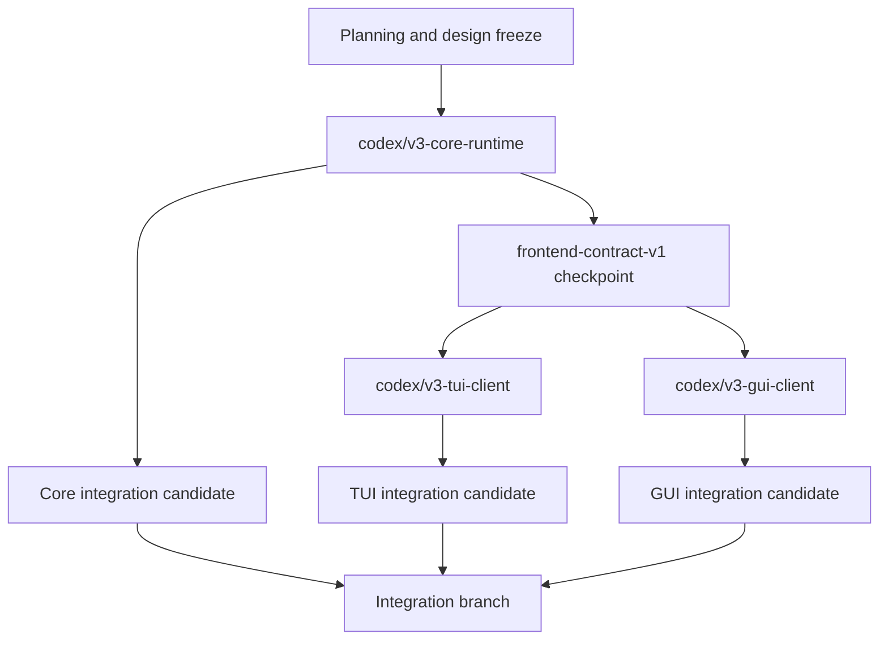

# Viden Core / TUI / GUI Three-Branch Development Plan

Chinese version: [parallel-development-plan.zh-CN.md](parallel-development-plan.zh-CN.md)

Last updated: 2026-07-22

## Purpose

This plan translates the new design under `docs/viden-design/Viden/` into three requirement classes and defines the boundaries, dependencies, phases, and acceptance gates for three long-lived development branches.

| Branch | Requirement class | Sole responsibility |
| --- | --- | --- |
| `codex/v3-core-runtime` | Core | Authoritative runtime, cross-frontend contracts, persistence, safety, and execution |
| `codex/v3-tui-client` | TUI | Terminal interaction, rendering, and TUI-local view state |
| `codex/v3-gui-client` | GUI | Desktop interaction, rendering, platform adapters, and GUI-local view state |

The governing rule is:

> Core delivers a versioned contract-freeze checkpoint first. TUI and GUI branch from that checkpoint and operate only through the same command, event, snapshot, and replay contracts.

This plan replaced the previous assumption that the GUI should immediately proceed as a Tauri implementation: Tauri and GPUI implemented the same vertical slice against the same contracts and were judged by the same evidence gate before the production framework was selected. The `0.1.0-alpha.1` gate has since selected **Tauri** as the single production framework; see the [GUI Framework Decision](gui-framework-decision.md).

## Design Sources And Naming Boundary

The current sources of truth are:

- `docs/viden-design/Viden/index.html`
- `docs/viden-design/Viden/docs/SPEC.md`
- `docs/viden-design/Viden/docs/DESIGN-REF.md`
- `docs/viden-design/Viden/docs/screens-status.js`
- `docs/viden-design/Viden/tokens.css`
- `docs/viden-design/Viden/Core/`
- `docs/viden-design/Viden/TUI/`
- `docs/viden-design/Viden/GUI/`
- `docs/frontend-integration-contract.md`
- `docs/gui-version-functional-design.md`

Two uses of Core must remain distinct:

- The design package `Core/` directory is the reference for product mechanics, branding, tokens, and visual rules. It is not an operator-facing product screen.
- The Core development branch owns the Rust engine/runtime, cross-frontend contracts, and authoritative product state.

They align through design decisions and contracts, not through a mechanical directory mapping.

Before planning or implementing TUI or GUI work, review the design package from
the unified entry point rather than opening an isolated page directly:

1. Start at `docs/viden-design/Viden/index.html` to confirm the active design
   set and avoid archived pages.
2. For TUI, open `docs/viden-design/Viden/TUI/Viden - 设计稿索引 (TUI).html`,
   then `docs/viden-design/Viden/TUI/Viden - 统一原型 (TUI).html`, then the TUI
   component library.
3. For GUI, open `docs/viden-design/Viden/GUI/Viden - 设计稿索引 (GUI).html`,
   then `docs/viden-design/Viden/GUI/Viden - 桌面驾驶舱 (GUI).html`, then the GUI
   component library.
4. Treat `GUI/pages/**`, `TUI/pages/**`, and archived pages as supporting
   evidence only after the index, unified prototype, cockpit, and component
   libraries are understood.

## Shared Product Model

The contract freeze first resolves the hierarchy as:

```text
Workspace -> Project -> Lane -> Session -> Task/Subagent
```

- Workspace is the current operator scope.
- Project maps to a repository and project policy.
- Lane is the isolated work container for routing, permissions, targets, and gates.
- Session is resumable interaction history inside a lane.
- Task/Subagent is a schedulable, cancellable, verifiable unit of work.

Lane becomes a first-class typed record with at least:

- `role`
- `route = built_in | acp | terminal | tmux`
- `gate_strength = full | cooperative | containment`
- `mutation_policy = autonomous | propose_only | read_only`
- worktree, branch, target, and data-egress policy
- status, budget, and active session ids

Legacy JSONL and fixtures remain readable through compatible deserialization or explicit schema migration.

## Three Requirement Classes

### A. Core Requirements

Core owns authoritative facts and every side effect. States shown in the TUI and GUI designs must not become a second frontend-owned business model.

#### Core P0: Contract Freeze Before Parallel Work

1. **Versioned multi-frontend protocol**
   - Freeze `RuntimeCommand -> RuntimeEvent -> RuntimeViewState`.
   - Add `schema_version`, capability discovery, event cursor, replay, and sequence-gap recovery.
   - Export a transport-neutral client contract from `viden-core`; clients do not create or mutate `SessionEngine`.

2. **Typed domain records**
   - Replace string inference for lane/task status, route, gate strength, and mutation policy with enums and records.
   - Align built-in roles with the design: planner, coder, reviewer, tester, doc-writer, researcher, and release-operator.
   - External is a transport/source/capability, not a built-in role.

3. **Promote lane runtime into Core**
   - Move authoritative worktree, terminal/tmux/PTY spawn, accept/apply, and conflict recovery out of `apps/tui/src/tui/lane.rs` into `crates/runtime` and `crates/tools`.
   - TUI and GUI send lane commands and consume lane events only.

4. **Real multi-lane supervisor**
   - Replace the single global active job with a registry keyed by lane/session/task identity.
   - Cancellation, approvals, queued input, and errors must identify their owner. One lane waiting for permission must not block another lane.

5. **Shared parity fixtures**
   - Cover streaming + tool calls, approval allow/deny, queued follow-up, DAG blocker, multiple lanes, MergeGate, context pressure, cost blind spots, and Plan mode denial.
   - Replaying one fixture in Core, TUI, and GUI must produce the same business facts.

6. **Approval and transcript contracts that can express the design**
   - Approval publishes risk, target, scope, policy reason, expiry/default action, and a stable audit id.
   - Transcript facts are paged or streamed as message/tool rows rather than only one accumulated string, enabling stable scroll anchors, history loading, and bounded virtualization.

7. **Internationalization and appearance contract**
   - Define a shared `UserPresentationPreferences` contract with language,
     locale, skin, mode, density, font scale, terminal color capability, and
     accessibility flags.
   - Ship built-in locale catalogs for `en` and `zh-CN`, with `system` as a
     resolver input; clients
     may render local strings, but Core owns the persisted preference and emits
     preference-change events.
   - Support skin/mode values derived from `tokens.css`, not hard-coded client
     palettes. The valid built-in pairs are `aurora`, `ice`, and `mono` in
     dark/light modes plus dark-only `amber` and `phosphor` (eight pairs total).
     `system` resolves to an effective dark/light mode and must never create an
     invalid light variant.
   - Keep `compact`, `regular`, and `comfy` density plus `system`, `reduced`,
     and `full` motion as configurable user preferences. The schema is open for
     future registered locales and skins, but unknown or invalid values fall
     back safely instead of becoming private client palettes.
   - Expose effective preferences in `RuntimeViewState` and replay fixtures so
     TUI and GUI render the same business state under the same language and
     appearance settings.

#### Core P1: Single-Operator Supervision Loop

- Add `handoff`, `review_request`, `contract`, and `dependency` as cross-lane primitives.
- Complete MergeGate with gate type, owner, validator, policy snapshot, structured decisions, conflict bounce, and audited revert.
- Add an append-only audit timeline and stable query/pagination contracts.
- Add repository-level `viden.toml` schema for gates, ownership, domain packs, tool/MCP allowlists, budgets, and data egress.
- Freeze an `ExecutionTarget` interface and implement local first. The SSH adapter is P1 and does not block local P0.
- Mark terminal/tmux cost as blind or unmetered and expose only wall time, run count, diff size, and exit code.

#### Core P2: Team And Platform

- Domain Pack, validator, and evidence-renderer descriptors.
- Team ownership, claim, handoff, and multi-party approval.
- Cross-device daemon, Fleet, observe/takeover, and remote targets.
- Webhook, email, IM notifications, and team timeline.
- Vertical Domain Packs such as ML/robotics, device leases, and field gates.

### B. TUI Requirements

The TUI is a high-density terminal client. It no longer owns runtime lifecycle or lane side effects.

#### TUI P0: Thin Client With Existing Stability Preserved

- Render only from `RuntimeViewState` plus TUI-local layout state and send `RuntimeCommand` only through the Core client.
- Remove or reduce authoritative runtime behavior in `apps/tui/src/tui/lane.rs`.
- Replace direct `SessionEngine`/`EngineEvent` coupling with a client adapter and ordered event projection.
- Preserve the 0.1.30 zero-bug gate for input, CJK, focus, resize, scrollback, approvals, and non-blocking active turns.
- Implement Normal / Insert / Overlay input modes. `Ctrl-C` interrupts active work only; `Esc` unwinds overlay -> selection -> insert state.
- Support multiline composition, internal scrolling, and bracketed paste. Paste preserves newlines and never auto-submits, and CJK double-width cursor placement remains correct.
- Align T1/T1c/T1d/T3/T4 behavior: the composer stays editable, active turns support queue/cancel, actionable permission state stays pinned, and the ambient ticker contains no actions.
- Replay every shared fixture and assert the critical terminal render model.
- Read the TUI design through the unified entry path: root index -> TUI design
  index -> unified TUI prototype -> TUI component library. Do not use individual
  TUI pages as the starting point for interaction decisions.
- Consume Core presentation preferences for language, locale, skin, mode, and
  density. The TUI maps shared skin tokens to terminal capabilities with
  truecolor -> ANSI 256 -> ANSI 16 fallback and must not introduce a private
  theme registry.
- Keep bilingual and CJK layout support in the baseline: all selector labels,
  approval text, status rows, and narrow-screen fallbacks must be tested in
  English and Simplified Chinese where the string is user-visible.

#### TUI P1: Multi-Lane Supervision And Evidence

- T1/T1b multi-lane cockpit, lane detail, and inspector.
- T2 global navigation and selector-first provider/model/mode/permission/lane actions.
- Global fuzzy jump covers lane/session/gate/command/file with scoped prefixes.
- Compact task/DAG, MergeGate, evidence, context pressure, cost blind spot, and recovery panels.
- Terminal workflows for Decision Center, history/replay, and conflict bounce.
- The reference sidebar is off by default. Primary tabs are Changes, Evidence, and Context; Inbox/Fleet provide summary entry points only in P1.
- Wait for Core events before showing success; never infer success from transcript text or command output wording.

#### TUI P2: Advanced Terminal Capabilities

- Declarative plugin/domain UI contributions.
- Degraded terminal views for remote targets, Fleet, and large DAGs.
- Derive theme data from shared design tokens and cover valid skin/mode combinations plus truecolor -> 256 -> 16 color fallback.
- Use one glyph registry, prohibit emoji, keep mouse input disabled by default, and support bilingual and narrow-screen layout.
- Add terminal capability detection and broader accessibility support.

### C. GUI Requirements

The GUI is a desktop client of the same runtime. It may not directly depend on provider, tools, permissions, session, workflow, or runtime internals.

#### GUI P0: Operable Local Loop

- D11 first-run/project intake: repository scan, mode selection, `viden.toml` preview/confirm, and starter lane.
- D4 lane creation: role, route/agent/model, worktree, mutation policy, gate, target, budget, and audit.
- D1 cockpit: workspace/project/lane navigation, virtualized transcript, composer, queue/cancel, live work, provider health, context/cost, diff/test/evidence.
- Provider/model configuration and credential handles, with every mutation mediated by Core approval.
- D6 empty, disconnected, provider error, context overflow, and reconnect recovery states.
- Bilingual UI, theme, density, CJK IME, keyboard-only operation, visible focus, and baseline accessibility semantics.
- Read the GUI design through the unified entry path: root index -> GUI design
  index -> desktop cockpit -> GUI component library. The desktop cockpit is the
  P0 visual target; D11, D4, D2, and D6 pages refine specific flows.
- Consume Core presentation preferences for language, locale, skin, mode,
  density, font scale, and accessibility flags. GUI implementation imports or
  derives from shared tokens and does not ship a parallel skin palette.
- Expose language and appearance as user-configurable settings in the first
  operable GUI loop, even if only the default values are fully polished in the
  first vertical slice.

#### GUI P1: Decisions, Supervision, And Trusted Delivery

- D2 Decision Center for permission, gate, lane asks, and contract confirmation.
- D10 Lane Monitor, D12 MergeGate conflict bounce, and D14 append-only audit timeline.
- Plan Studio with an explicit Plan -> Build handoff.
- Agent Board, Context/Cost, history/replay, gallery review, and Release/Test Center.
- Approval, Evidence, MergeGate, and Audit must cross-link through stable IDs.

#### GUI P2: Scale And Collaboration

- D13 Fleet/workflow supervision.
- D7 team inbox, D8 team permissions, and D9 remote targets.
- Desktop notifications, team handoff/export, and remote/Web operator.
- D2h/D3 summon docks and Pip remain concepts or decoration and do not enter the first release gate.

## GUI Framework Selection Gate

`codex/v3-gui-client` did not bind Tauri or GPUI in its branch name. G0 implemented the same D1 vertical slice against the same Core fixture: theme, composer, streaming, tool row, approval, queue, cancel, and history scroll. The originally scoped D11 intake slice was not part of the executed gate and remains later GUI work.

The `0.1.0-alpha.1` gate selected **Tauri** as the single production framework.
The full result and reproduction commands are recorded in the
[GUI Framework Decision](gui-framework-decision.md). GPUI remained eligible
only if it passed all of these gates:

- composer input p95 below 50 ms;
- event-to-visible p95 below 100 ms;
- frame work p95 below 16 ms;
- 10,000 events with no loss, duplication, or reordering;
- bounded virtualization for 50,000 transcript rows;
- CJK IME, keyboard-only operation, and screen-reader semantics;
- macOS, Linux, and Windows build + launch;
- credible signing, updater, credential storage, and crash recovery paths;
- repeatable and explained visual differences from the D1 reference.

Both candidates passed functional parity, ordered 10,000-event replay, shared
50,000-row paging, and a local macOS build/launch smoke. Neither candidate had
p95 timing, native IME/accessibility, Linux/Windows launch, framework-rendering,
soak/CPU, visual, signing/updater/credential, or crash-recovery evidence. The
GPUI hard gate therefore did not pass and the deterministic rule selected
Tauri. These missing Tauri results remain release blockers; Task 5 may create
only the Tauri production client.

## Branch Topology And Creation Order

The current dirty local `main` is not an implementation-branch base. The design freeze and this plan first land in a synchronized integration commit.



Execution order:

1. Merge the design freeze and this plan.
2. Create `.worktrees/v3-core-runtime` from synchronized main.
3. Core completes the C0 contract freeze and records an immutable checkpoint commit.
4. Create `.worktrees/v3-tui-client` and `.worktrees/v3-gui-client` from that checkpoint.
5. Later Core changes are backward-compatible or include a schema version, migration, and fixtures.
6. TUI and GUI regularly integrate Core checkpoints and never invent private runtime state to bypass a missing contract.
7. Integration order is fixed: Core -> TUI -> GUI.

## Independent Version Lines

Core, TUI, and GUI carry independent product version numbers after the V3
planning baseline. The repository release can still publish an aggregate
workspace version, but branch planning and acceptance are tracked independently:

| Track | Version prefix | First planning target | Version owner |
| --- | --- | --- | --- |
| Core | `core-v0.3.x` | `core-v0.3.0` contract freeze | Core branch |
| TUI | `tui-v0.3.x` | `tui-v0.3.0-alpha.1` thin-client parity | TUI branch |
| GUI | `gui-v0.1.x` | `gui-v0.1.0-alpha.1` local cockpit vertical slice | GUI branch |

Rules:

- Core versions describe contract/runtime capability. A Core version can ship
  without a new TUI or GUI version if no client behavior changes.
- TUI versions describe terminal interaction and render parity against a named
  Core checkpoint.
- GUI versions describe desktop interaction, framework decision state, visual
  parity, and platform readiness against a named Core checkpoint.
- TUI and GUI version plans must declare their required Core checkpoint and all
  Core contract requests. Core records whether each request is accepted,
  deferred, or replaced by an existing contract.
- Integration reports include four values: workspace release candidate, Core
  version, TUI version, and GUI version.

## Parallel Development Cadence

Each iteration starts with a short joint planning pass, then splits into
parallel track work:

1. TUI and GUI each select their next user-visible version goal from the design
   entry path above.
2. Core derives a version goal from the combined TUI/GUI contract needs and its
   own runtime requirements.
3. Core implements or rejects the required contract changes first and publishes
   a checkpoint.
4. TUI and GUI branch or rebase onto that checkpoint and implement their local
   surfaces without changing Core-owned facts.
5. Integration runs Core fixtures first, then TUI fixture/render parity, then
   GUI fixture/render parity.

If TUI and GUI request incompatible Core behavior, Core does not add two
frontend-specific contracts. The joint plan either chooses one shared contract
or records one request as deferred.

## File Ownership

| Owner | Exclusive scope | Shared, but Core contract first |
| --- | --- | --- |
| Core | `crates/types`, `crates/core`, `crates/runtime`, `crates/session`, `crates/workflows`, `crates/config`, `crates/permissions`, `crates/tools`, `crates/plugin-*` | `Cargo.toml`, frontend contract, shared fixtures |
| TUI | `apps/tui/**`, TUI previews/screenshots, TUI user docs | New command/event fields land in Core first |
| GUI | `apps/gui/**`, GUI adapters/components/screens/platform tests, GUI screenshots, GUI user docs | New command/event fields land in Core first |

For design assets, shared `tokens.css`, SPEC, and DESIGN-REF changes are reviewed by the Core/design owner first. The TUI owner controls TUI kit/screens; the GUI owner controls GUI kit/screens. Shared token or decision changes must update the matching design guards and changelog.

## Phases And Deliverables

### Current Native / ACP Interaction Checkpoint

- The current local integration candidate combines Core `0.3.5`, TUI `0.3.3`,
  and GUI `0.1.0-rc.3` on `codex/d1-cockpit-closed-loop`. TUI `0.3.3` was
  originally certified from the immutable Core `0.3.4` checkpoint and is
  compatibility-tested against the additive Core `0.3.5` contract here.
- Core owns default Lane identity and workspace isolation selection through
  `PreviewDefaultStarterLane` and `WorkspaceEligibilityUpdated`: valid Git
  `HEAD` uses branch/worktree isolation; other existing directories use the
  opened workspace directly.
- Core owns native DeepSeek/OpenAI sessions and ACP Codex/Claude/Kiro sessions.
  Follow-up, retry, exact-owner cancel, persistence, and recovery use
  `SendAgentSessionInput`, `RetryAgentSession`, and `AgentSessionInputAccepted`.
- TUI exposes ACP selection through the system command `/acp`; GUI exposes a
  compact Zed-style new-Lane popup. Neither frontend implements a private
  agent/session reducer.

### 0.3.0: Design And Contract Freeze

- Resolve the shared product model.
- Deliver typed lane/task/gate schemas, schema version, and migration fixtures.
- Deliver the transport-neutral Core client and snapshot/replay/cursor/gap-recovery contract.
- Deliver multi-frontend parity fixtures.

### 0.3.1: Core Promotion And TUI/GUI Start

- Core promotes lane runtime and supports a multi-lane supervisor.
- TUI completes thin-client migration without regressing the zero-bug gate.
- GUI completes framework selection and starts the production shell.

### 0.3.2: Local Operator Loop Integration Candidate

- Core completes handoff/review/contract and MergeGate/audit/conflict/revert.
- TUI completes its P0/P1 supervision surfaces.
- GUI completes the local D11, D4, D1, D2 permission, and D6 loop.

### 0.3.3: Trusted Delivery And Operable GUI Beta

- TUI/GUI parity, reconnect, history, context/cost, and evidence pass.
- GUI completes D2/D10/D12/D14, Plan Studio, and Agent Board.
- A real local-first development task completes with auditable evidence.

Amendment 2026-09-09: the executable plan for this milestone is
[release-0.3.3-plan.md](release-0.3.3-plan.md), with its Core contract
increment in
[release-0.3.3-contract-design.md](release-0.3.3-contract-design.md). Plan
Studio and Agent Board move to `0.3.4`: neither has a registered D-screen or
a Core contract, and `0.3.3` already adds the registered DiffReview and
EvidenceView surfaces. "GUI completes D2/D10/D12/D14" is read as D2 gaining
typed decision context and D12 gaining structured conflict content; D10 and
D14 were migrated to the audit and live-work contracts during `0.3.2`.

### 0.3.4: Visual, Performance, And Production Release Gate

- TUI deterministic previews plus real Terminal/iTerm2 evidence.
- GUI screenshot/component parity, CJK, accessibility, performance, and three-platform packaging.
- Full workspace, real DeepSeek, migration, GitHub Release, and matching Homebrew validation.

## Branch Acceptance Gates

### Core

```bash
cargo test -p viden-types
cargo test -p viden-session
cargo test -p viden-workflows
cargo test -p viden-runtime
cargo test -p viden-core
scripts/check-dependency-boundaries.sh
cargo test --workspace --quiet
```

Also prove that multiple lanes do not block each other; Plan mode denies file/shell/Git/workflow/memory/task mutations before execution; JSONL replay reconstructs the same `RuntimeViewState`; legacy fixtures migrate; and Core has no dependency on a UI crate.

### TUI

```bash
cargo test -p viden-tui
scripts/tui-turn-controller-smoke.sh
scripts/rc-tui-stability-smoke.sh
scripts/tui-regression.sh
cargo test --workspace --quiet
```

Also prove that all shared fixtures replay; the composer remains editable during streaming/tool/approval; scrollback, resize, CJK, and selector-first behavior do not regress; and the TUI no longer owns authoritative lane side effects.

### GUI

The exact alpha selection commands and current missing evidence are recorded in
the [GUI Framework Decision](gui-framework-decision.md). Task 5 and later Tauri
work must additionally prove that:

- dependency boundaries permit only `viden-core` and frontend-neutral contracts;
- every mutation sends `RuntimeCommand` and waits for event confirmation;
- sequence gaps trigger snapshot/replay instead of inferred state;
- GUI close or crash preserves session, workflow, permission, and audit integrity;
- replaying the TUI fixtures produces the same business facts;
- CJK IME, keyboard-only, accessibility, visual, and performance gates pass.

### Documentation And Integration

```bash
scripts/check-doc-pairs.sh
scripts/check-doc-links.sh
git diff --check
cargo fmt --check
```

Every behavior change updates the matching English and Chinese documentation and necessary code comments in the same branch. A release is complete only when the GitHub Release and Homebrew tap are validated at the same version as one release unit.

### D1 Cockpit Integration Checkpoint

The former local `codex/d1-cockpit-integration` checkpoint was a historical
Core+GUI-only attempt. It remains useful negative evidence: it omitted the TUI
branch, lacked the native/ACP parity gate, failed the workspace gate, and could
not complete native Lane creation.

The current local candidate is `codex/d1-cockpit-closed-loop`, rebuilt from
`origin/main` at `aba8b05c5d334cf1a8424c8dc899819b4ecae0bb` in the required order:

- Core `0.3.5`: source `f7fe1b31dfb237e4062209767a7051c2b2c68b93`,
  merge `76f7f8e3a84ff38846023dda7dead0c50bfb2b68`;
- TUI `0.3.3`: source `6260f183d19da27e61fdf068d67a9c481c68d829`,
  merge `026736dc4c16b1d039b80e77b9fe8ff99788d51b`;
- GUI `0.1.0-rc.3`: source
  `1c44094dd29674e1cc585ff6c83302581440aeb0`, merge
  `864966d0677e9d958396fac150f4701b2d14b0a1`.

The candidate now passes the deterministic Core/TUI/GUI fixture parity,
component suites, dependency boundary, full workspace, GUI build, and TUI
smoke/regression gates. The unsigned standalone macOS app bundle also builds.
After the Mac was unlocked, Computer Use completed the scoped native path:
Welcome -> Open Project -> zero-Lane -> built-in Viden Agent -> exact
application approval -> Lane/worktree/Native owner -> retained task and
follow-up. Fallback transcript rows remain typed `Unavailable`, and
locale/skin configuration, live providers, and ACP authentication remain
explicit future gates.
See `docs/release-gui-0.1.0-rc.3-status.md` and
`docs/release-evidence/gui-d1-cockpit/checkpoints.md`.

## Explicit Non-Goals

- Do not create implementation branches from the current dirty, stale local `main`.
- Do not rewrite the TUI and start the production GUI before the contract freeze.
- Do not treat HTML prototype Babel, mock data, or window scaffolding as production runtime.
- Do not let TUI/GUI call providers, tools, permission engines, or write JSONL/SQLite directly.
- Do not put D7/D8/D9, Fleet, summon docks, or Pip into GUI P0.
- Do not invent frontend-private business state, gate reducers, or cost estimates to keep a branch moving.
