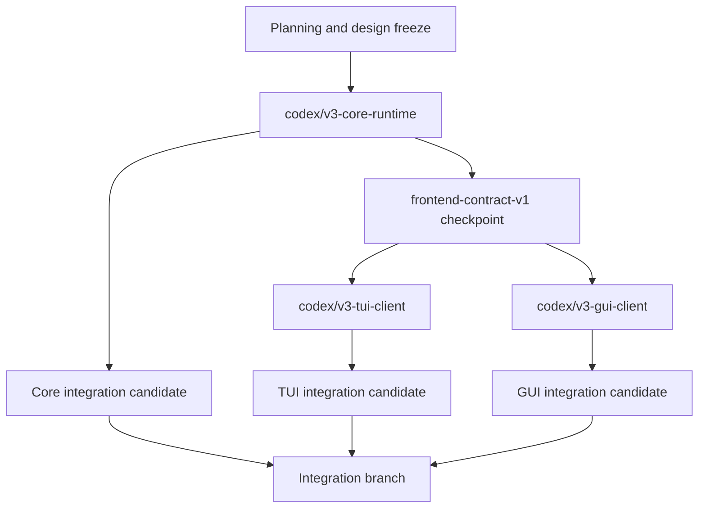

# Viden Core / TUI / GUI 三分支开发计划

英文版：[parallel-development-plan.md](parallel-development-plan.md)

最后更新：2026-07-22

## 目的

本计划把 `docs/viden-design/Viden/` 的新设计转成三类开发需求，并定义后续三个长期工作分支的边界、依赖、阶段和验收门禁。

三个分支是：

| 分支 | 需求类别 | 唯一职责 |
| --- | --- | --- |
| `codex/v3-core-runtime` | Core | 权威 runtime、跨前端 contract、持久化、安全和执行 |
| `codex/v3-tui-client` | TUI | 终端交互、渲染和 TUI 本地视图状态 |
| `codex/v3-gui-client` | GUI | 桌面交互、渲染、平台适配和 GUI 本地视图状态 |

核心规则：

> Core 先交付可版本化的 contract freeze checkpoint。TUI 和 GUI 从这个 checkpoint 分支，并且只能通过同一套 command、event、snapshot 和 replay contract 工作。

本计划取代了旧的“直接进入 Tauri GUI 并行开发”假设：Tauri 与 GPUI 先在同契约、同场景、同指标下完成垂直切片门禁，再选择正式实现框架。`0.1.0-alpha.1` 门禁已选择 **Tauri** 作为唯一正式框架，详见 [GUI 框架选型决策](gui-framework-decision.zh-CN.md)。

## 设计源与命名边界

计划依据以下当前设计真源：

- `docs/viden-design/Viden/index.html`
- `docs/viden-design/Viden/docs/SPEC.md`
- `docs/viden-design/Viden/docs/DESIGN-REF.md`
- `docs/viden-design/Viden/docs/screens-status.js`
- `docs/viden-design/Viden/tokens.css`
- `docs/viden-design/Viden/Core/`
- `docs/viden-design/Viden/TUI/`
- `docs/viden-design/Viden/GUI/`
- `docs/frontend-integration-contract.zh-CN.md`
- `docs/gui-version-functional-design.zh-CN.md`

必须区分两个同名概念：

- 设计包的 `Core/` 是产品机制、品牌、token 和视觉规则的参考源，不是一个用户可操作的产品屏。
- 开发分支的 Core 是 Rust engine/runtime、跨前端 contract 和权威业务状态。

它们通过设计决策和 contract 对齐，不能按目录名机械映射。

规划或实现 TUI/GUI 前，必须从统一入口看设计包，而不是直接打开某个孤立页面：

1. 从 `docs/viden-design/Viden/index.html` 开始，确认当前生效的设计集合，避免误用归档页。
2. TUI 依次打开 `docs/viden-design/Viden/TUI/Viden - 设计稿索引 (TUI).html`、
   `docs/viden-design/Viden/TUI/Viden - 统一原型 (TUI).html`，再看 TUI 组件库。
3. GUI 依次打开 `docs/viden-design/Viden/GUI/Viden - 设计稿索引 (GUI).html`、
   `docs/viden-design/Viden/GUI/Viden - 桌面驾驶舱 (GUI).html`，再看 GUI 组件库。
4. `GUI/pages/**`、`TUI/pages/**` 和归档页只能作为补充证据；必须先理解索引、统一原型、桌面驾驶舱和组件库。

## 共同产品模型

Contract freeze 前先统一以下层级：

```text
Workspace -> Project -> Lane -> Session -> Task/Subagent
```

- Workspace 是用户当前操作域。
- Project 对应 repository 和项目级 policy。
- Lane 是隔离、路由、权限、target 和 gate 的工作容器。
- Session 是 lane 内可恢复的交互历史。
- Task/Subagent 是可调度、可取消、可验证的工作单元。

Lane 必须成为一等 typed record，至少包含：

- `role`
- `route = built_in | acp | terminal | tmux`
- `gate_strength = full | cooperative | containment`
- `mutation_policy = autonomous | propose_only | read_only`
- worktree、branch、target 和 data-egress policy
- status、budget 和 active session ids

旧 JSONL 和 fixture 必须通过兼容反序列化或显式 schema migration 继续可读。

## 三类开发需求

### A. Core 需求

Core 独占权威事实和所有副作用。设计包中的 TUI/GUI 状态不能在前端重新实现成第二套业务模型。

#### Core P0：并行开发前的 contract freeze

1. **版本化多前端协议**
   - 冻结 `RuntimeCommand -> RuntimeEvent -> RuntimeViewState`。
   - 增加 `schema_version`、capability discovery、event cursor、replay 和 sequence-gap recovery。
   - `viden-core` 导出 transport-neutral client contract，不要求客户端创建或修改 `SessionEngine`。

2. **Typed domain records**
   - 用 enum/record 替换 lane/task status、route、gate strength、mutation policy 等字符串猜测。
   - 内置角色与设计统一为 planner、coder、reviewer、tester、doc-writer、researcher、release-operator。
   - external 是 transport/source/capability，不是内置角色。

3. **Lane runtime 上收**
   - 把 `apps/tui/src/tui/lane.rs` 中 authoritative worktree、terminal/tmux/PTY spawn、accept/apply、conflict recovery 移入 `crates/runtime` 和 `crates/tools`。
   - TUI/GUI 只发送 lane commands 并消费 lane events。

4. **真实多 Lane supervisor**
   - 把全局单 active job 改为按 lane/session/task 标识管理的 job registry。
   - cancel、approval、queued input 和 error 必须能定位 owner；一条 lane 等待 permission 不得阻塞其他 lane。

5. **共享 parity fixtures**
   - 覆盖 streaming + tool、approval allow/deny、queued follow-up、DAG blocker、多 lane、MergeGate、context pressure、cost blind spot 和 Plan mode denial。
   - 同一 fixture 在 Core、TUI 和 GUI replay 后必须得到同一业务事实。

6. **足够表达设计的 approval 与 transcript contract**
   - Approval 至少发布 risk、target、scope、policy reason、expiry/default action 和稳定 audit id。
   - Transcript 必须按 message/tool row 分页或流式发布，不能只提供单一累加字符串，否则前端无法实现稳定 scroll anchor、历史加载和有界虚拟化。

7. **多语言与外观配置 contract**
   - 定义共享 `UserPresentationPreferences` contract，覆盖 language、locale、skin、mode、density、font scale、terminal color capability 和 accessibility flags。
   - 内置 locale catalog 为 `en` 和 `zh-CN`，`system` 只作为解析输入；客户端可以本地渲染字符串，但 Core 负责持久化偏好并发出 preference-change event。
   - skin/mode 从 `tokens.css` 派生，禁止客户端硬编码私有配色。有效内置组合固定为 `aurora`、`ice`、`mono` 的 dark/light，加上仅 dark 的 `amber`、`phosphor`，共 8 组；`system` 解析为 effective dark/light，不能产生无效的 light 变体。
   - density 支持 `compact`、`regular`、`comfy`，motion 支持 `system`、`reduced`、`full`，均作为可配置的个人偏好。schema 为后续注册 locale/skin 保留扩展口，但未知或无效值必须安全回退，不能演变为客户端私有主题。
   - `RuntimeViewState` 和 replay fixtures 必须暴露 effective preferences，保证 TUI/GUI 在同一语言与外观设置下渲染相同业务事实。

#### Core P1：单人监督闭环

- 增加 `handoff`、`review_request`、`contract`、`dependency` 四个跨 Lane 原语。
- 完整化 MergeGate：gate type、owner、validator、policy snapshot、结构化 decision、conflict bounce 和受审计的 revert。
- 建立 append-only audit timeline 和稳定 query/pagination contract。
- 增加仓库级 `viden.toml` schema，覆盖 gate、ownership、domain pack、tool/MCP allowlist、budget 和 data egress。
- 冻结 `ExecutionTarget` 接口并先实现 local；SSH adapter 放在 P1，不阻塞本地 P0。
- terminal/tmux 成本必须标记为 blind/unmetered，只展示 wall time、run count、diff size 和 exit code。

#### Core P2：团队与平台

- Domain Pack、validator 和 evidence renderer descriptor。
- 团队 ownership、认领、移交和多人批准。
- 跨设备 daemon、Fleet、旁观/接管和远程 target。
- webhook、email、IM 通知和团队 timeline。
- ML/机器人等垂直 Domain Pack 与设备租约、field gate。

### B. TUI 需求

TUI 是高密度终端客户端，不再拥有 runtime 生命周期或 lane 副作用。

#### TUI P0：薄客户端与现有稳定性保留

- 只从 `RuntimeViewState` 和 TUI-local layout state 渲染，只通过 Core client 发送 `RuntimeCommand`。
- 删除或收缩 `apps/tui/src/tui/lane.rs` 中的 authoritative runtime 行为。
- 把当前 `SessionEngine`/`EngineEvent` 直接耦合迁移到 client adapter + ordered event projection。
- 保持 0.1.30 zero-bug gate：输入、CJK、focus、resize、scrollback、approval 和 active-turn 非阻塞行为不能回归。
- 落实 Normal / Insert / Overlay 输入模式；`Ctrl-C` 只中断当前工作，`Esc` 按 overlay -> selection -> insert 的层级返回。
- composer 支持多行、内部滚动和 bracketed paste；粘贴保留换行且不自动发送，CJK 双宽光标必须正确。
- 对齐设计 T1/T1c/T1d/T3/T4：composer 始终可输入、active turn 可 queue/cancel、permission 项固定可操作，ambient ticker 不携带操作项。
- replay 全部共享 fixtures，并对关键 terminal render model 做断言。
- TUI 设计必须按统一入口读取：根 index -> TUI 设计稿索引 -> 统一 TUI 原型 -> TUI 组件库。不能从单个 TUI 页面开始做交互决策。
- 消费 Core presentation preferences 中的 language、locale、skin、mode 和 density。TUI 把共享 skin token 映射到 terminal 能力，按 truecolor -> ANSI 256 -> ANSI 16 降级，不建立私有主题注册表。
- 双语和 CJK 布局进入基线：selector label、approval 文案、status row 和窄屏回退中凡是用户可见字符串，都要覆盖英文和简体中文。

#### TUI P1：多 Lane 监督与证据

- T1/T1b 多 lane cockpit、lane detail 和 inspector。
- T2 全局跳转与 selector-first provider/model/mode/permission/lane 操作。
- 全局 fuzzy jump 覆盖 lane/session/gate/command/file，并支持限域前缀。
- task/DAG、MergeGate、evidence、context pressure、cost blind spot 和 recovery action 的紧凑面板。
- Decision Center、history/replay 和 conflict bounce 的终端工作流。
- 参考侧栏默认关闭；核心页签为 Changes、Evidence、Context，Inbox/Fleet 在 P1 只提供摘要入口。
- 任何成功状态都等待 Core event，不能从 transcript 文本或命令退出文案推断。

#### TUI P2：高级终端能力

- 声明式 plugin/domain UI contributions。
- remote target、Fleet 和大规模 DAG 的降级终端视图。
- 从共享 design tokens 派生主题数据，覆盖有效皮肤/明暗组合和 truecolor -> 256 -> 16 色降级。
- 统一 glyph registry、禁 emoji、鼠标默认关闭、双语和窄屏重排。
- 终端能力探测和更完整的可访问性支持。

### C. GUI 需求

GUI 是同一 runtime 的桌面客户端。它不能直接依赖 provider、tools、permissions、session、workflow 或 runtime internals。

#### GUI P0：单机可操作闭环

- D11 首启与项目接入：repo scan、模式选择、`viden.toml` preview/confirm、starter lane。
- D4 Lane 创建：role、route/agent/model、worktree、mutation policy、gate、target、budget 和 audit。
- D1 Cockpit：workspace/project/lane 导航、virtualized transcript、composer、queue/cancel、live work、provider health、context/cost、diff/test/evidence。
- Provider/model 配置和 credential handle；所有 mutation 通过 Core approval。
- D6 空态、断线、provider error、context overflow 和 reconnect recovery。
- 双语、主题、密度、CJK IME、keyboard-only、visible focus 和最低可访问性语义。
- GUI 设计必须按统一入口读取：根 index -> GUI 设计稿索引 -> 桌面驾驶舱 -> GUI 组件库。桌面驾驶舱是 P0 视觉目标；D11、D4、D2、D6 页面用于细化具体流程。
- 消费 Core presentation preferences 中的 language、locale、skin、mode、density、font scale 和 accessibility flags。GUI 实现必须 import 或派生共享 tokens，不交付第二套皮肤配色。
- 首个可操作 GUI 闭环必须暴露语言与外观配置入口；即使第一条 vertical slice 只精修默认值，也要保留可配置结构。

#### GUI P1：决策、监督和可信交付

- D2 Decision Center：permission、gate、lane ask 和 contract confirmation。
- D10 Lane Monitor、D12 MergeGate conflict bounce、D14 append-only audit timeline。
- Plan Studio 和显式 Plan -> Build handoff。
- Agent Board、Context/Cost、history/replay、gallery review 和 Release/Test Center。
- Approval、Evidence、MergeGate 和 Audit 必须能通过稳定 ID 互相跳转。

#### GUI P2：规模化与协作

- D13 Fleet/workflow 监督。
- D7 team inbox、D8 team permissions、D9 remote target。
- Desktop notifications、team handoff/export 和 remote/Web operator。
- D2h/D3 summon dock 与 Pip 是概念/装饰，不进入首版 release gate。

## GUI 框架选型门禁

`codex/v3-gui-client` 没有在分支名绑定 Tauri 或 GPUI。G0 已在同一 Core fixture 上实现同一组 D1 垂直切片：theme、composer、streaming、tool row、approval、queue、cancel 和 history scroll。原定的 D11 intake 切片没有进入本次门禁执行范围，仍属于后续 GUI 工作。

`0.1.0-alpha.1` 门禁已选择 **Tauri** 作为唯一正式框架。完整结果与复现命令见
[GUI 框架选型决策](gui-framework-decision.zh-CN.md)。GPUI 当时只有同时通过以下门禁才有资格成为正式框架：

- composer input p95 小于 50 ms；
- event-to-visible p95 小于 100 ms；
- frame work p95 小于 16 ms；
- 10,000 events 不丢失、不重复、不乱序；
- 50,000 transcript rows 有界虚拟化；
- CJK IME、keyboard-only 和 screen-reader semantics 通过；
- macOS、Linux、Windows build + launch 通过；
- signing、updater、credential storage 和 crash recovery 有可信路径；
- 与 D1 reference 的视觉差异可重复并有解释。

两个候选都通过了功能 parity、10,000-event 有序 replay、共享 50,000-row paging
与本机 macOS build/launch smoke；但都没有 p95 timing、原生 IME/可访问性、
Linux/Windows launch、framework rendering、soak/CPU、视觉、signing/updater/credential
或 crash-recovery 证据。因此 GPUI hard gate 未通过，确定性规则选择 Tauri。这些 Tauri
缺口仍是 release blocker；Task 5 只能创建 Tauri production client。

## 分支拓扑与创建顺序

当前 dirty `main` 不能作为实现分支基线。设计冻结和本计划必须先进入同步后的 integration commit。



执行顺序：

1. 合并设计冻结与本计划。
2. 从同步后的 main 创建 `.worktrees/v3-core-runtime`。
3. Core 完成 C0 contract freeze，并记录不可变 checkpoint commit。
4. 从该 checkpoint 创建 `.worktrees/v3-tui-client` 和 `.worktrees/v3-gui-client`。
5. Core 后续只做向后兼容扩展，或带 schema version、migration 和 fixture 的变更。
6. TUI/GUI 定期合入 Core checkpoint，不允许用私有 runtime state 绕过缺失 contract。
7. 集成顺序固定为 Core -> TUI -> GUI。

## 独立版本线

V3 规划基线之后，Core、TUI、GUI 各自维护独立产品版本号。仓库仍可发布聚合 workspace 版本，但分支计划和验收按各自版本跟踪：

| 轨道 | 版本前缀 | 首个规划目标 | 版本 owner |
| --- | --- | --- | --- |
| Core | `core-v0.3.x` | `core-v0.3.0` contract freeze | Core 分支 |
| TUI | `tui-v0.3.x` | `tui-v0.3.0-alpha.1` thin-client parity | TUI 分支 |
| GUI | `gui-v0.1.x` | `gui-v0.1.0-alpha.1` local cockpit vertical slice | GUI 分支 |

规则：

- Core 版本描述 contract/runtime 能力。如果客户端行为无变化，Core 可以单独发一个版本。
- TUI 版本描述基于某个 Core checkpoint 的终端交互与渲染 parity。
- GUI 版本描述基于某个 Core checkpoint 的桌面交互、框架决策状态、视觉 parity 和平台就绪度。
- TUI/GUI 版本计划必须声明依赖的 Core checkpoint 和所有 Core contract requests。Core 逐项记录 accepted、deferred 或由现有 contract 替代。
- 集成报告必须同时列出四个值：workspace release candidate、Core version、TUI version、GUI version。

## 并发开发节奏

每轮迭代先做一次联合计划，再拆成并发轨道：

1. TUI 和 GUI 分别从上述设计入口路径选择下一个用户可见版本目标。
2. Core 根据 TUI/GUI 的 contract 需求和自身 runtime 要求定义本轮 Core 版本目标。
3. Core 先实现或拒绝必要 contract 变更，并发布 checkpoint。
4. TUI 和 GUI 从该 checkpoint 创建或同步分支，只实现各自本地表面，不修改 Core 权威事实。
5. 集成先跑 Core fixtures，再跑 TUI fixture/render parity，最后跑 GUI fixture/render parity。

如果 TUI 和 GUI 提出互相冲突的 Core 行为，Core 不新增两套 frontend-specific contract。联合计划必须选择一个共享 contract，或把其中一个请求记录为 deferred。

## 文件所有权

| Owner | 独占范围 | 共享但需先经 Core contract |
| --- | --- | --- |
| Core | `crates/types`、`crates/core`、`crates/runtime`、`crates/session`、`crates/workflows`、`crates/config`、`crates/permissions`、`crates/tools`、`crates/plugin-*` | `Cargo.toml`、frontend contract、shared fixtures |
| TUI | `apps/tui/**`、TUI previews/screenshots、TUI 用户文档 | 新 command/event 字段必须先进入 Core |
| GUI | `apps/gui/**`、GUI adapter/components/screens/platform tests、GUI screenshots、GUI 用户文档 | 新 command/event 字段必须先进入 Core |

设计资产所有权：共享 `tokens.css`、SPEC 和 DESIGN-REF 的变更由 Core/design owner 先审；TUI kit/screen 由 TUI owner；GUI kit/screen 由 GUI owner。任何共享 token 或 decision 变更都必须同步对应设计 guard 和 changelog。

## 阶段与交付物

### 当前 Native / ACP 交互检查点

- 当前本地集成候选在 `codex/d1-cockpit-closed-loop` 上组合 Core `0.3.5`、
  TUI `0.3.3` 与 GUI `0.1.0-rc.3`。TUI `0.3.3` 最初基于不可变的 Core
  `0.3.4` 检查点认证，本候选验证其与增量 Core `0.3.5` contract 兼容。
- Core 通过 `PreviewDefaultStarterLane` 与 `WorkspaceEligibilityUpdated` 独占默认
  Lane identity 与 workspace isolation 选择：有效 Git `HEAD` 使用 branch/worktree
  隔离，其他真实存在的目录直接使用已打开工作区。
- Core 同时负责 DeepSeek/OpenAI 原生 session 与 Codex/Claude/Kiro ACP session；
  `SendAgentSessionInput`、`RetryAgentSession`、`AgentSessionInputAccepted` 统一续聊、
  retry、精确 owner cancel、持久化和恢复。
- TUI 通过系统命令 `/acp` 打开选择列表；GUI 使用简洁的 Zed 风格新建 Lane 弹出菜单。
  两个前端都不能实现私有 agent/session reducer。

### 0.3.0：设计与 contract freeze

- 完成共同产品模型消歧。
- 完成 typed lane/task/gate schema、schema version 和 migration fixtures。
- 完成 transport-neutral Core client、snapshot/replay/cursor/gap recovery contract。
- 完成多前端 parity fixtures。

### 0.3.1：Core 上收，TUI/GUI 起跑

- Core 上收 lane runtime，支持多 lane supervisor。
- TUI 完成薄客户端迁移且 zero-bug gate 不回归。
- GUI 完成框架选型门禁和 production shell 起点。

### 0.3.2：本地 operator loop 集成候选

- Core 完成 handoff/review/contract、MergeGate/audit/conflict/revert。
- TUI 完成 P0/P1 核心监督面。
- GUI 完成 D11、D4、D1、D2 permission、D6 本地闭环。

### 0.3.3：可信交付与可操作 GUI beta

- TUI/GUI parity、reconnect、history、context/cost 和 evidence 通过。
- GUI 完成 D2/D10/D12/D14、Plan Studio 和 Agent Board。
- local-first 全流程在真实开发任务中可审计地跑通。

修订 2026-09-09：本里程碑的可执行计划见
[release-0.3.3-plan.zh-CN.md](release-0.3.3-plan.zh-CN.md)，其 Core 契约
增量见
[release-0.3.3-contract-design.zh-CN.md](release-0.3.3-contract-design.zh-CN.md)。
Plan Studio 与 Agent Board 移到 `0.3.4`：二者都没有登记的 D 屏与 Core 契约，
而 `0.3.3` 已新增已登记的 DiffReview 与 EvidenceView 两个面。"GUI 完成
D2/D10/D12/D14" 解读为 D2 获得类型化决策上下文、D12 获得结构化冲突内容；
D10 与 D14 已在 `0.3.2` 迁移到 audit 与 live-work 契约。

### 0.3.4：视觉、性能和生产发版门禁

- TUI deterministic previews + 真实 Terminal/iTerm2 证据。
- GUI screenshot/component parity、CJK、accessibility、性能和三平台 packaging。
- full workspace、real DeepSeek、migration、GitHub Release 与 Homebrew 同版本验证。

## 分支验收门禁

### Core

```bash
cargo test -p viden-types
cargo test -p viden-session
cargo test -p viden-workflows
cargo test -p viden-runtime
cargo test -p viden-core
scripts/check-dependency-boundaries.sh
cargo test --workspace --quiet
```

除测试通过外，还必须证明：多 lane 不互相阻塞；Plan mode 在 mutation 前拒绝 file/shell/Git/workflow/memory/task 变更；JSONL replay 得到相同 `RuntimeViewState`；legacy fixtures 可迁移；Core 不依赖任何 UI crate。

### TUI

```bash
cargo test -p viden-tui
scripts/tui-turn-controller-smoke.sh
scripts/rc-tui-stability-smoke.sh
scripts/tui-regression.sh
cargo test --workspace --quiet
```

必须额外证明：共享 fixtures 全部可 replay；composer 在 streaming/tool/approval 期间仍可输入；scrollback、resize、CJK 和 selector-first 行为不回归；TUI 不再拥有 authoritative lane 副作用。

### GUI

Alpha 选型的精确命令与当前缺失证据已记录在
[GUI 框架选型决策](gui-framework-decision.zh-CN.md)。Task 5 及后续 Tauri 工作还必须证明：

- 依赖边界只允许 `viden-core` 和 frontend-neutral contracts；
- mutation 全部发送 `RuntimeCommand` 并等待事件确认；
- sequence gap 触发 snapshot/replay，而不是继续猜测状态；
- GUI 关闭或崩溃不破坏 session、workflow、permission 或 audit 完整性；
- 与 TUI replay 同一 fixtures 时业务事实一致；
- CJK IME、keyboard-only、accessibility、视觉和性能门禁通过。

### 文档与集成

```bash
scripts/check-doc-pairs.sh
scripts/check-doc-links.sh
git diff --check
cargo fmt --check
```

每个行为变更都必须在同一分支更新对应中英文文档和必要代码注释。发布仍以 GitHub Release 与 Homebrew tap 同版本、同一验证单元完成。

### D1 Cockpit 集成检查点

原本地 `codex/d1-cockpit-integration` 是历史 Core+GUI-only 尝试。它保留为
负向证据：遗漏 TUI 分支、缺少 native/ACP parity 门禁、workspace 门禁失败，并且
无法完成 native Lane creation。

当前本地候选是 `codex/d1-cockpit-closed-loop`，从 `origin/main`
`aba8b05c5d334cf1a8424c8dc899819b4ecae0bb` 按固定顺序重建：

- Core `0.3.5`：来源 `f7fe1b31dfb237e4062209767a7051c2b2c68b93`，
  merge `76f7f8e3a84ff38846023dda7dead0c50bfb2b68`；
- TUI `0.3.3`：来源 `6260f183d19da27e61fdf068d67a9c481c68d829`，
  merge `026736dc4c16b1d039b80e77b9fe8ff99788d51b`；
- GUI `0.1.0-rc.3`：来源 `1c44094dd29674e1cc585ff6c83302581440aeb0`，
  merge `864966d0677e9d958396fac150f4701b2d14b0a1`。

当前候选已通过确定性的 Core/TUI/GUI fixture parity、组件套件、dependency
boundary、full workspace、GUI build 与 TUI smoke/regression 门禁，也成功构建
unsigned standalone macOS app bundle。Mac 解锁后，Computer Use 完成了限定原生
路径：Welcome -> Open Project -> zero-Lane -> 内置 Viden Agent -> 精确应用内
授权 -> Lane/worktree/Native owner -> 保留任务与 follow-up。Fallback transcript
rows 仍是 typed `Unavailable`；locale/skin 配置、live provider 与 ACP
authentication 仍是明确的后续门禁。
详见 `docs/release-gui-0.1.0-rc.3-status.zh-CN.md` 和
`docs/release-evidence/gui-d1-cockpit/checkpoints.md`。

### 0.3.3 可信交付候选

2026-09-10 修订。上一节记录的是 `0.3.2` 时期的候选，作为历史保留。当前的本地候选
是集成分支 `claude/int-0.3.3`，基于 `origin/main` 的
`7473a73eeec6336c2ed9059780d3ed97082b0c5e`，组合 Core `0.3.6`（实现 checkpoint
`1cec82185bbe860d6b8536a63741bc01f1edf2f6`，schema `1`，23 项 extension
capability）、TUI `0.3.4` 与 GUI `0.1.0-rc.4`。它不在 `main` 上，没有推送，也没有
发布。记录、确定性 gate 结果，以及它那次真实任务的诚实边界，见
`docs/release-evidence/gui-trusted-delivery/checkpoints.zh-CN.md`。

## 明确不做

- 不从当前 dirty、落后的本地 `main` 直接创建三个实现分支。
- 不在 contract freeze 前同时重写 TUI 和启动正式 GUI。
- 不把 HTML 原型的 Babel、mock 数据或窗口脚手架当生产 runtime。
- 不允许 TUI/GUI 直接调用 provider、tool、permission engine 或写 JSONL/SQLite。
- 不把 D7/D8/D9、Fleet、summon dock 或 Pip 塞进 GUI P0。
- 不为赶进度制造 UI 私有业务状态、私有 gate reducer 或私有 cost 估算。
